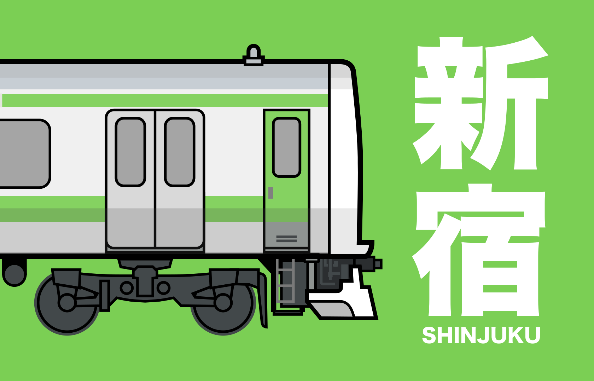

# Shinjuku

_Shinjuku_ is a strategic network-building and pick-up-and-deliver board game.

In _Shinjuku_, you build department stores in Tokyo and the rail lines to connect them so that you can build the most successful shopping/rail conglomerate.

## Rule Summary

Every turn, new customers will arrive on the map looking to purchase one of 4 different goods. On your turn, you choose 2 different actions from: (a) **Open** a store, (b) **Expand** your rail, (c) **Upgrade** to a department store, (d) draw cards as **Income** or (e) **Move** customers along the rail to stores.

You start with a hand of 4 location cards and get a new card each turn. The Build, Upgrade and Move actions require that you play a matching location card from your hand. Cards in your hand that match locations where you have previously built a store are Wild and can be used to match any location.

The game ends when the last customer is placed (+ one final round) and victory goes to the player that can create the most sets of each type of customer.

## Links

| | | |
| --- | --- | --- |
|  | <a href="https://garykac.github.io/shinjuku/docs/shinjuku_quickstart.pdf">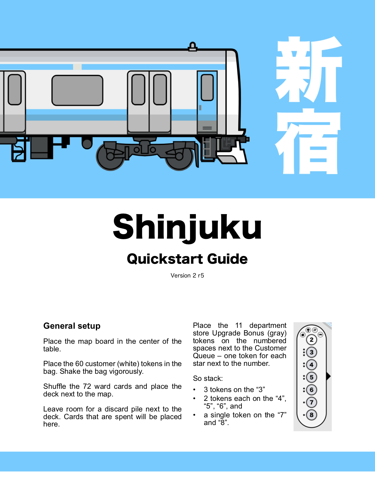</a> | <a href="https://garykac.github.io/shinjuku/docs/shinjuku_variants.pdf">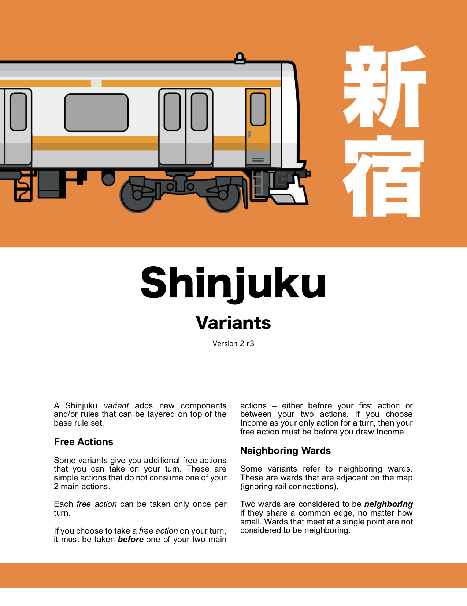</a> |
| 
Rules

<a href="https://garykac.github.io/shinjuku/docs/shinjuku_rules.pdf">Letter</a>, <a href="https://garykac.github.io/shinjuku/docs/shinjuku_rules_a4.pdf">A4</a>
 | 
Quickstart

<a href="https://garykac.github.io/shinjuku/docs/shinjuku_quickstart.pdf">Letter</a>, <a href="https://garykac.github.io/shinjuku/docs/shinjuku_quickstart_a4.pdf">A4</a>
 | 
Variants

<a href="https://garykac.github.io/shinjuku/docs/shinjuku_variants.pdf">Letter</a>, <a href="https://garykac.github.io/shinjuku/docs/shinjuku_variants_a4.pdf">A4</a>
 |

* [Kickstarter Upcoming Project](https://www.kickstarter.com/projects/garykac/shinjuku)

* [Tabletop Simulator implementation](https://steamcommunity.com/sharedfiles/filedetails/?id=2138588825)

* [BoardGameGeek](https://boardgamegeek.com/boardgame/286690/shinjuku), [Instagram](https://www.instagram.com/shinjuku.game/)

* Videos
	* [General Overview](https://www.youtube.com/watch?v=WozxrZ81nBs) (4:42 rule/gameplay summary)

* [Print and Play Instructions](https://garykac.github.io/shinjuku/pnp/index.html)

* Game Development
	* Game categories: strategic; network building; pick-up and deliver, set collection
	* [Design Notes](https://boardgamegeek.com/blogpost/96561/introduction) (design diary on BGG)
	* [Github repository](https://github.com/garykac/shinjuku)
	* [Playtest notes](playtests/playtests.md)
	* [Blank playtest comment sheet (pdf)](docs/playtest_comment_sheet.pdf)

## Background

Tokyo is a city of trains and Shinjuku is the busiest train station in the world.

Unlike most passenger rail systems, Tokyo has dozens of companies running competing rail lines rather than having a single entity that manages rail for the entire city. Many of these companies are large conglomerates that own not only the rail, but also the major department stores at the rail stations.

In **Shinjuku**, you manage a rail conglomerate in Tokyo. You need to build stores for the customers to visit and also the rail lines to get them there.

Every turn, new customers will arrive looking to purchase one of 4 different goods. If you have a store that sells those goods, then you might be able to move them to your store and earn them as a customer (=VP).

* 2-4 players
* 60 minutes
* Ages 10+

## How to Play

### Map Board

_Shinjuku_ is played on a map of central Tokyo:

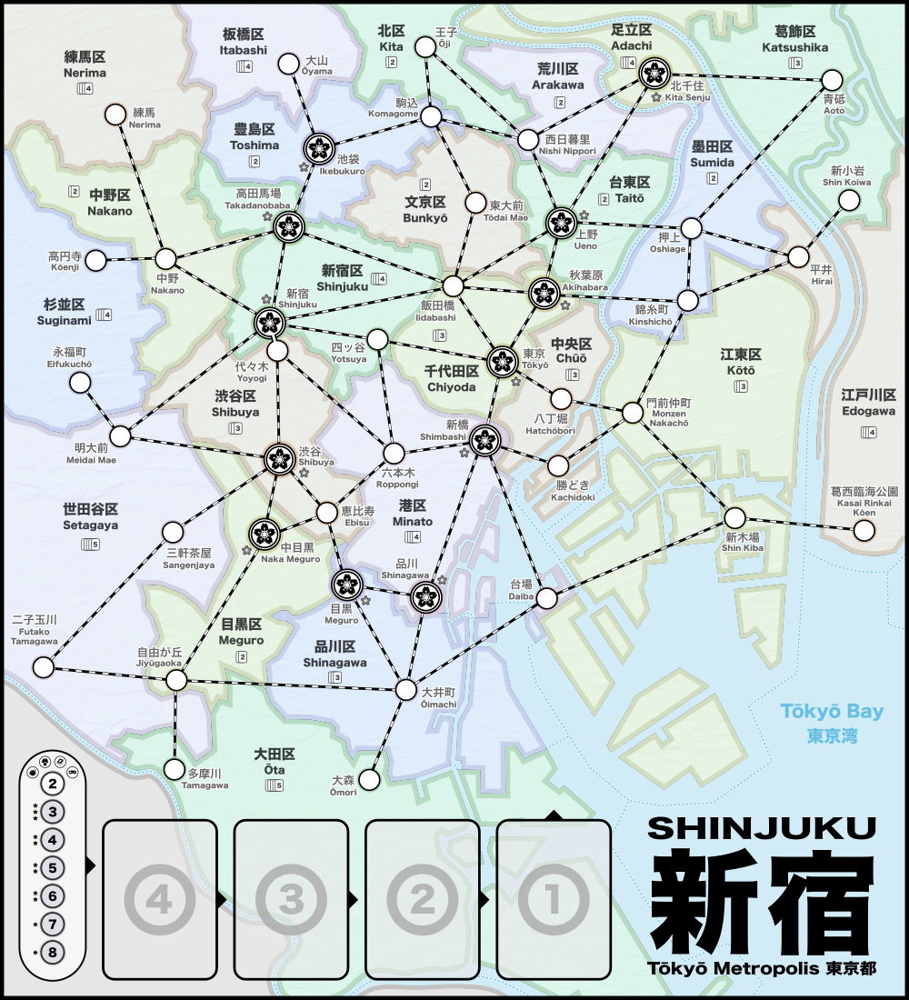

The map is divided into the 23 regions (known as "wards", or "区" (_ku_) in Japanese).

Each region contains 1 or more train stations and these stations have lines that identify potential connections to other stations. Some stations have a _sakura_ icon to indicate that stores built there are allowed to be upgraded to a department store.

On the bottom of the board is the customer queue (④ ③ ② ①). Customers will accumulate here before moving on to the map.

### Cards

There are 72 cards and each card identifies a single ward on the map.

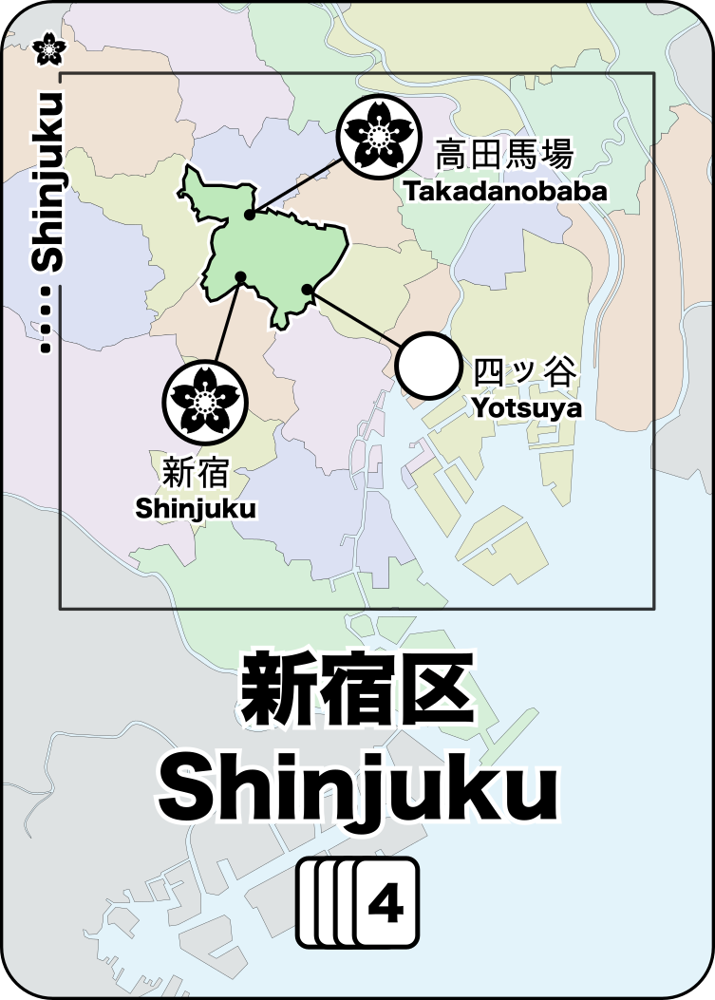 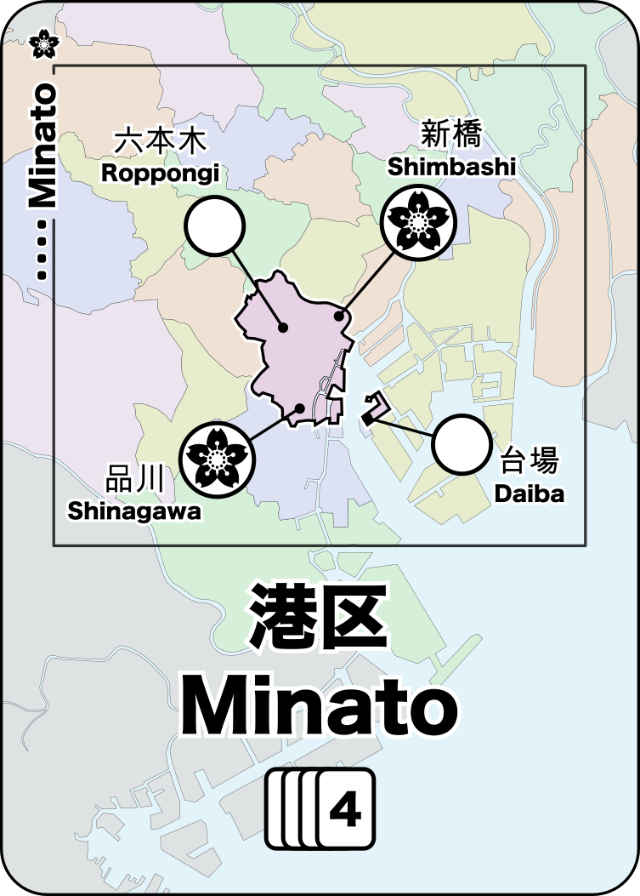 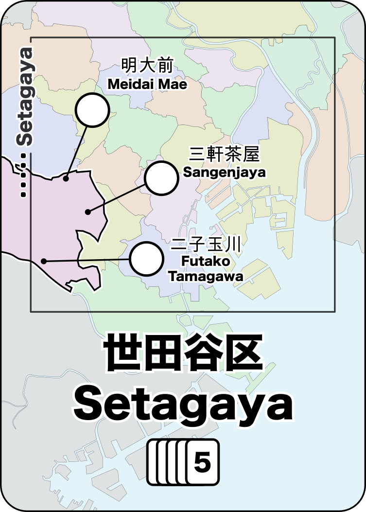 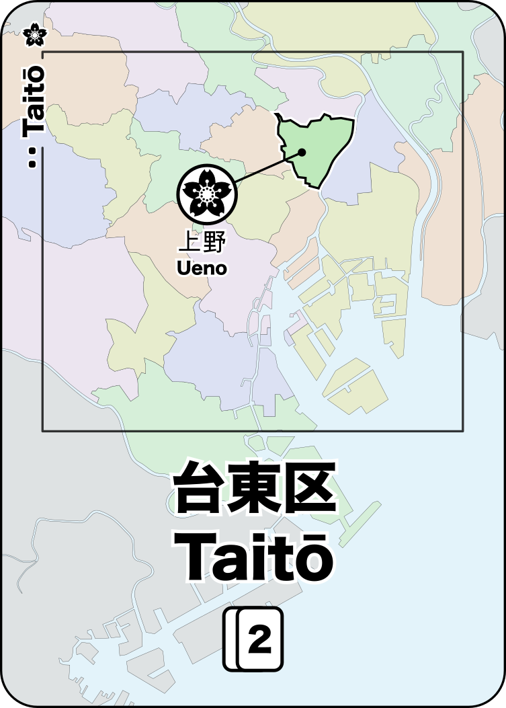

There are multiple copies of each card based on the population of that ward. The numbers on the map and on each card indicate how many of each card are in the deck (this information is important later).

### Player Pieces

Each player starts with 3 department stores, 8 stores and 16 track segments.

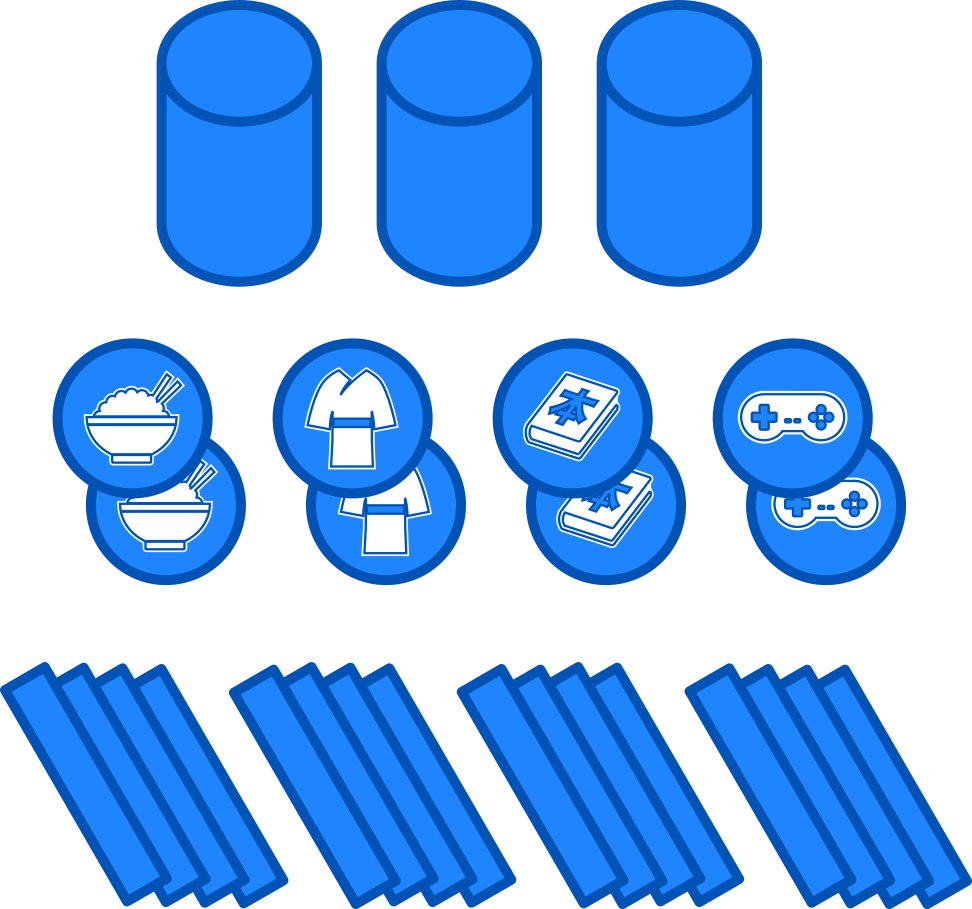

There are 4 kinds of stores:

| | |
| --- | --- |
|  | sells Food |
|  | sells Clothing |
|  | sells Books |
|  | sells Electronics |

A department store (represented by a tall cylinder) sells all of these goods.

### Customers

There are a total of 60 customers. They are stored in a bag so that they can be drawn at random.

The 4 customer types match the store types:

| | | |
| --- | --- | --- |
| 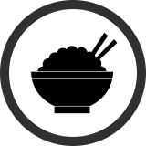 | 20 customers want Food | 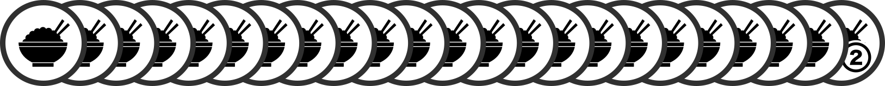 
| 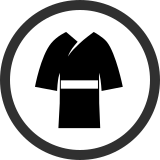 | 17 customers want Clothing | 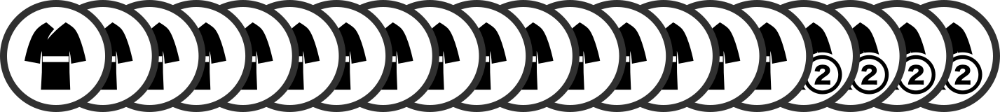 |
|  | 13 customers want Books | 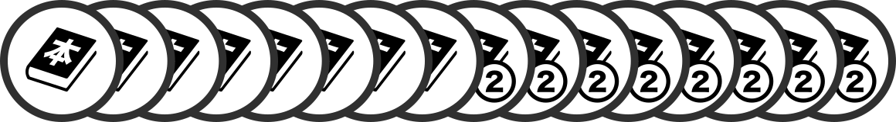 |
|  | 10 customers want Electronics | 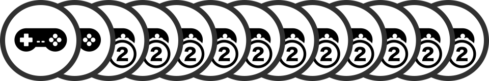 |

Some customers count as 2 customers:

### Upgrade Bonus Tokens

There are tokens that players can earn for the first 6 department store upgrades.

These tokens give a bonus in endgame scoring.

### Gameplay

#### Initial Setup

Choose a player color, take the pieces and then draw 4 cards into your hand.

Initialize the Customer Queue:

* Draw 4 ward cards and place them on the 4 queue spaces: ④ ③ ② ①
* Add 2 customers to the queue.

To add a customer to the queue:

* Draw a customer from the bag
* Is there already a customer of the same type in the queue?
	* If so, place the new customer on the card with the matching customer.
* Otherwise, place the new customer on the next available (empty) card.

#### Each Turn

##### Place Customers

Customers are taken from the queue and placed on the map as follows:

* Take all the customers from the head ① of the queue and then place them in the location indicated by the card they were sitting on.
	* Note that the customers are placed in the ward, not in any particular station.
Customers are not associated with a station until they are being **Move**d.
* Take the card from the queue (where the customers were taken) into your hand.
* Refresh the customer queue.

To refresh the customer queue:

* Slide the existing cards (with customers) down
* Draw a new card and place it on ④
* Add customers to the queue equal to the number that were just placed on the map. 

##### Take Two Actions

Choose any two of the following actions (must be different actions):

* **Open Store** : Spend a ward card and open a store at any empty station in that ward.
* **Expand Track** : Build a single piece of track on any empty connection on the map. Optionally, you may spend a card that matches either end of the newly placed track to build a second segment of track that is connected to the first.
* **Upgrade Store** : Spend a matching ward card and a matching customer to upgrade an existing store to a department store. The spent customer is added to the customer queue and the old store is returned to you. You may now claim the next department store Upgrade Bonus Token (if any remain). Note that stores can only be upgraded if they were built in a station marked with the department store icon.
* **Draw Income** : Draw your hand back up to 4 cards, or draw a single card if you already have 4 or more cards in hand. **_Your turn ends immediately_** after taking this action, even if you had one more action available.
* **Move Customers** : Spend a ward card to [move the customers](#moving-customers) in that ward to stores, following train tracks to connected stations.

### Wildcards

You can play a wildcard to match any card. There are no explicit "wildcard" cards in _Shinjuku_, but you can create wildcards during gameplay:

#### ...from cards

You can play any three cards from your hand as a single wildcard.

#### ...from stores

Once you've built a store (or department store) in a ward, the cards for that ward become wildcards for you.

Because the card frequency varies based on the population of that ward, some wards work better as wildcards (because you're more likely to draw them).

### Moving Customers

The **Move** action is the most important action in _Shinjuku_ because it is the only way to gain customers (which are needed to win the game).

When you choose the **Move** action, do the following:

1. Gather _all_ of the customers in the ward that matches the card played
2. Select their starting station within that ward
3. Move the customers from station to station on the map, following the track connections that players have added.
	* If the station has a store that matches a customer, then the store satisfies the matching customer and it _must_ be given to the player that owns the store.
		* A store can satisfy a single customer that matches the store type. A department store can satisfy a single customer of _any_ type.
		* If more than one customer matches (e.g., with a department store; or if there are multiple customers of the same type), then you may choose which single customer is given to the store owner.
	* No station may be visited more than once during this action.
	* If there are 2 or more customers being **Move**d, then you must cross at least one track segment.
4. Any remaining customers are added to the ward that contains the final station visited, merging with any existing customers in that ward.
5. If any track segments owned by other players were used during the **Move** action, then those players may immediately take an **Income** action. Maximum one **Income** action per player, regardless of the number of track segments used. You (the player taking the **Move** action) are not entitled to this Income bonus.

### End of Game

When the last customer is drawn from the bag, play continues until the customer queue is emptied. The player that places the final customer from the queue finishes their turn and then every other player takes one last turn.

### Endgame Scoring

Customers are scored using set collection plus any bonuses from department store upgrades.

* 10 pts for each set of 4 different customers
* 6 pts for each set of 3 different customers
* 3 pts for each set of 3 different customers
* 1 pt for each remaining customer

Customers marked with a “2” count as 2 separate customers.

In endgame scoring, each Upgrade Bonus Token acts as a wild customer and can be used in place of any single customer.

