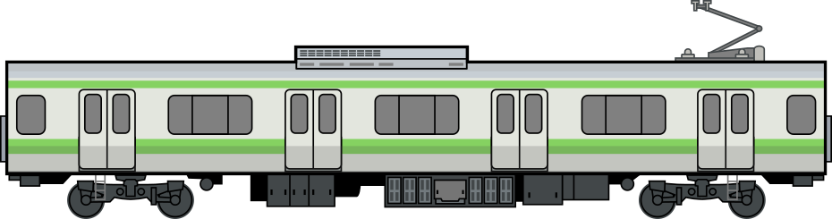
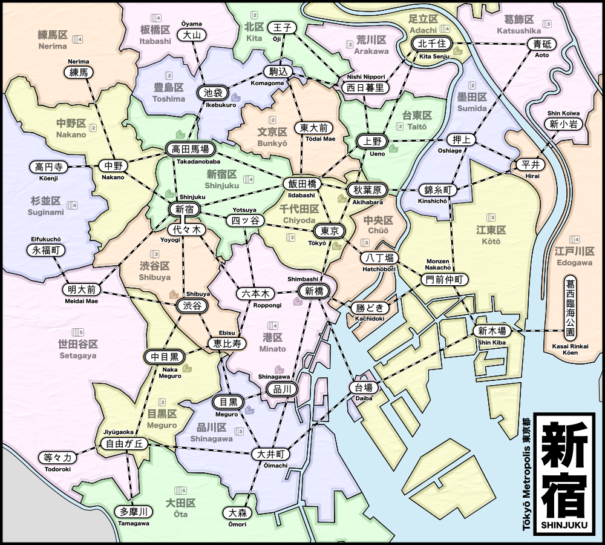
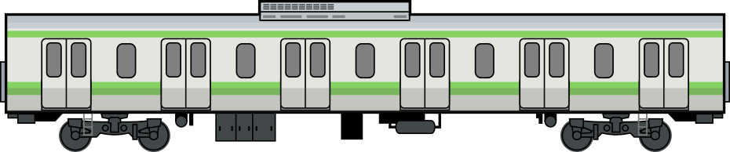

# Shinjuku

Shinjuku is a board game where you build department stores in Tokyo and the rail lines to connect them
so that customers can get to your stores.

**STATUS: Rules are stable. Continuing playtests.**

* [One page overview (pdf)](docs/shinjuku_onepage.pdf)

* Rules:
	* [Quickstart Rules (pdf)](docs/shinjuku_quickstart.pdf)
	* [Complete Rules (pdf)](docs/shinjuku_rules.pdf)

* Mini-Expansions:
	* [Chairman Expansion (pdf)](docs/shinjuku_x_chairman.pdf)
	* [Empress Expansion (pdf)](docs/shinjuku_x_empress.pdf)
	* [Flash Mob Expansion (pdf)](docs/shinjuku_x_flash_mob.pdf)
	* [Hachiko Expansion (pdf)](docs/shinjuku_x_hachiko.pdf)
	* [Kaiju Expansion (pdf)](docs/shinjuku_x_kaiju.pdf)
	* [Thief Expansion (pdf)](docs/shinjuku_x_thief.pdf)

* Game Development
	* [Playtest notes](playtests/playtests.md)
	* [Blank playtest comment sheet (pdf)](docs/playtest_comment_sheet.pdf)

## Background

Tokyo is a city of trains and Shinjuku is the busiest train station in the world.

Unlike most passenger rail systems, Tokyo has dozens of companies running competing rail lines rather than having a single entity that manages rail for the entire city. Many of these companies are large conglomerates that own not only the rail, but also the major department stores at the rail stations.

In **Shinjuku**, you manage a rail conglomerate in Tokyo. You need to build stores for the customers to visit and also the rail lines to get them there.

Every turn, new customers will arrive looking to purchase one of 4 different goods. If you have a store that sells those goods, then you might be able to move them to your store and earn them as a customer (=VP).

* 2-5 players (recommended 3-4)
* 60 minutes
* Ages 10+

## Components

* Map of Tokyo with stations and connections
* 72 Ward cards
* 60 Customer tokens (white), each with a marking identifying the type of goods they want to purchase:
    * 19 want food (◯)
    * 16 want clothing (⤫)
    * 14 want books (△)
    * 11 want electronics (⭐︎)
* 1 bag to hold all the customers
* 40 Store tokens (5 colors): 2 for each store type per player color
* 15 Department store tokens (5 colors): 3 per player color
* 80 Track markers (5 colors): 16 per player color
* 5 Player screens (5 colors) to hide customers during gameplay

## How to Play

### Setup

For each player:

* Draw 5 cards into your hand
* Select the appropriate number of stores, department stores and track based on the total number of players:

| # of players | stores | dept stores | track |
| ------------ | ------ | ----------- | ----- |
|       2      |    8   |      3      |  16   |
|       3      |    7   |      2      |  13   |
|       4      |    6   |      2      |  10   |
|       5      |    5   |      2      |   8   |

### Gameplay

#### Place a Customer

At the start of your turn, [place a customer](#placing-customers) at random on the map.

#### Take Two Actions

Choose any two of the following actions (must be different actions):

* **Build** Play a ward card and build a store at any empty station in that ward.
* **Upgrade** Play a matching ward card and a matching customer to upgrade an existing store to a department store.
* **Move** Play a ward card and [move customers](#moving-customers) from that ward to stores, following train tracks to connected stations.
* **Expand** Discard a single card and build new track that connects to one of your stores or to your existing track.
   Or discard 3 cards to build 2 connected segments of track
* **Income** Draw hand back up to 5 cards, or draw a single card if you already have 5 or more cards in hand. Your turn ends immediately after taking this action, even if you had one more action available.

### End of Game

When the last customer is drawn and placed on the map, that player completes their turn and then every player (including the player that drew final customer) gets one final turn before endgame scoring takes place.

#### Endgame Scoring

Remove the customer type that you have the most of and then count all the remaining customers.

## The Map

The map contains train stations where you can build your stores.

Each station has a set of potential connections to other stations. Some stations have an icon indicating that stores built here can be upgraded to a department store.

## The Cards

There are 23 different cards – one for each ward (区 or _ku_) in Tokyo.
There are multiple copies of each card based on the population of that ward.

## Customers

### Placing Customers

New customers are added randomly to the board each turn. To do this:

* Draw a ward card to determine the location of the customer
* Draw a customer token to determine what the customer desires
* Place the customer token in the ward that matches the card

Note that the customer is located in the ward, not in any particular station.
Customers are not associated with a station until they are being Moved.

### Moving Customers

When you choose the action to move customers to your store, do the following:

1. Gather *all* of the customers in the ward that matches the card played
2. Select their starting station within that ward
3. Satisfy customers that match the shops in that station
   * A single shop can satisfy a single customer that matches the shop type
   * A department store can satisfy any single customer.
4. Optionally, move all unsatisfied customers to another connected station and then repeat steps 3 & 4.

When customers are satisfied, their token is given to the player who owns the store where they were
satisfied. These customer tokens are used in endgame scoring.

If there are no customers that match the store, then they all just pass that station by and continue to the next station.
But if a customer matches the shop, you *must* satisfy them with that store if possible.

You *must* end your train journey on a station with a store that satisfies at least one customer.

Any remaining unsatisfied customers are moved into the ward that contains the final station.

## Department Stores

To upgrade a store to a department store, a player must pay:

* A card matching the location of the store to be upgraded
* A customer that matches the store being upgraded

The spent customer is removed from the game and the store being upgraded is returned to the player (and can be used again).

### Upgrade Limitations

Only stations marked with a department store icon can be upgraded to a department store.

### Burst of Customers

When a new department store is created, a burst of new customers appears on the map:

| # of players | # of new customers |
| ------------ | ------------------ |
|       2      |         4          |
|       3      |         4          |
|       4      |         3          |
|       5      |         3          |

## Wildcards

You can play a wildcard to match any ward card.

There are two ways to get wildcards: from stores and from cards

### Wildcards from stores

Once you've built a store (or department store) in a ward, the cards for that ward become wildcards for you.

Because the card frequency varies based on the population of that ward, some cards work better as wildcards (because you're more likely to encounter them). Each card indicated how many copies of it exist in the deck.

### Wildcards from cards

You can play any three cards from your hand as a single wildcard.

