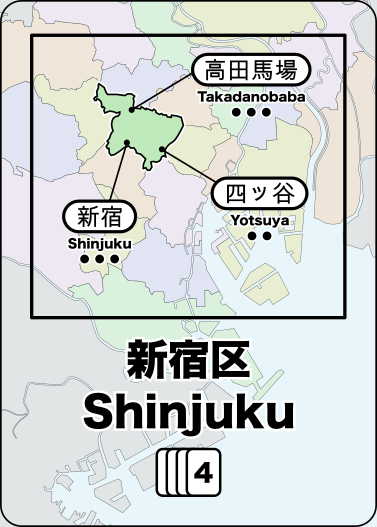

# Shinjuku

Shinjuku is a board game where you build department stores in Tokyo and the rail lines to connect them
so that customers can get to your stores.

**Note: This game is a work in progress**

## Background

Shinjuku is the busiest passenger rail line in the world. Of the top 100 busiest stations, the vast
majority are in Japan and of those, the vast majority are in Tokyo.
Unlike most passenger rail systems, Tokyo has dozens of companies running competing rail lines
rather than having a single entity that manages rail for the entire city.
Many of these companies are large conglomerates that own not only the rail, but the major department
stores at the rail stations.

In **Shinjuku**, you are playing the part of those conglomerates to build rail and stores so that
you can satisfy customers.

## Components

* Map of Tokyo with stations and potential connections
* 72 Ward cards
* 40 Customer tokens (white), each with a marking identifying the type of goods they want to purchase:
    * 10 want food
    * 9 want clothing
    * 8 want books
    * 7 wanat toys
    * 6 want electronics
* 60 Store tokens (4 colors): 3 for each store type per player color
* 8 Department store tokens (4 colors): 2 per player color

## How to Play

### Setup

For each player:

* Draw 5 cards into your hand
* Place 2 customers on the board (see "Placing Customers" below)
* Place one of your stores (any kind) onto *any* empty station.
    * This is the only time you don't need to play a card to place a station.

### Gameplay

During your turn, you can choose any two of the following actions (must be different actions):

* **Build** Play a ward card and build a store at any empty station in that ward.
* **Upgrade** Play a ward card and upgrade an existing store that you have in that ward.
* **Lure** Play a ward card and lure customers from that ward to stores, following train tracks to connected stations.
* **Expand** Discard a single card and build new track that connects to one of your stores or to your existing track.
   Or discard 3 cards to build 2 connected segments of track
* **Refresh** Draw hand back up to 5 cards, or draw a single card if you already have 5 or more cards in hand.
   Your turn ends immediately after taking this action, even if you had one more action available.

After taking your 2 actions:

* Place 1 customer on the board as a signal to the next player that they can take their turn

### Endgame Scoring

* +1 vp per customer
* +2 vp for each good type where you have the undisputed max # of customers satisfied
* +1 vp for each good type where you are tied for the max # of customers satisfied

## The Map

The map contains train stations where you can build your stores.

Each station has a set of potential connections to other stations and a maximum build height for stores (1, 2, or 3 dots).

## The Cards

There are 23 different cards – one for each ward (区 or _ku_) in Tokyo.
There are multiple copies of each card based on the population of that ward.

## Customers

### Placing Customers

New customers are added randomly to the board each turn. To do this:

* Draw a ward card to determine the location of the customer
* Draw a customer token to determine what the customer desires
* Place the customer token in the ward that matches the card

Note that the customer is located in the ward, not in any particular station.
Customers are not associated with a station until they are being lured.

### Luring Customers

When you choose the action to lure customers to your store, do the following:

1. Gather *all* of the customers in the ward that matches the card played
2. Select their starting station within that ward
3. Satisfy customers that match the shops in that station
   * A single shop can satisfy a single customer that matches the shop type
   * A double shop can satisfy two customers that match the shop type
   * A department store can satisfy two customers that match any 2 different shop types.
4. Optionally, move all unsatisfied customers to another connected station and then repeat steps 3 & 4.

When customers are satisfied, their token is given to the player who owns the store where they were
satisfied. These customer tokens are used in endgame scoring.

If there are no customers that match the store, then they all just pass that station by and continue to the next station.
But if a customer matches the shop, you *must* satisfy them with that store if possible.

You *must* end your train journey on a station with a store that satisfies at least one customer.

Any remaining unsatisfied customers are moved into the ward that contains the final station.

## Stores

The very first store placed during setup can be placed on any empty space, but after that
you need to play a card that matches the ward where you want to build the new store.

### Upgrading

To upgrade one of your stores, you need to play a ward card that matches the ward where that store
is located. Then you place a store token *of a different type* on top of the existing store token.
This enhanced store can now satisfy up to 2 customers of the new type.

### Department Stores

The second store upgrade converts the shop into a department store.
Remove the 2 store tokens (add them back into your pool of store tokens) and replace
them with the special department store token.

A department store provides all 5 types of goods and can satisfy up to 2 customers as long as they
each want a different good.

### Upgrade Limitations

Not all stations can accept larger stores:

* A station marked with a single dot does not allow stores to be upgraded beyond a basic store
* A station marked with two dots allows the station to be upgraded once
* A station marked with three dots can be upgraded all the way up to a department store

## Wildcards

Once you build a station in a ward, the cards for that ward become wildcards for you.
You can play one of your wildcard to match any ward.

Because the card frequency varies based on the population of that ward, some cards work better
as wildcards (because you're more likely to encounter them). Each card indicated how many copies
of it exist in the deck.

## Playtest images

* https://twitter.com/hackerblinks/status/1032744357642657792
