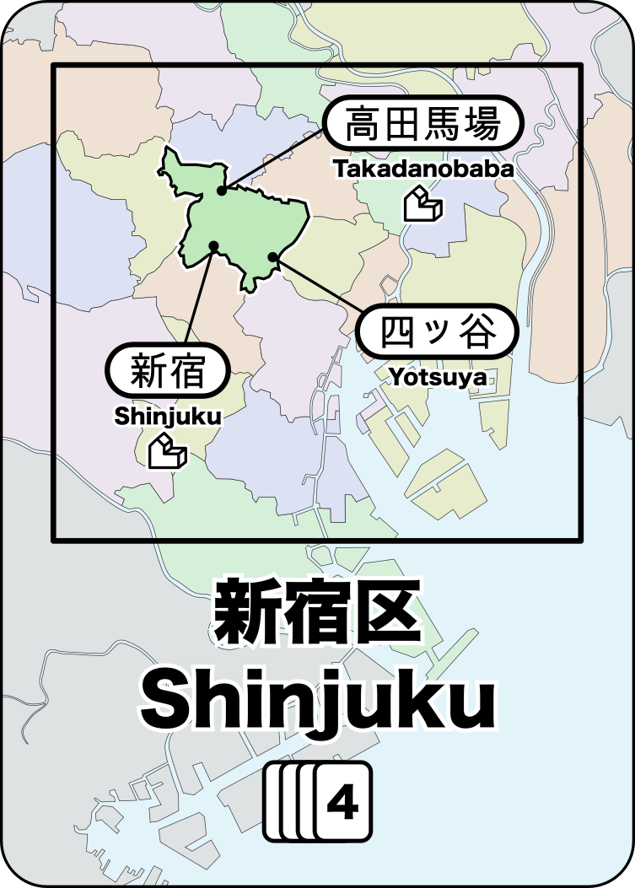
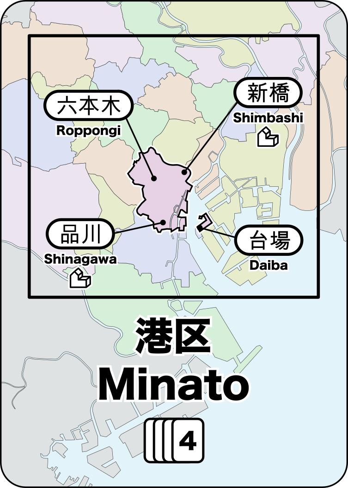

# Shinjuku

Shinjuku is a board game where you build department stores in Tokyo and the rail lines to connect them so that you can build the most successful shopping/rail conglomerate.

**STATUS: Rules are stable. Continuing playtests.**

* [Sell sheet (1-page overview for publishers) (pdf)](docs/shinjuku_sellsheet.pdf)

* Rules:
	* [Quickstart Rules (pdf)](docs/shinjuku_quickstart.pdf)
	* [Complete Rules (pdf)](docs/shinjuku_rules.pdf)

* Mini-Expansions:
	* [Chairman](docs/shinjuku_x_chairman.pdf), [Empress](docs/shinjuku_x_empress.pdf), [Flash Mob](docs/shinjuku_x_flash_mob.pdf), [Hachiko](docs/shinjuku_x_hachiko.pdf), [Kaiju](docs/shinjuku_x_kaiju.pdf), [Thief](docs/shinjuku_x_thief.pdf)

* Alternate Maps
	* [Paris](paris/paris-map.png), [London](london/london-map.png)

* Game Development
	* Game categories: strategic; network building; pick-up and deliver
	* [Playtest notes](playtests/playtests.md)
	* [Blank playtest comment sheet (pdf)](docs/playtest_comment_sheet.pdf)

## Background

Tokyo is a city of trains and Shinjuku is the busiest train station in the world.

Unlike most passenger rail systems, Tokyo has dozens of companies running competing rail lines rather than having a single entity that manages rail for the entire city. Many of these companies are large conglomerates that own not only the rail, but also the major department stores at the rail stations.

In **Shinjuku**, you manage a rail conglomerate in Tokyo. You need to build stores for the customers to visit and also the rail lines to get them there.

Every turn, new customers will arrive looking to purchase one of 4 different goods. If you have a store that sells those goods, then you might be able to move them to your store and earn them as a customer (=VP).

* 2-5 players (recommended 3-4)
* 60 minutes
* Ages 10+

## How to Play

### Map

Shinjuku is played on a map of central Tokyo:

The map is divided into the 23 regions (known as "wards", or "区" (_ku_) in Japanese).

Each region contains 1 or more train stations and these stations have lines that identify potential connections to other stations.

Some stations have an icon  indicating that stores built there can be upgraded to a department store.

### Cards

There are 72 cards and each card identifies a single ward on the map.

   

There are multiple copies of each card based on the population of that ward. The numbers on the map and on each card indicate how many of each card are in the deck (this info is important later).

### Player Pieces

Each player has a set of stores and track available (the exact number varies based on the number of players).

There are 4 kinds of stores:

* ◯ produce food
* ⤫ produce clothing
* △ produce books
* ⭒ produce electronics

A department store can produce any one of these goods.

### Customers

There are a total of 60 customers. They are stored in a bag so that they can be drawn at random.

The 4 customer types match the store types.

* ◯ customers want food (19 - _most common customer type_)
* ⤫ customers want clothing (16)
* △ customers want books (14)
* ⭒ customers want electronics (11 - _least common customer type_)

### Gameplay

#### Place a Customer

At the start of your turn, place a customer at random on the map:

* Draw a customer at random from the bag
* Draw a card at random to determine the location

Note that the customer is located in the ward, not in any particular station.
Customers are not associated with a station until they are being **Move**d.

#### Take Two Actions

Choose any two of the following actions (must be different actions):

* **Build Store** : Play a ward card and build a store at any empty station in that ward.
* **Upgrade Store** : Play a matching ward card and sacrifice one of your matching customer to upgrade an existing store to a department store.
* **Move Customers** : Play a ward card and [move customers](#moving-customers) from that ward to stores, following train tracks to connected stations.
* **Expand Track** : Build a single piece of track anywhwere on the map. Or play a wildcard to build 2 connected segments of track
* **Draw Income** : Discard as many (or as few) cards as you like and then draw your hand back up to 5 cards, or draw a single card if you already have 5 or more cards in hand. Your turn ends immediately after taking this action, even if you had one more action available.

### Wildcards

You can play a wildcard to match any card. There are no explicit "wildcard" cards in **Shinjuku**, but you can create wildcards during gameplay:

#### ... from cards

You can play any three cards from your hand as a single wildcard.

#### ... from stores

Once you've built a store (or department store) in a ward, the cards for that ward become wildcards for you.

Because the card frequency varies based on the population of that ward, some wards work better as wildcards (because you're more likely to draw them).

### End of Game

When the last customer is drawn and placed on the map, that player completes their turn and then every player (including the player that drew final customer) gets one final turn before endgame scoring takes place.

### Endgame Scoring

Remove the customer type that you have the most of and then count all the remaining customers. Each customer is worth 1 VP.

## Moving Customers

The Move action is the most important action in **Shinjuku** because it is the only way to gain customers (which are needed to win the game).

When you choose the Move action, do the following:

1. Gather *all* of the customers in the ward that matches the card played
2. Select their starting station within that ward
3. Satisfy customers that match the shops in that station
   * A single shop can satisfy a single customer that matches the shop type
   * A department store can satisfy any single customer.
4. Optionally, move all unsatisfied customers to another connected station and then repeat steps 3 & 4.

When customers are satisfied, their token is given to the player who owns the store. These customer tokens are used in endgame scoring.

If there is a customer that matches the current shop, then you *must* give a customer to that store. If multiple customers match, then you choose which one to give. Each store (or dept store) may only take a single customer, even if more than one matches.

If there are no customers that match the store (or if there is no store), then they all just pass that station by and continue to the next station.

You *must* end your train journey on a station with a store that satisfies at least one customer.

Any remaining unsatisfied customers are moved into the ward that contains the final station.

