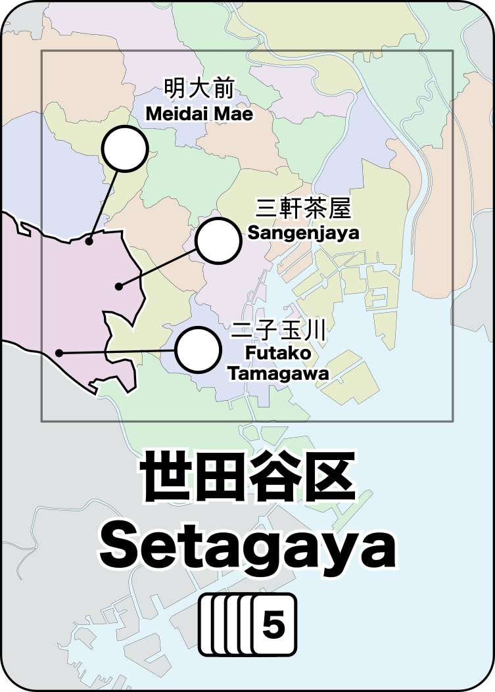
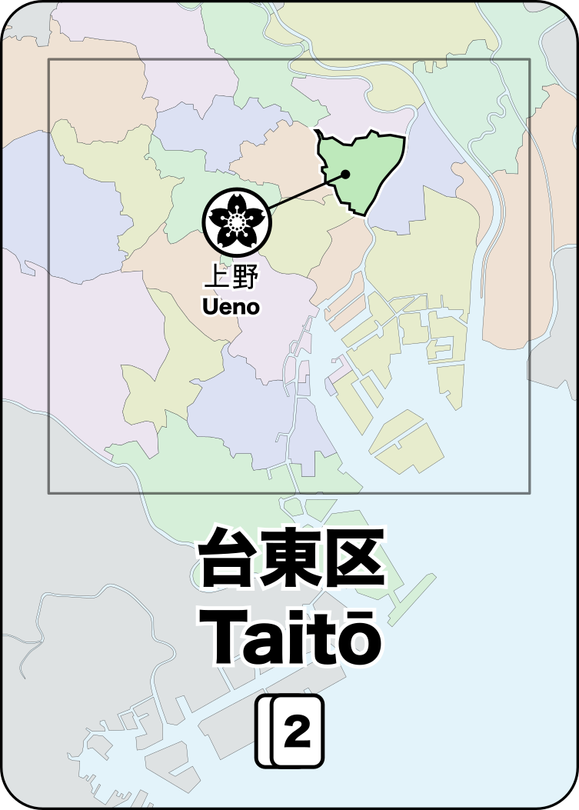
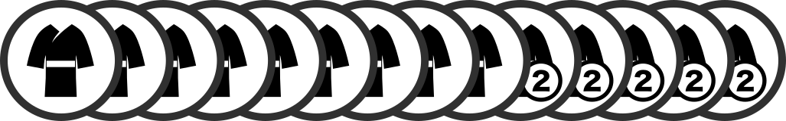

# Shinjuku

_Shinjuku_ is a strategic network-building and pick-up-and-deliver board game.

In _Shinjuku_, you build department stores in Tokyo and the rail lines to connect them so that you can build the most successful shopping/rail conglomerate.

## Rule Summary

Every turn, new customers will arrive on the map looking to purchase one of 4 different goods. On your turn, you choose 2 different actions from: (a) Build a store, (b) Expand your rail, (c) Upgrade to a department store, (d) draw cards as Income or (e) Move customers along the rail to stores.

You start with a hand of 5 location cards. The Build, Upgrade and Move actions require that you play a matching location card from your hand. Cards in your hand that match locations where you have previously built a store are Wild and can be used to match any location.

The game ends when the last customer is placed (+ one final round) and victory goes to the player that acquired the most customers (after each player removes the customer type that they have the most of).

## Links

* [BoardGameGeek](https://boardgamegeek.com/boardgame/286690/shinjuku), [Instagram](https://www.instagram.com/shinjuku.game/)

* Rules:
	* Complete Rules of Play ([Letter](docs/shinjuku_rules.pdf), [A4](docs/shinjuku_rules_a4.pdf))
	* Quickstart Rules ([Letter](docs/shinjuku_quickstart.pdf), [A4](docs/shinjuku_quickstart_a4.pdf))

* [Print and Play Instructions](pnp)

* Mods (Mini-Expansions and Rule Variants):
	* Mod Pack I - Princess, Thief, Chairman, Hachiko, Kaiju ([Letter](docs/shinjuku_mods_1.pdf), [A4](docs/shinjuku_mods_1_a4.pdf))
	* Mod Pack II - Savvy Advertisement, Preorder Discount, Indecisive Shopper, Party Planner, Bonus Action, Bypass, Flash Mob (in progress)

* Alternate Maps
	* [Paris](paris/paris-map.png), [London](london/london-map.png)

* [Sell sheet (1-page overview for publishers) (pdf)](docs/shinjuku_sellsheet.pdf)

* Game Development
	* Game categories: strategic; network building; pick-up and deliver
	* [Github repository](https://github.com/garykac/shinjuku)
	* [Playtest notes](playtests/playtests.md)
	* [Blank playtest comment sheet (pdf)](docs/playtest_comment_sheet.pdf)

## Background

Tokyo is a city of trains and Shinjuku is the busiest train station in the world.

Unlike most passenger rail systems, Tokyo has dozens of companies running competing rail lines rather than having a single entity that manages rail for the entire city. Many of these companies are large conglomerates that own not only the rail, but also the major department stores at the rail stations.

In **Shinjuku**, you manage a rail conglomerate in Tokyo. You need to build stores for the customers to visit and also the rail lines to get them there.

Every turn, new customers will arrive looking to purchase one of 4 different goods. If you have a store that sells those goods, then you might be able to move them to your store and earn them as a customer (=VP).

* 2-4 players
* 60 minutes
* Ages 10+

## How to Play

### Map

_Shinjuku_ is played on a map of central Tokyo:

The map is divided into the 23 regions (known as "wards", or "区" (_ku_) in Japanese).

Each region contains 1 or more train stations and these stations have lines that identify potential connections to other stations.

Some station names are highlighted with a background color which indicates that stores built there are allowed to be upgraded to a department store.

### Cards

There are 72 cards and each card identifies a single ward on the map.

   

There are multiple copies of each card based on the population of that ward. The numbers on the map and on each card indicate how many of each card are in the deck (this information is important later).

### Player Pieces

Each player has a set of available track, stores, and department stores (the exact number of each component varies based on the number of players).

There are 4 kinds of stores:

| | |
| --- | --- |
|  | sells Food |
|  | sells Clothing |
|  | sells Books |
|  | sells Electronics |

A department store (represented by a tall cylinder) sells all of these goods.

### Customers

There are a total of 52 customers. They are stored in a bag so that they can be drawn at random.

The 4 customer types match the store types:

| | | |
| --- | --- | --- |
|  | 17 customers want Food |  
|  | 14 customers want Clothing |  |
|  | 12 customers want Books |  |
|  | 9 customers want Electronics |  |

Some customers are worth double points:

### Gameplay

#### Initial Setup

Select the appropriate number of player pieces (based on the total number of players) and then draw 5 cards into your hand.

#### Place a Customer

At the start of your turn, place a customer at random on the map:

* Draw a customer at random from the bag
* Draw a card at random to determine the location

Note that the customer is located in the ward, not in any particular station.
Customers are not associated with a station until they are being **Move**d.

Once three department stores have been built, you will place 2 customers (in the same location) at the start of your turn.

#### Take Two Actions

Choose any two of the following actions (must be different actions):

* **Build Store** : Play a ward card and build a store at any empty station in that ward.
* **Expand Track** : Build a single piece of track anywhwere on the map. Or play a wildcard to build 2 connected segments of track
* **Upgrade Store** : Play a matching ward card and sacrifice one of your matching customers to upgrade an existing store to a department store.
* **Move Customers** : Play a ward card and [move customers](#moving-customers) from that ward to stores, following train tracks to connected stations.
* **Draw Income** : Discard as many (or as few) cards as you like and then draw your hand back up to 5 cards, or draw a single card if you already have 5 or more cards in hand. **_Your turn ends immediately_** after taking this action, even if you had one more action available.

### Moving Customers

The **Move** action is the most important action in _Shinjuku_ because it is the only way to gain customers (which are needed to win the game).

When you choose the **Move** action, do the following:

1. Gather _all_ of the customers in the ward that matches the card played
2. Select their starting station within that ward
3. Satisfy customers that match the shops in that station
   * A single shop can satisfy a single customer that matches the shop type
   * A department store can satisfy any single customer.
4. Optionally, move all unsatisfied customers to another connected station and then repeat steps 3 & 4.

When customers are satisfied, their token is given to the player who owns the store. These customer tokens are used in endgame scoring.

If there is a customer that matches the current shop, then you _must_ give a customer to that store. If multiple customers match, then you choose which one to give. Each store (or dept store) may only take a single customer, even if more than one matches.

If there are no customers that match the store (or if there is no store), then the customers just pass through that station and continue to the next station.

You _must_ end your train journey on a station with a store that satisfies at least one customer.

Any remaining unsatisfied customers are moved into the ward that contains the final station.

### Wildcards

You can play a wildcard to match any card. There are no explicit "wildcard" cards in _Shinjuku_, but you can create wildcards during gameplay:

#### ... from cards

You can play any three cards from your hand as a single wildcard.

#### ... from stores

Once you've built a store (or department store) in a ward, the cards for that ward become wildcards for you.

Because the card frequency varies based on the population of that ward, some wards work better as wildcards (because you're more likely to draw them).

### End of Game

When the last customer is drawn from the bag, the player that drew the final customer finishes their turn and then the Final Round begins.

At the start of the Final Round, everyone simultaneously takes a free **Income** action and then everyone takes one final turn, continuing the game where it left off so that the player who drew the last customer takes the final turn of the game.

### Endgame Scoring

Remove the customer type that you have the most customer tokens of and then score all the remaining customers. Each customer is worth 1 point – double customers are worth 2 points.

