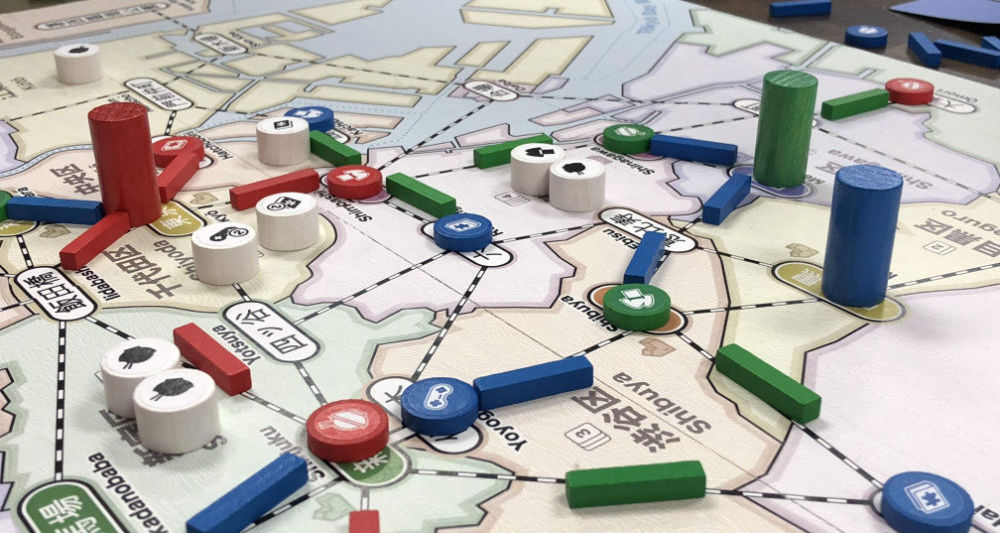

# Introduction

This is the first in a series of short articles about the design and development of **Shinjuku**.

Overall, this series is going to be an amalgam of designer diary entries, a case study and a post-mortem retrospective. The intent is to walk through the entire design and development process, but with a bit of organization added that can only be applied in hindsight.

If you’re unfamiliar with the rules of **Shinjuku**, it is a strategic network-building and pick-up-and-deliver game that plays in roughly one hour.

From a birds-eye view, **Shinjuku** is a game with:

* A map of Tokyo, divided into regions and marked with stations and potential rail connections.
* A deck of cards, where each card identifies a single region on the map
* A set of stores/track for each player to build their rail/shopping empire
* A bag of customers that arrive randomly on the map

The rules ([Quickstart](https://garykac.github.io/shinjuku/docs/shinjuku_quickstart.pdf) and the complete [Rules of Play](https://garykac.github.io/shinjuku/docs/shinjuku_rules.pdf)) and [print-and-play materials](https://garykac.github.io/shinjuku/pnp/index.html) are freely available online, so you can just skip this entire discussion and jump straight to the end.

**_BUT_**

If you’re curious about the game design journey that led to the current state of the game, then you might want to avoid contaminating yourself by knowing too much about how this adventure ends. Or not, your choice.

In this series, I’ll start with the creation of the first prototype and then follow that to the very first “playable” (ha!) version and summarize the changes that were considered as the design progressed. Particular attention will be paid to **why** the changes were considered and also **why** they were ultimately adopted or rejected.

Here are links to the articles so far:

* [Introduction](00-introduction.md)
* [Inspiration](01-inspiration.md)
* [The Design Process](02-process.md)
* [The First Map](03-first-map.md)
* [The Cards](04-cards.md)
