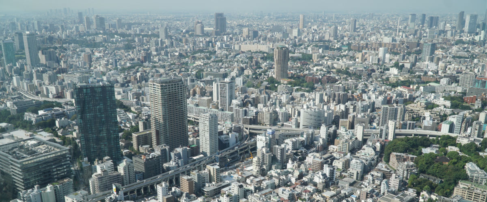
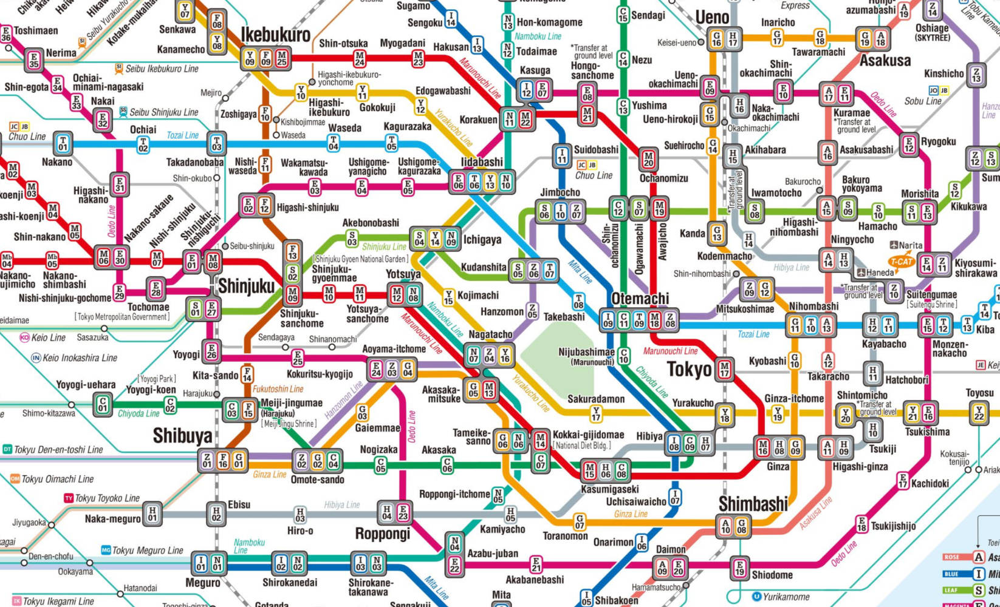
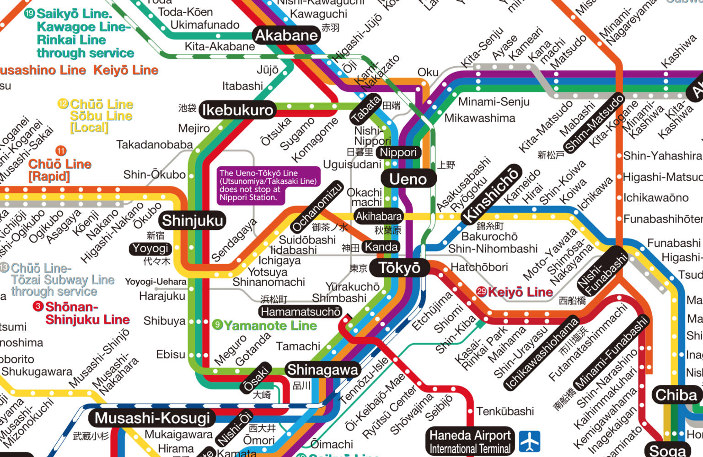
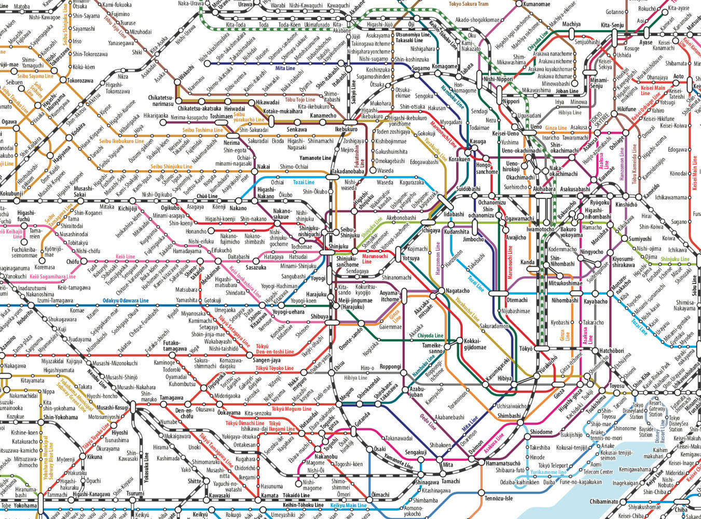
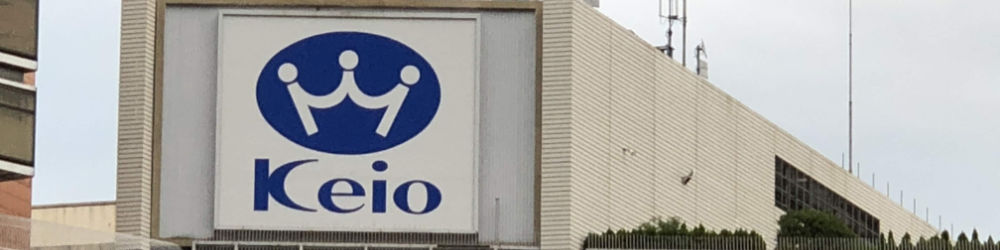
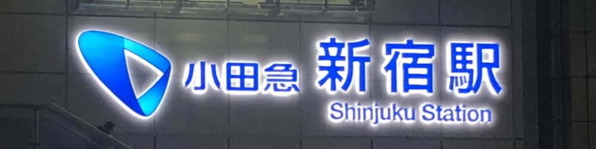
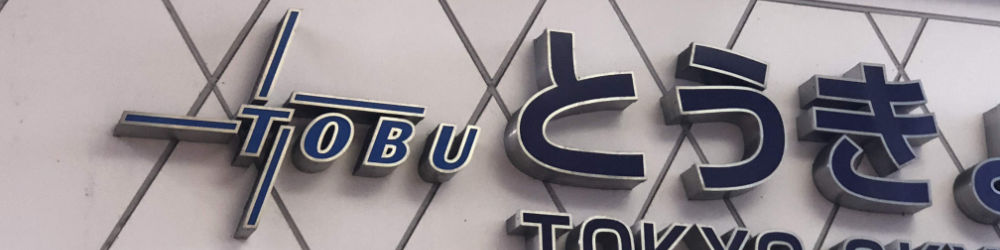

# Inspiration

The core idea for Shinjuku came after a visit to Tokyo. Not on my first visit, of course, because during my first visit I was overwhelmed by the maze of twisty little train connections that connect the city. I wasn't aware and didn’t notice that there was a small set of companies that owned a good portion of not only the rail but also the major department stores.

## Tokyo Metro/Subway/Rail

To get a sense of the rail system in Tokyo, it's useful to start with a map of the Tokyo Metro.

This map shows the 9 [Tokyo Metro](https://en.wikipedia.org/wiki/Tokyo_Metro) lines but it also includes the 4 lines run by [Toei](https://en.wikipedia.org/wiki/Tokyo_Metropolitan_Bureau_of_Transportation), because they have an operating agreement with each other.

But this isn't a complete map of Tokyo's rail because there are also the JR lines. These lines can be found on this map:

But that still doesn't include other rail lines run by [private companies](https://en.wikipedia.org/wiki/Transport_in_Greater_Tokyo#Other_railway_operators_serving_Greater_Tokyo) such as Keio, Odakyu, Seibu, Tobu and a few others. Fortunately, the JR company has a map that combines all of the rail/subway/metro lines together into a convenient (and easy-to-read!) map.

And what's amazing is that they all work together (mostly) seamlessly.

## Tokyo Department Stores

  

The other half of the inspiration came from the department stores. Most of the major train stations have massive shopping centers on top of them with large department stores serving as anchors. The names of these department stores are familiar: the eponymous
 Keio and Odakyu Department Stores, Tokyu Hands, and the Tokyo Skytree (run by Tobu).

I imagine that some of these conglomerates started as stores and then built out a rail network to make it easier for customers, or if they were transport companies that took advantage of the people passing through their stations to open stores. Probably a combination of the two.

## The Game

Once I realized that there were multiple conglomerates that ran competing rail and shopping empires, I knew that could be a great thematic foundation for a game. Players would control one of these conglomerates and the game would take place over simulated decades as the network expanded to cover the city.

But ideas just sit around until something prompts you to act on them. In my case, it was after playing the recent (Aug 2018) Kickstarter release of **Brass: Birmingham**.

“I had an idea for a train game in Tokyo”, I said casually after we finished our game, because everyone in our group always has a half-dozen unfinished game designs floating in their heads.

“You should totally do that”, said Adam, at whose feet you can now totally lay the blame for everything that follows.

_[Ed note: I have no idea if Adam actually said “totally”, but that’s how I replay it in my head.]_

And so it began...
