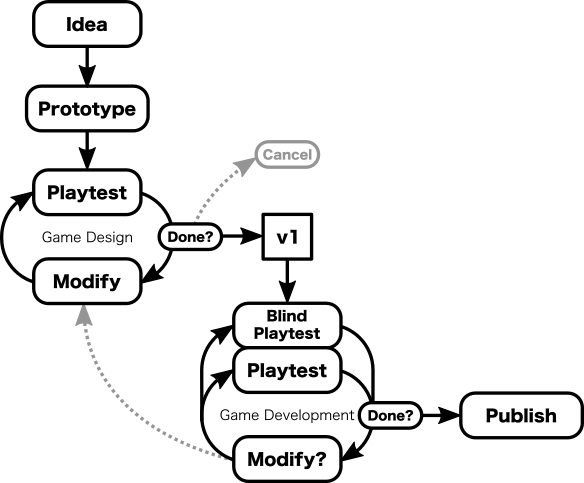

# The Design Process

Before diving into the actual game design, it’s worth stepping back and discussing the overall game design process that is being used. This will serve as a high-level roadmap for the following articles.

Of course, there is no universal "correct" way to design games that works for everyone – each designer has their preferred approach and different approaches work better for different people.

For example, an established game designer with a few published titles might follow a process like this:

While it's not uncommon to see other designers following a more accelerated self-publishing route that minimizes the tedious playtesting requirement.

While there are many variations of the above workflows, there is a general consensus that the approach shown above for the established game designer is a good starting point for a new designer about to create their first game – with the obvious exception of that tricky direct-to-Publisher bit at the end.

This general approach can be summarized as:

Where "Now what?" generally involves creating sell sheets, reaching out to potential publishers, starting a crowdfunding campaign, or posting to game design forums asking how to do any of those things.

This last flowchart is roughly the approach that I took with **Shinjuku**, but because I didn't have a publisher lined up for this game, I felt the need to lay the groundwork in case I needed to publish it myself (while trying to avoid the "Landfill" end-result).

## The Role of the Publisher

It's easy to misunderstand the role of the game publisher as a company that simply slaps some art on the game they receive from the designer and then sells boxes to customers.

A good game publisher will continue working on the game and (if necessary) make changes to increase the game's chance of success in the marketplace.

This additional work is known as "game development" because they are taking the original design and developing it further by making the various modifications necessary for manufacturing, marketing or playability.

## Game Design vs. Development

For the most part, game design and development follow the same process. They both involve making changes to the game and then testing them out to see how well they work. The difference is primarily in how the work is carried out.

During the **Design** phase, you are making a lot of big changes to the game. If you don't do this, then you probably aren't exploring the design space as much as you should be. The game changes being made at this point are large; multiple changes are being made simultaneously; and your motivation for the changes can be based solely on intuition. The goal at this stage is to move through the design space quickly to find the set of rules that is the most fun to play.

A secondary goal of the design phase is to determine if it is worth continuing with the game project. If the game is not going to work, then it's better to cancel the project early – before you've invested too much time/money/effort in it.

The **Development** phase, on the other hand, starts when you've settled on your first "final" set of rules and decided to move forward with the project. This is where the core game is tested on a wider audience and blind playtesting is performed. It is also where smaller changes are tested in isolation. Changes are far less frequent and any change made to the game at this point requires supporting evidence – ideally each change being considered will have multiple playtests associated with it to provide this evidence. The focus at this stage is to refine the game and smooth out any rough edges.

## Shinjuku Design/Development Flowchart

For **Shinjuku**, the process I followed is summarized in this flowchart:

The boundary between design and development is blurry, and it's easy to slide from design into development without realizing it until after the fact. For **Shinjuku**, at one point I thought I had entered the development phase only to realize that I still needed some large-ish changes, so I mentally placed myself back in the design phase. Later on, I entered the development phase but didn't realize it until I noticed that my playtests weren't prompting any changes.

_[Ed. note: Another way of thinking about the transition from design to development is that it is close to the point at which you first say to yourself “Whoa! It’s good enough that I should start a Kickstarter campaign”.]_

Something to note about this flowchart is that it still ends with the poorly-defined "Publish" task. That's because this chart focuses on the tasks related to taking a game design to the point where it is good enough to be published. The actual process of finding a publisher is outside the scope of these articles, so I consider getting to this "Publish" node to be my end-goal.

## Shinjuku Changes over Time

This figure shows the week-by-week timeline that Shinjuku followed, calling out the different phases and plotting the number of rule changes and playtests conducted each week. The dotted line around week 28 shows the (guesstimated) point at which the game switched from design to development.
 
For **Shinjuku**, the initial game design phase was about 8 weeks (23 playtests). At this point, the game felt complete, but as you can see from the above chart, there were still plenty of additional improvements to be made.
