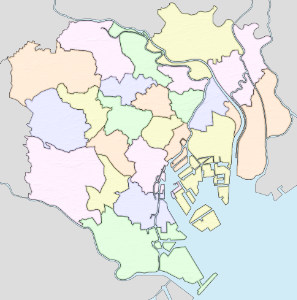
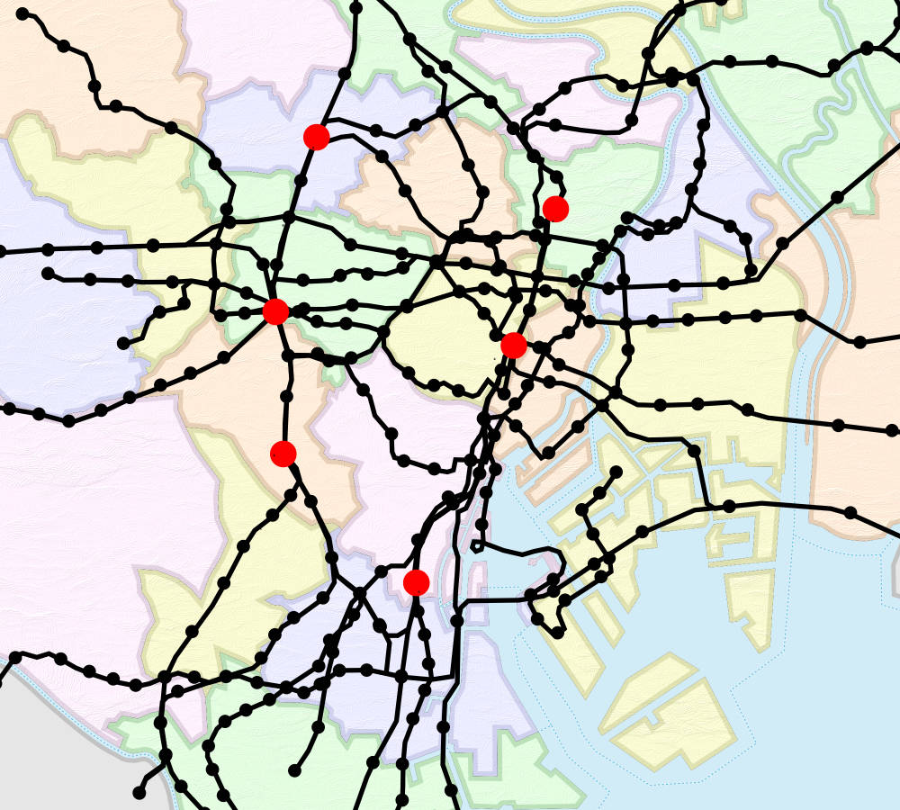
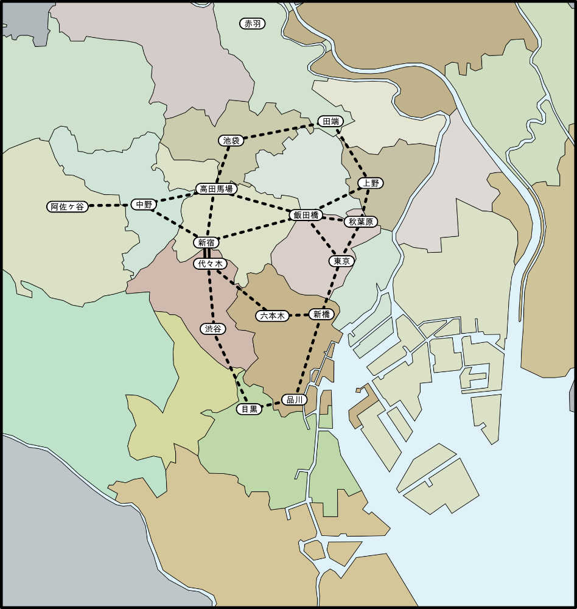
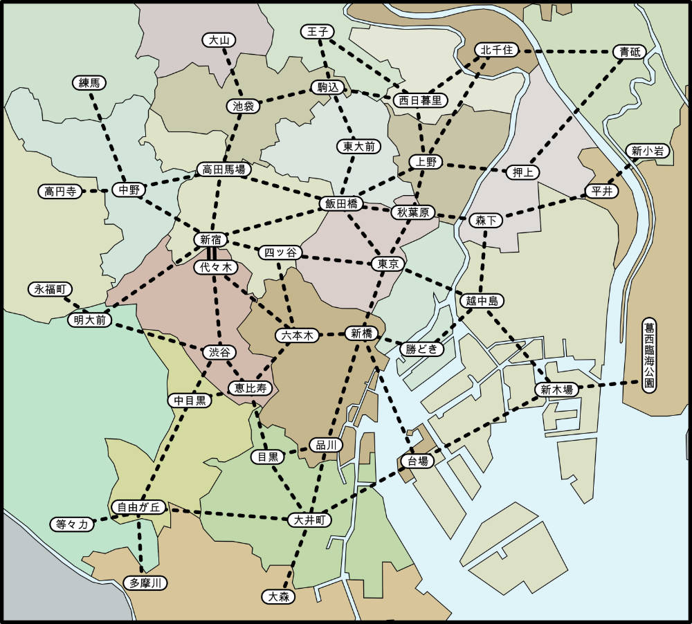
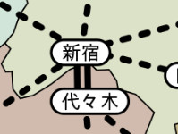
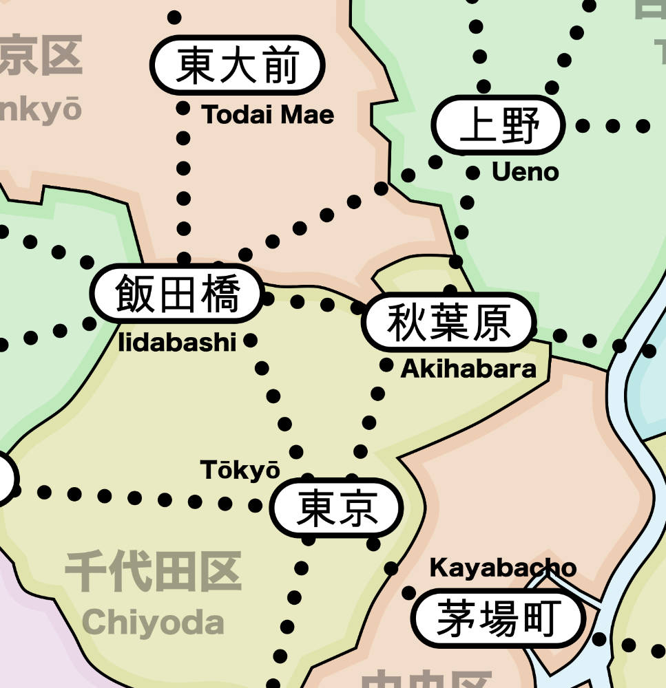

# The First Map

I'm a big proponent of keeping the initial prototype as simple as possible, both in terms of the rules that are being tested and also the components used.

But I'm terrible at actually following through with this.

There are two basic reasons why you want everything to be fast and simple at the early design stage:

* You don't want to get attached to rules or components too early.
* You don't want playtesters to get the impression that the game is more complete than it actually is.

## Don't get too attached

_“Kill your darlings, kill your darlings, even when it breaks your egocentric little scribbler’s heart, kill your darlings.”
― Stephen King, On Writing_

King's comment was in reference to writing, but it applies to almost every  creative process. The more you spend tweaking that clever little mechanism in the rules or crafting those beautiful components, the more you will get attached to them. And as you grow more attached to them, you will keep trying to make them work long after it's obvious (to other people) that they're dragging the game down.

## Don't make it look done

With respect to the components at this stage, the more finished the prototype looks, the higher the expectations of the people playing the game. If you have beautiful components but bad rules, it will come across as a finished game that is simply bad. But if it's taped together and uses components borrowed from other games, then it reminds people that this is a work in progress.

This is similar to the approach used by architects when they present early work to clients. Even if all the preliminary work is done on computers, the client is still shown rough sketches (often computer-generated) to underscore that the project is not done and is still open to modifications.

## Do As I Say...

"Do as I say, not as I do" because of course I spent too much time making the initial map.

But my rational was as follows: If I was only concerned about a generic game with trains and stores, the right course of action would be to scribble out a simple map and start working on the rules. But I wanted/needed this game to work in Tokyo, with a somewhat-accurate set of train stations and rail. Because of this, I felt it was important to start with a (mostly) accurate map.

I was also concerned about the number of stations that I would need on the map. My plan was to have a deck of cards where each card represented a single location on the map. But there are hundreds of stations in Tokyo, and even if I chose  subset, it felt like it would require too many cards to have 1 card = 1 station.

Fortunately, the government of Tokyo divides the central core of the city (technically a "metropolis") into [23 special wards](https://en.wikipedia.org/wiki/Special_wards_of_Tokyo), which seems like a more manageable number.

But how can I confirm that 23 regions a good number? Clearly I needed to create the game and playtest it, but before that I could look at existing games as a point of comparison:

* Risk divides the map into 42 regions
* Brass: Birmingham has cards for 19 locations (+ a few around the edge)
* Power Grid maps have 40-something cities
* Ticket to Ride maps tend to have between 35 and 45 cities.

Another consideration is that, unlike cities in Europe, the layout of Tokyo will be completely new to most first-time players of the game. This means that there's a higher risk of player frustration if they have to spend a lot of time searching for unfamiliar locations on the map.

So, having cards for 20-ish regions and having a network of around 40 stations seems like a reasonable starting point for the map.

## Choosing Stations

Using the wards of Tokyo gave me more flexibility when choosing the number of stations, but it did mean that I needed to figure out which ward "owned" each station. If you look back at the train maps, it's pretty obvious that they are distorted representations of the actual layout. While these maps are great references for connectivity, I needed to plot each station onto an actual map to determine where they belonged.

Here is an (incomplete) map of the rail lines with the stations placed in their actual (close enough) locations.
A few rail lines are missing from this map (for example in the lower left side), but it was at this point that I felt I had enough to start choosing the stations for the map (or, more likely, I just got tired of adding more dots to the map).

The question now is: Which stations should be included?

Fortunately, Tokyo has a well-known train line that forms a ring around the core of the city. The [Yamanote line](https://en.wikipedia.org/wiki/Yamanote_Line) contains the majority of the major train stations in the city and is a standard reference in Tokyo (even though it's a JR line, it is typically present on non-JR train maps).

Along the Yamanote, there are 6 stations that are highlighted on the JR maps: Shinjuku, Ikebukuro, Shibuya, Tokyo, Shinagawa and Ueno (these are shown as red dots on the map above). Three of these (Shinjuku, Ikebukuro and Shibuya) are the top three busiest stations in the world and the others are in the top 10, so these are great starting points for the map.

Following around the Yamanote, I added other major stations to connect the loop and then started working outward. New stations were added based roughly on the number of passengers while making sure that each ward had at least one station. Priority was given to stations that connected multiple rail lines.

Another constraint was that I couldn't place the stations too close together since I needed to keep room for a rail token that would be placed between them during gameplay. Because of this, there are some very large stations in Tokyo that are not included on the map because they are overshadowed by nearby stations that are even larger.

There isn't a single company that runs all the rail in Tokyo, so it shouldn't be too surprising to learn that there isn't a definitive list of busiest stations. Here are the top Tokyo entries from two lists that were compiled at different times (2008 vs 2013) and from different data. The entries in (parentheses) are stations that are *not* included on the **Shinjuku** map (see notes after table).

| [2008](http://d.hatena.ne.jp/keyword/%B1%D8%CA%CC%BE%E8%B9%DF%B5%D2%BF%F4%A5%E9%A5%F3%A5%AD%A5%F3%A5%B0) | [2013](https://japantoday.com/category/features/travel/the-51-busiest-train-stations-in-the-world-all-but-6-located-in-japan) |
| --------------- | --- |
| Shinjuku        | Shinjuku |
| Ikebukuro       | Shibuya |
| Shibuya         | Ikebukuro |
| Tokyo           | Kita-Senju |
| Shinagawa       | Tokyo |
| Takadanobaba    | Shinagawa |
| Shimbashi       | Takadanobaba |
| Ueno            | Shinbashi |
| Kita-Senju      | Akihabara |
| (Hamamatsucho)  | (Yurakucho-Hibiya) |
| Akihabara       | Meguro |
| (Ayase)         | (Daimon-Hamamatsucho) |
| Meguro          | Ueno |
| (Yurakucho)     | Oshiage |
| (Yoyogi Uehara) | (Tamachi-Mita) |
| (Gotanda)       | (Ayase) |
| (Kamata)        | (Yoyogi-Uehara) |
| Nakano          | (Gotanda) |
| Naka-Meguro     | Oimachi |
| Ebisu           | Nakano |
| Nishi Nippori   | (Tachikawa) |
| Iidabashi       | Iidabashi |
| Oimachi         | Nishi-Nippori |
| Yotsuya         | Nakameguro |

Note the following:

* (Hamamatsucho) Skipped because it's located between Shimbashi and Shinagawa and not enough room on the map
* (Ayase) Removed because it's off map to north past Kita-Senju
* (Yurakucho) Skipped because it's too close to Tokyo station
* (Yoyogi Uehara - no interesting connections, name confusable with Yoyogi
* (Gotanda) Not enough room on map between Shinagawa and Meguro
* (Kamata) Removed because it's off map to south past Omori

In the end, 41 stations were selected to include on the map.

## Choosing Connections

When selecting stations, I needed to take the network connectivity into account. Fully connecting each station to its nearest neighbors (using a [Delaunay triangulation](https://en.wikipedia.org/wiki/Delaunay_triangulation)) would have far too many connections for a good game – it would be too easy to route around opponents. I also wanted the connections to reflect the actual rail lines in Tokyo.

So when I was choosing stations, I was following out the major rail lines and looking for stations that connected to other lines. As I moved out from the central core of the city, it sometimes became hard to find a station with the perfect connections, so there were a few cases where I needed to merge the connections from 2 adjacent smaller stations into a single station on the map.

## Making Shinjuku Special

One last thing I wanted to do was to give some special status to Shinjuku station – the busiest train station in the world and the game's namesake.

For the past decade (or so it seems), Shinjuku station has been expanding southward by covering over some of the tracks leading into the station and then building on top of them. This is a convenient way to recapture "lost" real estate in the city and resulted in the opening of the Shinjuku New South Gate and bus terminal in 2016.

In my mind (and to be clear, this is my imagination working here), Shinjuku will continue this southward expansion until it eventually merges with and consumes Yoyogi station.

So, to reflect this growth of Shinjuku station and to call it out on the map as someplace special, I added a permanent connection between Shinjuku station (in Shinjuku ward) and Yoyogi station (in Shibuya ward).

## Finishing Touches

Now that the stations were selected and the connections completed, I zoomed in and cropped off the outer parts of the map.

The final step was to add the station names written in latin script so that people could more easily identify and pronounce them.

With the map done, I now needed to work on the cards.
