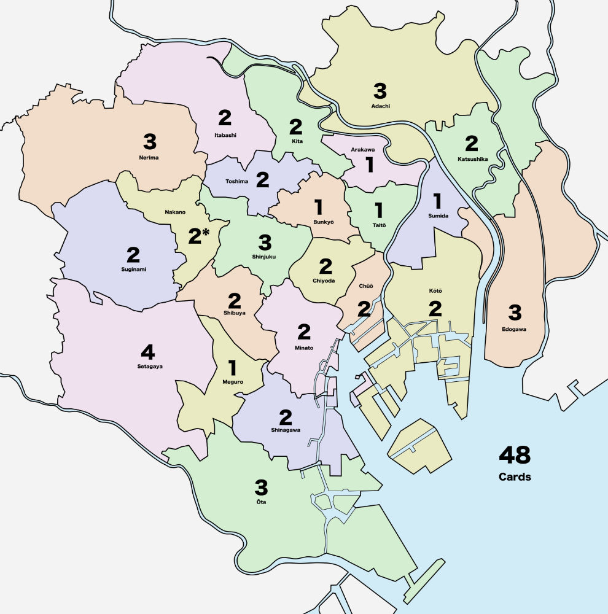
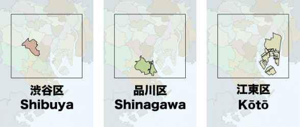

## The Cards

Since the cards only need to identify a region on the map, all they really need to be is the name of the region. But I still needed to figure out an appropriate distribution.

An advantage of using official divisions like the 23 wards is that the government publishes population and demographic statistics about each region. And I could use that information to determine the distribution of cards in the deck.

Using information from the Statistics Bureau of Japan (see [Table 1-3 in their population census data](https://www.stat.go.jp/english/data/kokusei/2000/jutsu1/00/01.html)), I took the average of the daytime and nighttime population of each ward and then scaled the numbers (by dividing by 200,000) to have 48 cards.

Why 48? I was printing these on 8.5x11 sheets of paper with 8 cards per page. Six pages gives me 48 cards, which is close enough to a regular deck of playing cards for a good starting point.

| Ward       | 　　　　 | Daytime | Nighttime | Avg     | # Cards |
| ---------- | ------- | :-----: | :-------: | :-----: | :-----: |
| Chiyoda    | 千代田区 | 855,000 |   36,000  | 445,500 |    2    |
| Chūō       | 中央区　 | 648,000 |   72,000  | 360,000 |    2    |
| Minato     | 港区　　 | 838,000 |  159,000  | 498,500 |    2    |
| Shinjuku   | 新宿区　 | 799,000 |  286,000  | 542,500 |    3    |
| Bunkyō     | 文京区　 | 343,000 |  176,000  | 259,500 |    1    |
| Taitō      | 台東区　 | 318,000 |  156,000  | 237,000 |    1    |
| Sumida     | 墨田区　 | 258,000 |  216,000  | 237,000 |    1    |
| Kōtō       | 江東区　 | 455,000 |  377,000  | 416,000 |    2    |
| Shinagawa  | 品川区　 | 479,000 |  323,000  | 401,000 |    2    |
| Meguro     | 目黒区　 | 267,000 |  239,000  | 253,000 |    1    |
| Ōta        | 大田区　 | 656,000 |  650,000  | 653,000 |    3    |
| Setagaya   | 世田谷区 | 707,000 |  797,000  | 752,000 |    4    |
| Shibuya    | 渋谷区　 | 550,000 |  196,000  | 373,000 |    2    |
| Nakano     | 中野区　 | 272,000 |  310,000  | 291,000 |    1    |
| Suginami   | 杉並区　 | 427,000 |  520,000  | 473,500 |    2    |
| Toshima    | 豊島区　 | 409,000 |  248,000  | 328,500 |    2    |
| Kita       | 北区　　 | 309,000 |  327,000  | 318,000 |    2    |
| Arakawa    | 荒川区　 | 176,000 |  180,000  | 178,000 |    1    |
| Itabashi   | 板橋区　 | 471,000 |  512,000  | 491,500 |    2    |
| Nerima     | 練馬区　 | 507,000 |  654,000  | 580,500 |    3    |
| Adachi     | 足立区　 | 535,000 |  616,000  | 575,500 |    3    |
| Katsushika | 葛飾区　 | 345,000 |  421,000  | 383,000 |    2    |
| Edogawa    | 江戸川区 | 503,000 |  619,000  | 561,000 |    3    |

Actually, if you add those numbers up you'll see it's only 47 cards. I gave the extra card to Nakano because it was the closest to the chosen cutoff values. There. 48 cards.

When calculating these values I initially tried to use just the standard "nighttime" population (representing people who actually live in that ward), but that produced skewed results for places like Chiyoda, which hosts the Imperial Palace and as a result has very few people actually living there.
Using only these nighttime population figures, it would have required a very large number of cards to have an appropriate ratio of cards for each ward. As an example of this problem, Setagaya (the most populated ward) would have required ~24 cards for every 1 Chiyoda card.

Using only nighttime population has the additional problem that it ignores the large number of people who commute to work and shop around the city. These people are important thematically in **Shinjuku**, so using a combination of daytime and nighttime population felt appropriate.

For the actual cards, technically all I needed was the name of each ward on the card. But I knew that most players would be unfamiliar with the layout of Tokyo and would need to spend time scanning the map for each location. And I didn't want that to affect the playtests.

Fortunately, because I had already created the map, I could simply shrink it down and place it on the card, highlighting the named ward on the card to make it easier to find. I added a rectangle to represent the boundary of the game map and let the map bleed out to fill the entire card.

## Waiting for Other Game Components

It would probably have been cheaper and faster to steal components from another game or two, but my fear with that is that the components will never make it back to their rightful boxes. Because of this, I tend not to scavenge parts from other games unless I'm going to get rid of the game. But then I have a different problem  in that I can't give/sell the game to someone else because it's missing pieces, and I'd rather not toss otherwise-good stuff in the garbage.

In practice this means that I tend not to borrow components from other games at all. Instead, I have built up a reasonably large (unreasonably, some might say) set of various pieces that I use only for game design and development.

But in this case, I didn't have the set of size/colors that I wanted for this prototype, so I needed to order some components.

And if I'm going to order components, I might as well have then make some cards while I'm at it. I didn't expect the cards to change very much and I generally prefer to play without card sleeves.

This is relevant because I designed for 48 cards, but [PrintPlayGames](https://www.printplaygames.com/) (where I was having the cards printed) only does increments of 18. That means I now had 54 cards, 6 of which were blank on the front. But that's OK – maybe I can find a use for those cards later.

As an aside, if you were hoping to find in these articles tips about the cheapest way to prototype your game, then you should prepare yourself for disappointment. While I love the process of crafting physical components, I love doing it exactly **once** (or maybe twice). After that, it starts to become tedious. As long as the time vs. money trade-off is reasonable, I will gladly throw a bit of money at a company/person to offload some of the work, especially if they can do a better job. I have enough of my time occupied doing tasks that I can't offload, so this allows me to move forward more quickly than if I had to craft everything myself.

I'm in a fortunate situation because I live in the Seattle area and PrintPlayGames is based in Vancouver (no, not [**that** one](https://en.wikipedia.org/wiki/Vancouver), [**this** one](https://blogs.scientificamerican.com/rosetta-stones/the-cataclysm-vancouver-vancouver-this-is-it/)). Being in the same state means that I typically get a 4-day turnaround between when I order and when it arrives at home.

## Putting it all together

I printed the map image onto 6 sheets of paper, taped them together, and then waited for the cards and other components to arrive.

The prototype would be functional and would have enough detail to play the game, but I didn't spend any time cleaning up the map to make it look pretty – no drop shadows or insets, and simple dotted lines for the rail connections.

And because I created the source images myself, it would still be very easy to change anything if needed.

Now I just need a set of rules...

_Next article: [The Initial Playtest Version](05-initial-rules.md)_
