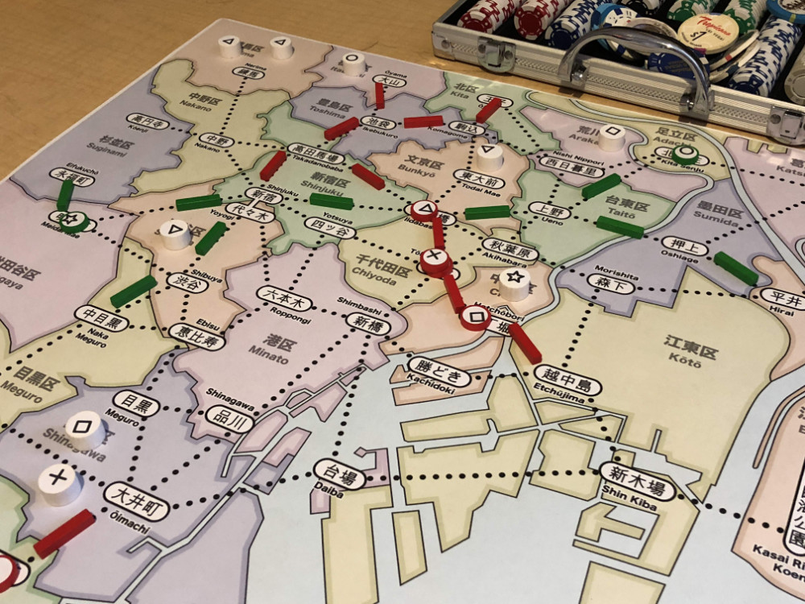
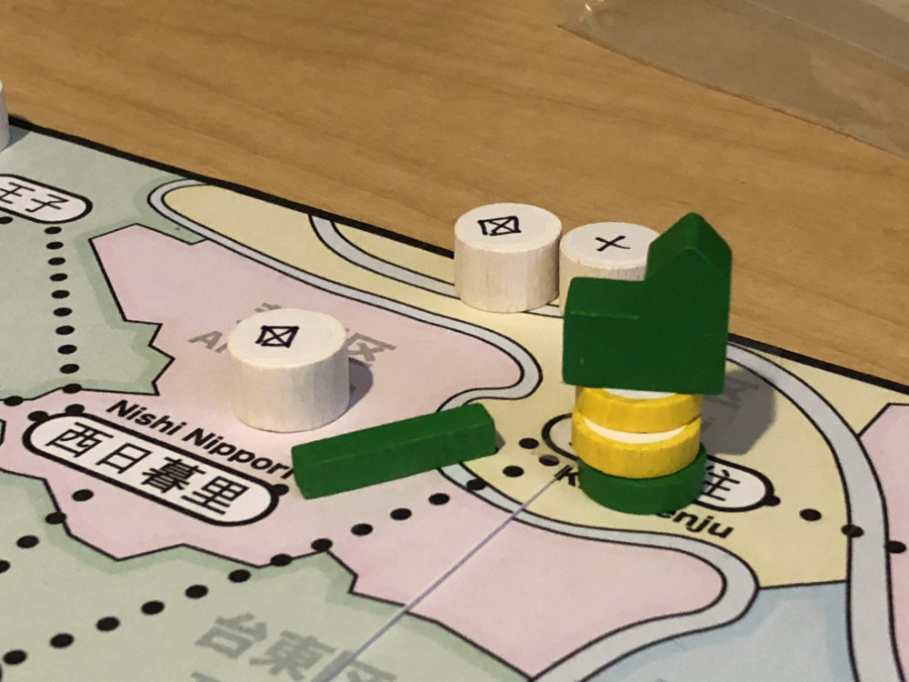

# Initial playtest version

_AKA: Does this game even work?_

Creating the first set of playable rules for a game is challenging because that's the first time that the great abstract idea you have in your head smacks into the brick wall of reality.

As you add details to make the game playable, you realize that the elegant version you imagined starts to look a bit more mundane. In fact, I've seen many game designers hold back at this point because the game isn't yet "good enough to show people". Their plan is to toil away on the game in isolation until the game achieves this magical "good enough" rating.

But this is a mistake. 

It's important to get a version out in front of other people as soon as you can. Ideally people that understand the game design process and are tolerant of half-baked ideas.

And this is where I was with **Shinjuku**. I needed to create an initial version that was playable so that I could get feedback, all the while knowing that this "playable" version would be terrible and that feedback would be harsh. But it's an important step to go through so you can determine if there is any "fun" to be found in the game. It there isn't an element of fun even in the terrible version, then it's probably best to shelve the idea entirely and move on.

As an aside, it's a bit embarrassing for me to present the game in this state because while it's "good enough" to show my playtest group, it's clearly not a good game to show off more broadly. At the time, I wasn't sure what would work and what wouldn't, and I needed to get it on the table to be able to see the flaws clearly. I certainly don't consider this initial version to be an example of a good game design. I'm including these details here primarily in the interest of properly documenting this as a case study, and also so that I can discuss the reasons why certain changes were made.

I'm frustrated when I read design "diaries" that can be best summarized as "It was bad. I made it better. Here it is." I want to know **why** it was bad and **how** you made it better. I want to know about things that **didn't** work as much as I want to know about the things that did work.

And in order to do that, I need to show you the terrible place that I started from. So here it is.

## Goals

The first version of **Shinjuku** needed to be a basic test of the core ideas:

* A map divided into regions, each of which contains multiple stations
* A set of cards that each identify a single region.
* Each player manages a rail and shopping conglomerate
* Customers arrive on map and you want to move them to your stores.

Beyond this, I needed the player to be able to perform standard actions like:

* Build stores
* Upgrade stores (to department stores)
* Expand track
* Move customers

And thematically, I wanted:

* **Player networks**, where players build out a connected series of rail lines.
* **Regional specialization**, where one station becomes the best place to go for a particular good. Like how Akihabara is known for electronics, but I wanted this to happen organically so it would be different for each game.

From a game mechanics perspective, I wanted:

* light to mid-weight rules complexity
* strategic decisions when building the network and stores
* roughly 60 minute game time
* support 2-5 players

Most of these goals were simply a reflection of games that I like to play. The 60 minute game limit was self-imposed because my playtest group often plays during lunch, so a game that fits in 60 minutes could be tested more thoroughly/frequently.

## Rules

Given these requirements, I needed to settle on the simplest set of rules possible that allow the game to be played. Most of the choices made at this point, like how many and what kind of customers or stores to include, are based on nothing more than a gut feeling of what seems somewhat reasonable. Often they are influenced by the game I played most recently with a similar mechanism. The expectation is that most of the choices made here will change based on actual testing.

I recently had the opportunity to chat with Martin Wallace and mentioned that I used elements of **Brass** when creating the initial prototype of this game. He responded that he does something similar with his early prototypes. As the game develops and takes on its own character these borrowed elements fade away, but in the early stages of design they are useful placeholders that allow you to move forward.

Here is the set of rules that I used for the first playtest. It will serve as a starting point for the discussions that follow:

```
Components for Initial Version of Shinjuku:
   • 1 map of Tokyo divided into 23 wards
   • 1 deck of 54 cards : 48 location cards + 6 blank wild cards
   • 1 bag of 25 customers (5 each 5 customer types : ◯ ⤫ △ ▢ ☆)
   • Per player:
      • 20 stores (4 each 5 store types : ◯ ⤫ △ ▢ ☆)
      • 20 track
      • 3 dept stores
   • Poker chips for money
 
Each player starts the game with a hand of 3 cards and ¥25.
 
Each turn of the game:
   • Place a customer:
      • Randomly draw card and customer, place customer in location
   • Take an action:
      • Build new store:
         • Pay ¥5 + card to build store
         • Either in card location, or connecting to your track
      • Upgrade existing store:
         • Pay ¥5 + card to upgrade existing store in that location
         • Upgrade is placing another store of same type on top of existing store
         • The 3rd upgrade is to a department store
      • Expand track
         • Pay ¥1 + any 1 card
   • [Optional] Move customers along track to stores (if possible)
      • (see details below)
   • Draw a card into hand

The game ends when the last customer is placed and everyone gets one final turn.
The player with the most money wins the game.
```

The Move action is also a critical part of the game:

```
Moving Customers
   • Choose a single region with customers
   • Each customer must go to the largest store that matches
      • If tie, player may choose
   • You must move (and match) all customers
   • Customers may not pass a smaller matching store on the way
   • Each store matches 1 customer
      • Upgraded stores match multiple customers (one per store)

When customers are moved, store and track owners are paid:
   • ¥1 (from bank) for each segment of track used
   • ¥5 (from bank) for each store that matches a customer
```

A scoring example: If 2 ◯ customers land on a stack of 3 ◯ stores (2 red, 1 blue), then the Red player would get ¥20 (= ¥5 * 2 customers * 2 stores) and the Blue player would get ¥10 (= ¥5 * 2 customers * 1 store).

## Why

Where did these rules come from?

* The map layout and card counts were discussed previously
* 25 customers seemed like a good starting amount with 5 each of 5 different types
* 20 track so that a 2 player game can fill roughly half of the available connections on the map
* 4 stores of each type because you need to stack 3 stores of the same type to upgrade to a dept store
* 3 dept stores because I thought players would typically build 2 and wanted a bit of headroom
* Poker chips are unbounded because I had no idea how much money would be needed
* Paying ¥1 for track and ¥5 for stores seemed like a reasonable ratio
* Paying a card (any card) to build track was something from **Brass** that allows players to shed cards they don't want from their hand

## Player Networks



To reinforce the theme of building rail lines, I wanted the game to encourage connected networks. To push the players in this direction, the rules require that new stores be built either:

* in the location that matches the card, or
* in a station connected to your track (in which case, the location on the card is ignored).

Similarly when adding new track – it must build out from your existing stores or track. The reasoning behind this is that network connectivity is encouraged by making it easy to extend from existing structures, but you always have the option to start a new network by building a store based on a card in your hand.

## Regional Specialization



For regional specialization, players can upgrade stores by stacking another store of the same type on top of an existing store. Stores can be upgraded 3 times (final upgrade is to a department store). Players can build on top of other player’s stores to have a shared investment in a station.

## Does it work?

So, does it work as a game? Well, yes, for the most part. It is certainly a game that can be played and it does present the players with some interesting decisions and puzzles to solve.

But there are also a number of obvious problems with this ruleset, chief amongst them are:

* When there are stores from multiple players in a station, what happens when it is upgraded to a department store? And who gets the customer?
* What happens if you lose all your money? How do you get back in the game?
* Your rail network can be blocked from expanding once all of the link out of a station are filled. While you can expand from other stations in that network, or build a new store and start a new network, it can still be frustrating to be blocked like this. This problem is more of a concern with higher player counts.
* Is there too much track for a 4 or 5 player game?

So how can these problems be fixed? Now’s when the playtesting fun begins.

Spoiler alert: the only part that makes it through this process unscathed is the map of Tokyo.
