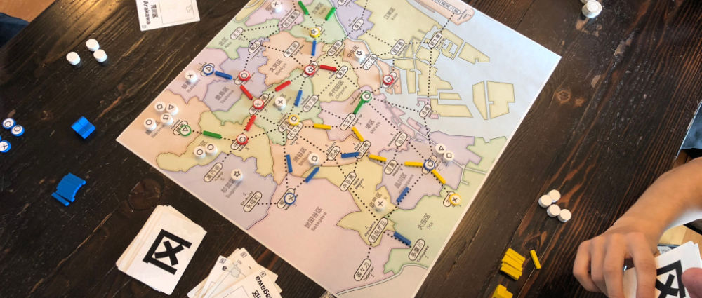
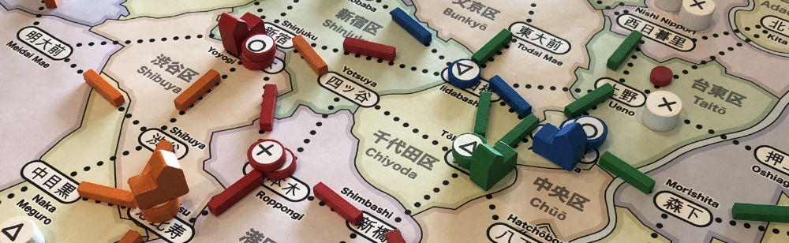
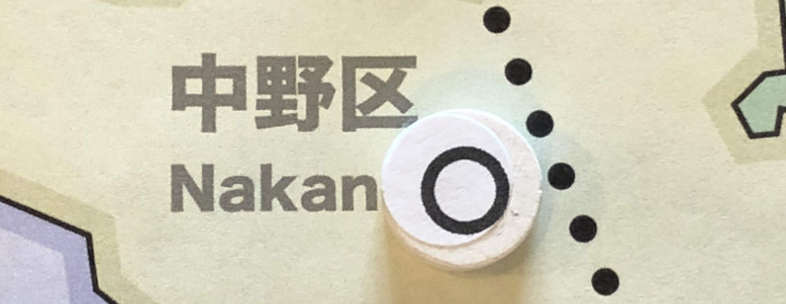
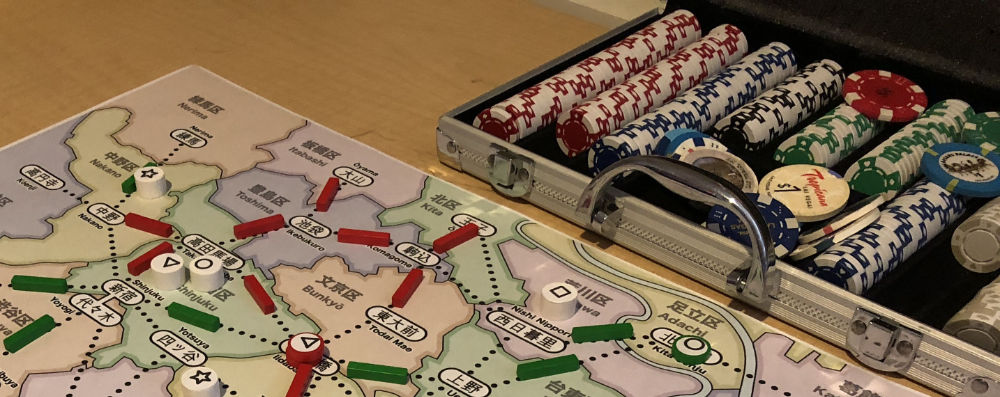
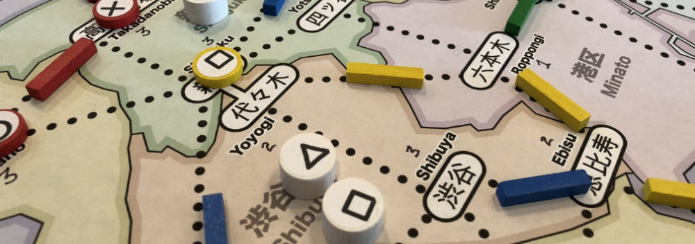
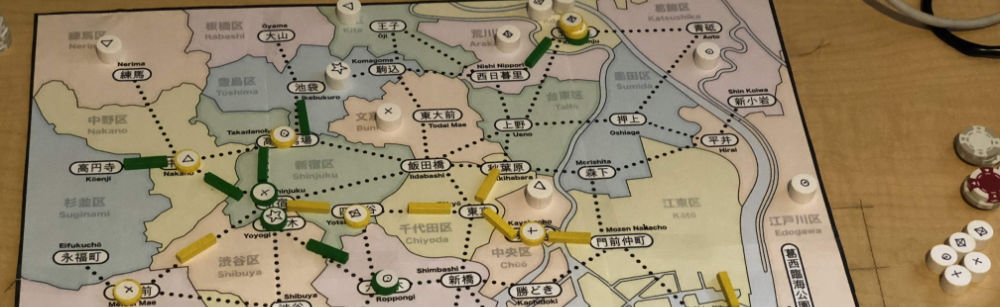

# The First Week of Playtests

_Game Design Rule #4: Double it or cut it in half. You are more wrong than you think. – Sid Meier_

Once the prototype was built, I ran it through 6 playtests over the following week: a variety of 2-, 3- and 4-player games with 5 different players (including myself).

During these first tests, I was still making big changes based mostly on how the game felt while being played.

## Game Changes

Because there were so many changes during this week, the changes here are grouped by type rather than the exact order in which they were made. Each change is accompanied by a brief note describing what motivated the change and the result.

### Store/upgrade/track

**_Change_**: Raise the cost of stores/upgrades/track: Stores cost ¥10, upgrades cost ¥20 and track costs ¥2 (pay out remains the same). Later, these upgrade costs were raised to ¥20/¥40/¥80.

* Why? The initial cost felt too low in the playtests so keep doubling the values to see how that works.

**_Change_**: Allow 2 pieces of track to be built at the same time for ¥16.

* Why? Requested by a playtester. Paying a lot to get track built faster feels good (as a player) if you have the money for it. It can result in a single big move instead of taking 2 smaller actions for the same result.

**_Change_**: Reduce player components to: 15 stores (3/type), 2 dept stores, 15 track

* Why? Component limitations force the player to be more careful with how they spend their resources. Too many available resources and the game decisions are less interesting.

**_Change_**: Make department store the 2nd upgrade (instead of 3rd)

* Why? It took too long in the game to get to the third upgrade. With fewer stores available, it’s harder for a player to commit the 3 matching stores required for a department store upgrade. This makes higher-level upgrades more achievable.

### Department Stores

**_Change_**: Department stores can match 2 of any customer type, except for the type that the dept store was upgraded from

* Why? I don't know. This was a terrible idea. I think it was trying to be a clever little puzzle, but it was just confusing and required that you track the previous store type on the map.

**_Change_**: Department stores can match 1 of any customer type.

* Why? OMG. So much better.

### Customers

**_Change_**: Increase number of customers to 40

* Why? Game was too short with 25 customers and players needed more time to build an engine on the board.

**_Change_**: Change customer distribution to 10/9/8/7/6 of each type: ◯ ⤫ △ ▢ ☆

* Why? Makes it more interesting when deciding which customers to take. Customers are no longer “all the same”. ◯s are the most common and ☆s are the least.

### Moving Customers

**_Change_**: Rather than forcing customers to go to the largest store globally, customers must go to the largest store that they are is connected to

* Why? To avoid a degenerate scenario that occurred in one playtest:
	* If a player manages to build a department store that is separated from the rest of the board, it can effectively break the game for the other players. Because the department store dominates (so everyone needs to go there), but it's not connected (so not everyone can get there), the other players might be blocked until it is connected or a competing store is built.

**_Change_**: You don't need to match all customers when moving, but you do need to move them all. Any unmatched customers are dropped in the final location

* Why? This makes it easier to move customers on the board. It also makes the customer position on the map more interesting (since they can be dropped in a new location).

### Turn structure

**_Change_**: Place customers on map at end of turn (rather than start)

* Why? The plan here was to have the customer draw serve as an indication that the next player can start their turn. However, in practice, having it at the end meant that players were more likely to forget to place a customer.

**_Change_**: Make “Move Customers” a separate action

* Why? Having to spend an action to score points simplifies the turn rules (by removing the optional step) and serves as a catch-up mechanism for players who are not scoring as often.

**_Change_**: Give players two actions per turn

* Why? This speeds up the game by giving more actions and allows the player to plan bigger moves. Combined with changing Move to be a separate action, this is roughly the same as the old "take 1 action; optionally Move customers" rule if you were moving customers on that turn, but it is strictly better if you were unable to move customers.

### Initial Setup

**_Change_**: Seed 2 customers on map on each player’s first turn.

* Why? Make the first few turns more interesting without giving the first player a large advantage. But this adds a bit of additional rule complexity, and I'm not convinced it's worth it.

**_Change_**: Give each player a starting location on the map

* Why? Players need to build a store on their first turn, but are constrained by the cards in their hand. Why not just skip that formality and put players on the map immediately. In practice, this felt too random and players felt like they weren't in control.

**_Change_**: Players get a free store build anywhere on map on first turn

* Why? Players need to build a store on their first turn, but are constrained by the cards in their hand... and having assigned starting positions felt bad (random). But there's probably a better way than having this additional rule.

### Money

**_Change_**: Allow loans from the bank when players run out of money. Borrow 10 and pay back 1 interest each turn until it can be paid off.

* Why? Because money is required to build or expand, the game needs a way to get players back in the game when they run out of money. Building 2 stores and some track depletes all of a player's money, and then they're stuck waiting for a customer to happen by.

### Cards

**_Change_**: Remove explicit wildcards

* Why? The wildcards are nice when you draw them into your hand, but the deck is also used to randomly place customers on the map and the “where should I place this customer?” decision slows the game down too much.

**_Change_**: Allow players to play doubles as a wildcard

* Why? Even though wildcards as separate cards have issues, wildcards themselves are rather useful and this increases the likelihood of having a wildcard in your hand. More wildcards = more flexibility to plan something interesting. Unfortunately, not every card has a double in the current deck, so this change didn't have a noticeable impact.

**_Change_**: Allow discarding when drawing cards

* Why? If you don’t like the cards in your hand, this allows you to try for a better set of cards when you draw cards back into your hand.

### Map

**_Change_**: Restrict max store height (from 1 to 3) at each station

* Why? Only allowing big stores near the center of the map (in the busiest train stations) forces players to invest more heavily there. This results in more interaction and competition for these spaces.

### Endgame Scoring

**_Change_**: Customers collected give scoring bonus

* Why? Scoring based solely on the amount of money reduces the importance of customers. In fact, it would be nice not to use money at all in final scoring.

**_Change_**: Don’t score stores and rails

* Why? Rail already pays out during the game, so there's no need for an endgame bonus. It’s more interesting to score indirectly (through customers). Contrast this with **Brass**, where rail doesn't pay out during the game, so it pays an endgame bonus based on the values of the cities it connects.

## Summary (after week of playtesting)

Overall, the game plays reasonably well and is steadily improving. It is definitely worth continuing even though there are serious issues remaining.

The big remaining open issues are:

### Cards

* Sometimes players don’t have good cards in their hand. I need to find a better solution to this problem.
* Cards don’t matter except for building new stores. How can they be made more relevant?

### Money

* Money is tedious to manage, especially with the tiny payments for each track.
* Loans feel terrible. It’s not nice to smack players when they are already struggling.

### Scoring

* Should be based only on the customers, but how?
* Is it better to have geometric scoring (to encourage more of the same type) or set collection (to encourage a balance of types)?

## The Plan (for the next round of playtests)

* Generate new deck of cards (with more cards)
* Draw 5 cards into hand (instead of 3)
* Remove money (and replace it with... something)
* Make cards more useful
* Settle on a mechanism for endgame scoring customers
