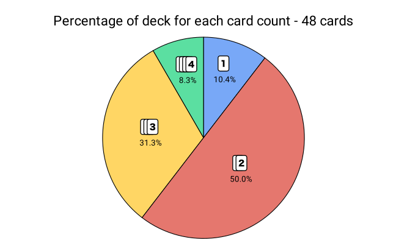
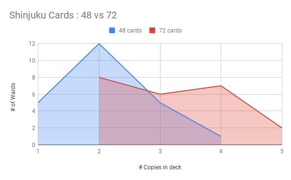
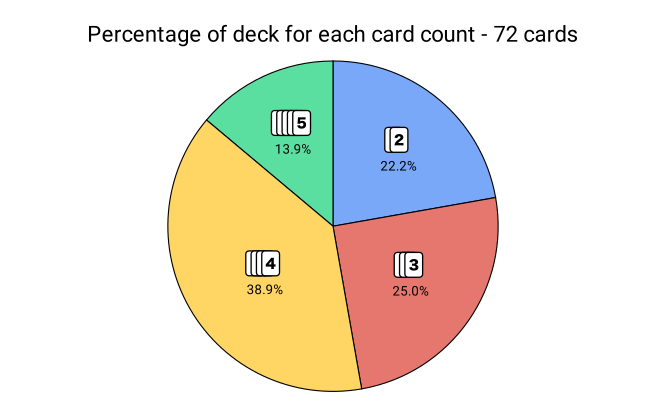

## New Card Distribution

Having only 48 cards (for 23 regions) was a bit limiting because it did not allow a lot of variation between the most and least populated wards. In addition, the majority of the deck (~60%) of the cards were "low count", with only 1 or 2 cards of each, rather than "high count", with 3 or 4. The higher count cards feel more useful in the game, so it would be nice to have a distribution that included more of these.

So I updated the card count to 72. Why 72? Because where I was having them printed preferred multiples of 18, which means 18, 36, 54, 72, 90, and so on. Increasing from 48 to 54 wouldn't make much of a difference, and I wanted to avoid having too many cards, so 72 is a reasonable value to try.

Using the same [population census data](https://www.stat.go.jp/english/data/kokusei/2000/jutsu1/00/01.html), I scaled the numbers to get 72 cards by adding 1 card for every 135,000 people (rounding up).

| Ward       | 　　　　 | Daytime | Nighttime | Avg     | # Cards |
| ---------- | ------- | :-----: | :-------: | :-----: | :-----: |
| Chiyoda    | 千代田区 | 855,000 |   36,000  | 445,500 |    3    |
| Chūō       | 中央区　 | 648,000 |   72,000  | 360,000 |    3    |
| Minato     | 港区　　 | 838,000 |  159,000  | 498,500 |    4    |
| Shinjuku   | 新宿区　 | 799,000 |  286,000  | 542,500 |    4    |
| Bunkyō     | 文京区　 | 343,000 |  176,000  | 259,500 |    2    |
| Taitō      | 台東区　 | 318,000 |  156,000  | 237,000 |    2    |
| Sumida     | 墨田区　 | 258,000 |  216,000  | 237,000 |    2    |
| Kōtō       | 江東区　 | 455,000 |  377,000  | 416,000 |    3    |
| Shinagawa  | 品川区　 | 479,000 |  323,000  | 401,000 |    3    |
| Meguro     | 目黒区　 | 267,000 |  239,000  | 253,000 |    2    |
| Ōta        | 大田区　 | 656,000 |  650,000  | 653,000 |    5    |
| Setagaya   | 世田谷区 | 707,000 |  797,000  | 752,000 |    6*   |
| Shibuya    | 渋谷区　 | 550,000 |  196,000  | 373,000 |    3    |
| Nakano     | 中野区　 | 272,000 |  310,000  | 291,000 |    2    |
| Suginami   | 杉並区　 | 427,000 |  520,000  | 473,500 |    4    |
| Toshima    | 豊島区　 | 409,000 |  248,000  | 328,500 |    2    |
| Kita       | 北区　　 | 309,000 |  327,000  | 318,000 |    2    |
| Arakawa    | 荒川区　 | 176,000 |  180,000  | 178,000 |    1*   |
| Itabashi   | 板橋区　 | 471,000 |  512,000  | 491,500 |    4    |
| Nerima     | 練馬区　 | 507,000 |  654,000  | 580,500 |    4    |
| Adachi     | 足立区　 | 535,000 |  616,000  | 575,500 |    4    |
| Katsushika | 葛飾区　 | 345,000 |  421,000  | 383,000 |    3    |
| Edogawa    | 江戸川区 | 503,000 |  619,000  | 561,000 |    4    |

This gives wards that range from 1 to 6 cards in the deck, which is a bit better than the 1 to 4 range of the 48-card deck.

But one other thing that I wanted to was to ensure that there were at least 2 copies of each card, so I pulled one card from Setagaya (reducing it to 5) and added it to Arakawa (to bring it up to 2 cards).

This reduced the range of card counts to 2-5, but gave a more even distribution of cards (boosting the number of high-count locations). The end result was the same number of buckets (4), but the higher count buckets have more cards. With this change, slightly more than half of the cards in the deck (~53%) are high count cards.

On the Tokyo map, the card distribution is now:

