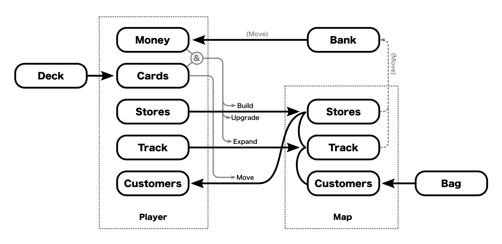
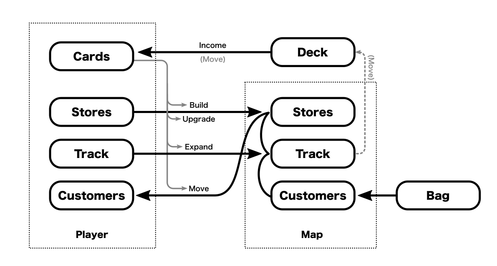
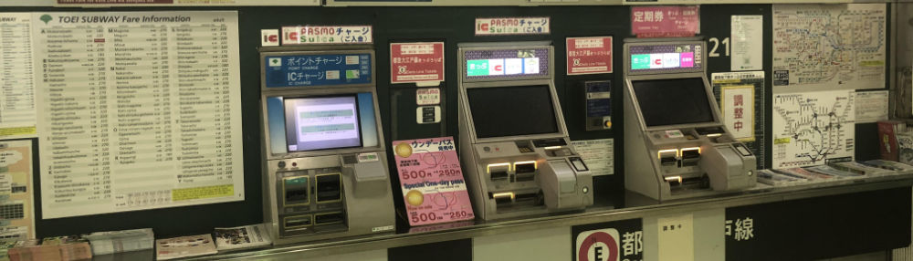
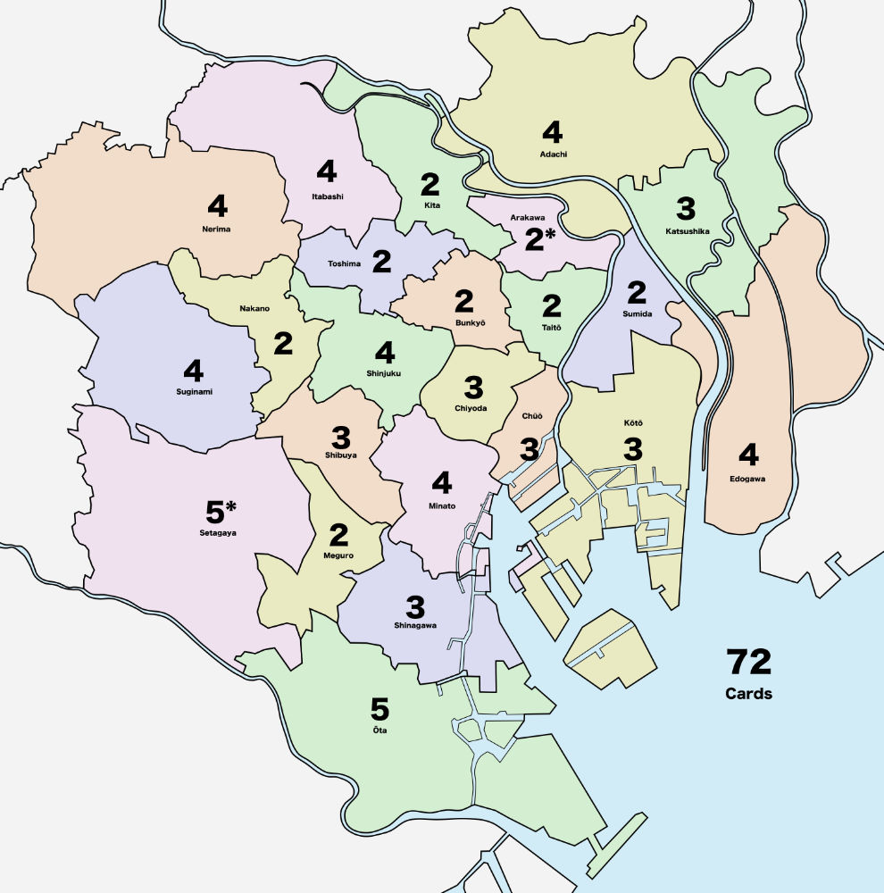

# Getting Rid of Money

Why get rid of money in **Shinjuku**?

Because money:

* Adds time
* Adds complexity ("rules weight")
* Adds components

With regards to time, it's hard to estimate how much time is spent handling money (and making change), but in the 18xx community it is [generally](https://boardgamegeek.com/article/659906#659906) [acknowledged](https://www.heavycardboard.com/faq#hc-q31) that handling money consumes about an hour of gametime. Assuming an average of 4-6 hours for an 18xx game, that means roughly 20% of the gametime is shuffling money around.

I don't have exact numbers for how much additional time is added for **Shinjuku**, but 20% feels about right.

For money to be worthwhile, it needs to pull its own weight. Keeping money would mean that I would probably need to make this a heavier game and increase the playing time to more than an hour. And I didn't want to do that.

So, given that I've decided to remove money, now the question is How?

## The Game Economy

The **Shinjuku** game economy at this point can be summarized as follows:

Note the following:

* Players have Money, Cards, Stores, Track and Customers
* Players get new Cards by drawing from the Deck (at end of turn)
* The Map has Stores, Track and Customers.
* New Customers are added to the Map from the Bag (at start of turn)

Player actions are:

* Build/Upgrade - spend Money + Card to build/upgrade Stores (and dept stores) on Map
* Expand - spend Money + Card to place Track on Map
* Move - spend Card to move Customers from the Map to the Player (via the Stores and Track), triggering income (Money).

Based on this, the obvious candidate for replacing Money is the Cards since they are often used in conjunction with each other. The main difference between them is how the player acquires them: Cards are gained for free whereas Money comes from Customers visiting Stores and Track on the Map.

Removing Money and folding its functionality into Cards results in the following:

Changes from above are:

* The Bank is removed and replaced by the Deck of cards
* Players no longer draw cards at the end of their turn, but must explicitly take an Income action.
* A free Income action is triggered whenever a player uses Track owned by another player.
* Stores no longer generate income (no need since they already give Customers).
* The victory condition is now based solely on Customers.

Another good thing is that this raises the importance of Cards in the game, and "make cards more useful" was one of the goals from the first week of playtests.

Well, that was easy. Sadly, there's a bit more to do in order to make it work.

## The Story of Money

Each component in the game has its own "story arc", and just mechanically replacing one component with another doesn't mean that the new version will feel like the old one.

As an example of these story arcs, consider how the store and track components feel to the player over the course of the game.

* The network of **stores** has a slow, incremental buildup as they are placed on the map. This is punctuated with small jumps mid- to late-game when a store is upgraded to a department store.
* The **track** network can also have a steady buildup, but the double-track action gives the player a bit more control. Players can have a fast early expansion (and risk running out of track) or a slower build out to allow a quick jump at the end to reach customers.

For **money**, the story is that you don't start with much, but your income increases as the game progresses and you build your engine on the map. In the beginning, you're restricted in what you can do because of your lack of funds, but these restrictions go away as you start earning more.

Unfortunately for our proposal, just drawing 5 cards doesn't have any meaningful growth over the course of the game. Drawing 5 cards at the start of the game feels just like drawing 5 cards at the end. In this respect, drawing cards is a poor replacement for earning money.

How can this "money growth" be recreated with the card draws? 

A straightforward way would be to treat cards simply as if they were "money", so in the early game you would have few cards, and you would gain more cards as the game progressed. But this would make the early game painful (too few cards to do anything interesting) and the end game would be unwieldy (too many cards to manage).

It would be nice if drawing 5 cards in the late game was simply worth more than drawing 5 cards in the early game. Fortunately, this can be accomplished by making the value of the cards dependent on something else that grows during the game – something that the player builds. In **Shinjuku**, this would be the network of stores (and track) on the map.

And this dependency can be created by re-introducing wildcards.

## Wildcards

Previously, wildcards didn't work because they were explicit cards in the deck. They were great when you drew them into your hand, but slowed the game down when they were drawn to place a random customer (as the player stopped and thought about the most advantageous place on the map for the new customer).

But if the wildcards were regular cards that became wild based on where you (the player) have stores on the map, then it addresses both of the problems that need to be fixed:

* Every card has a single location (so customer draws always have a well-defined location)
* Drawing 5 cards is likely to be worth more at the end of the game than at the beginning.

Note the "is likely to" qualifier.

Drawing 5 cards at the beginning of the game will definitely contain 0 wildcards because you haven't built anything on the map yet. Near the end of the game, however, that 5-card draw might contain 5 wildcards, or it might have 0 wildcards, but most likely it will have 1 or 2 (well, depending on where you build your stores).

Looking again at the map with the card distribution:

There are now places on the map (like Setagaya and Ota in the southwest) that are obviously better than other locations if all you're concerned about is maximizing the likelihood of drawing a wildcard. An added bonus is that these locations are also where customers are most likely to arrive.

But the stores in many of these locations cannot be upgraded to a department store. And the outer locations (where many high card count regions can be found) are away from the center of the map where a lot of the action (and department store upgrades) will be happening.

So there are interesting decisions to make. And that's a good thing.

### Why Not Base Wildcards on Track?

Since the player builds out both stores and track as the game progresses, either one (or both!) of them could have been used to create wildcards. Stores have the advantage that they are easily identified as belonging to a particular location.

In contrast, track typically connect 2 different locations and may cross over a third one. This makes it harder to tell at a glance which cards are associated with a piece of track.

## Next Steps

Now that we have a complete proposal, it can be playtested to see if it actually works the way we want it to.

_Next article: [Playtesting without Money](09-playtesting-without-money.md)_