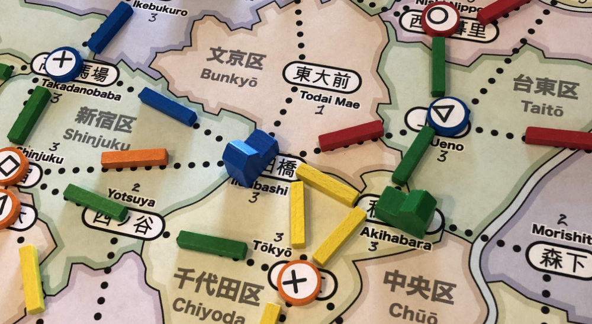

# Playtesting without Money

<a href="../playtests/images/pt09/pt09-0682.jpg"></a>

To recap, with the updated (moneyless) design:

```
  Players start with 5 cards in hand

  Each turn, players:
     * add 1 customer to the map
     * choose 2 different actions

  Possible actions are:
     * Build: Pay a card, build a store in that ward
     * Upgrade: Pay a card, upgrade a store in that ward
     * Expand: Pay any 1 card to build 1 track
        * Or pay 3 cards to build 2 connected track
     * Move: Pay a card, move customers from that ward
     * Income: draw up to 5 cards
        * Or draw 1 card if you already have 5 cards.
        * Taking this action ends your turn.

  For the Move action:
     * Pick up all customers in the ward
     * Move along track visiting stores (and matching customers)
     * If you use another player’s track, they get Income
```

The playtests with this new ruleset went... surprisingly well.

## Income

The biggest concern was regarding the new Income action and how the changed economy felt to the player. You no longer get “free money” (card draws) at the end of your turn – you now need to explicitly take the Income action. Instead of a slow trickle of cards into your hand at the end of each turn, you gain a burst of cards every couple of turns.

The primary downside of forcing players to take an Income action is that it effectively takes away one of the other actions that the player could have chosen. This will slow the game down a bit.

Is this worth the cost?

Surprisingly, it felt fine. This is probably because the other players need to be doing it as well, but it also allows more customers to arrive on the map while you’re building out your network on the map.

Additionally, the higher cost for taking Income made it feel good when other players gave you a free Income action (because they used your track). It feels great when you’re running low on cards and another player triggers Income for you – this frees up an extra action that you weren’t counting on.

It also adds an interesting decision when Moving customers. If the Red player (your arch-nemesis) is running low on cards, can you find a path that avoids Red track altogether? Or can you hold off on that Move action and take it later (when it will benefit them less)? Will those customers still be available or do you need to move now?

Having more interesting decisions is good, even with the slight slowdown. But accepting this change does mean that I’ll need to balance this slowdown by speeding up other aspects of the game.

<a href="../playtests/images/pt10/pt10-0686.jpg"></a>

## Seeding Customers

Do we need to seed the board with customers at the start of the game to speed things along? Sure, we could do that. But then we’ll need to address the first-player advantage that results. But before trying to fix that problem, how many customers should be seeded and when should they be added?

We playtested a bunch of variations by making the first round be special and having each player seed a few customers on their first turn. We added a total of ~6 customers as seeds in these tests:

* 2-player: each player seeds 3 customers
* 3-player: each player seeds 2 customers
* 4-player: _didn’t test_
* 5-player: each player seeds 1 customer

But we also performed other experiments like adding the new customers at the end of the turn vs. at the beginning. The rational for adding the customers at the end was to avoid breaking the concentration of the player about to take their turn. They could focus on their play instead of setting their cards down to draw and place a customer.

In practice, though, this was not great. Placing at the end didn’t really work for seeding and players would sometimes forget to place a customer. Forgetting to place a customers at the start of your turn deprives yourself of the opportunity, whereas forgetting at the end deprives the next player.

For one test, we even tried seeding at the start for the first round and then switching to the end for the rest of the game. For another, we had the first round go in reverse player order before switching back.

Thinking back on this, it’s surprising that we considered it worthwhile to test some of these ideas. It’s clear (again, in hindsight) that these are examples of trying too hard to fix a problem by piling on layers of complexity. “Forest for the trees” comes to mind.

## Building the First Store

And while we’re wandering around in this forest of game design failure, another consideration with the first turn has to do with each player building their first store. Since the first action that everyone needs to take is to build a store on the map, why not just remove that “decision” and make it explicit that a store needs to built on the first turn.

To fix this, the playtests allowed players to place their first store anywhere on the map. A side benefit of this is that it helps address another “first turn” issue where a player is stuck with a set of cards that don’t allow them to play where they want to.

## Actions for First Player

And finally, now that we’re seeding a bunch of customers and allowing players to build wherever they want, we need to think about the first player advantage. The standard way to do that is to reduce the number of actions for the first _n_/2 players (where _n_ is the player count).

## Removing the Special Startup Round

A combination of these special startup variations were playtested over the next few games but they didn’t seem to have a significant impact on how the game played. More importantly, they felt like an odd wart at the start of the game and made the experience more complex than it needed to be. “Here’s a set of rules for the first turn. Now forget that and use this different set of rules” is not a great introduction.

Even the attempt to remove the standard “build a store on your first turn” wasn’t worth it. The additional rules weight describing the weird first turn of the game distracted from learning the actual rules of the game and made the game feel heavier.

It’s far simpler to teach a consistent set of rules that the players will use throughout the game. The fact that you’ll need to build a store on your first turn can simply be noted in the rulebook somewhere.

By playtest #11, the seeding, free store placement and reduced actions were removed. All of them. There were still issues that needed to be addressed with the flow of the start of the game, but a different solution would have to be found.

One that doesn’t feel so clunky.

One that provides players with more flexibility without adding a lot of special rules just for the first turn.

<a href="../playtests/images/pt08/pt08-0675.jpg"></a>

## The First ”Complete” Version

Overall, though, the new economy is working well. The game plays faster without the money upkeep and turns feel smoother. 

Also, with these changes the overall character of the game has been set. There are still a lot of rough edges that need to be cleaned up, but the core structure of the game is in place.

Another aspect of settling on a core structure is that it is also clear what kind of game Shinjuku is *not*. Before money was removed, Shinjuku could have evolved down the path to become a multi-hour long, heavy strategic game, but it’s now clear that it doesn’t want to be that kind of game.

This will affect all future design decisions. With a heavier game, it would have been easier to add more components, but that’ll be less of an option for this design going forward. Or, more correctly, any such proposed additions will need to be truly amazing in order to counteract the additional rules weight they add to the game.

_Next article: More Customers_
