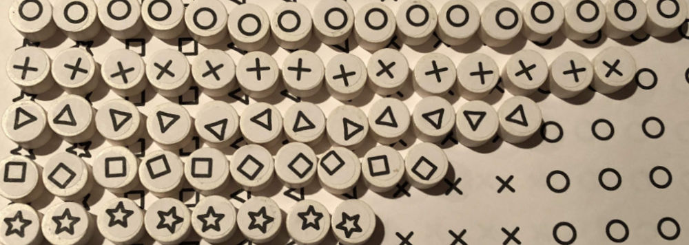
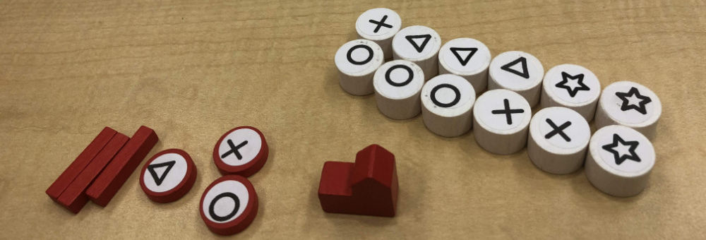

# Adding Customers

The number of customers serves as a timer for the game, so an appropriate number needs to be chosen so that the game won’t end too early or drag on too long.

Since I'm targetting 60 minutes for the game, that means somewhere between 40-60 customers as long as I can keep the average turn length to about 1 minute.

## More Extreme Type Distribution

So far, I've been using 40 customers with a 10/9/8/7/6 distribution (for ◯ ⤫ △ ▢ and ⭒ types). The first change was to make the distribution a little more extreme, so I applied the "double or half" rule so that the most common type (◯) has twice as many as the least common type (⭒). I didn't have enough components to do this properly for the first playtest, so as a stopgap I added 5 more customers to bring the total up to 45: 12 ◯, 10 ⤫, 9 △, 8 ▢, 6 ⭒.

The difference between 40 and 45 is not enough to make a noticeable impact, so the next playtest was primarily to see how the updated customer distribution felt. And it worked well – it made the difference between the common and uncommon types even more apparent, so there was more of a reason to prefer one type over another.

## Increase to 60 Customers

The first real expansion of customers was to take the count up to 60. The game felt a bit too short at 40, and more customers should help that and give more scoring opportunities. The number 60 was selected because it (a) is at the upper end of what I though was reasonable, and (b) is evenly divisible by 2, 3, 4 and 5, which is convenient because it gives each player the same number of turns.

## Remove a Customer Type

Given the combination of stores and customers, having 5 different customer types (and corresponding stores) felt unnecessarily complicated. With 5 types, players were less likely to be able to match customers. Cutting this down to only 4 types helps reduce the time taken for each turn (and also reduce player frustration).

## Forgetting Customer Draws

One unexpected problem that came up during playtests is that players would sometimes forget to make customer draws during the course of the game. This mistake would typically only happen once or twice per game, but it wouldn't be discovered until the end of the game when the last customer was drawn. Players would notice that some of them got extra turns instead of every player having the exact same number as intended.

Even without the finger-pointing for which player is to blame, this situation leaves all the players with a bad feeling because clearly someone "messed up". Did it affect the outcome of the game? What should we do about the extra turns? Skip them? Keep playing? Give everyone extra turns to compensate?

## Next Steps

From [playtest #13](../playtests/2018-09-17-playtest-13.md) onward the game had settled on a stable set of 60 customers with 4 types. This customer distribution appears to be pretty close to the "correct" number and would last for the next 20 playtests: 19 ◯, 16 ⤫, 14 △, 11 ⭒. Note that the star was reinstated as the least common customer type (replacing the square) because it is more distinct from the other remaining types, and thus easier to see from across the table.

Remaining work items:

* Verify (by repeated testing) the 60 customers and 4 types is good
* Figure out how to make it so that people don't forget to draw a customer each turn

_Next article: Stores_
