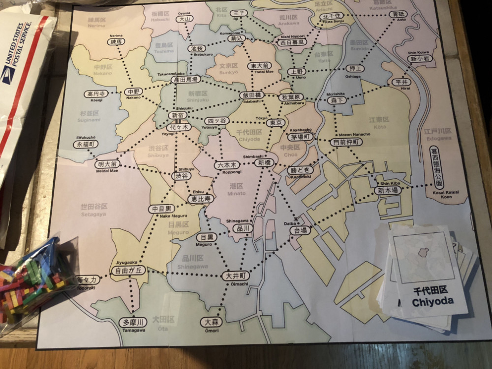

# Playtest #1

Sun 19 Aug 2018

Participants: self, AdrianK

## Overview

* Initial test of basic concept
* It is necessary to seed the board with customers? Try without seeding.

## Components

* 18"x20" board with Map of Tokyo
* 54 cards: 48 Ward cards + 6 wild cards
* Poker chips for money
* 20 stores per player (4 of each type)
* 20 track per player
* 3 dept stores per player
* 25 citizen tokens:
	* 5 ◯, 5 ⤫, 5 △, 5 ▢, 5 ⭒

## Rules

### Setup

* Deal 3 cards to each player
* Start with 25yen each

### Turns

At start of turn, randomly place a citizen on the map. Draw a card to determine the location.

Each turn choose an action:

* Pay 5yen + card, build a store in that ward or next to any of your track
	* Stores can be built on top of other players stores
* Pay 5yen + card, upgrade an existing store
* Pay 1yen + card to build 1 track that expands from shop or your track

After taking your action, you may optionally resolve the customers in a single ward. You must be able to match all customers in that ward with a shop.

At end of turn, draw 1 card

### Final turn

When last customer is placed, everyone takes one additional turn.

## Player actions

### Upgrading stores

Cost 5yen for each upgrade: 1-store -> 2-store -> 3-store -> dept store

* 1-store can satisfy 1 customer of that type
* 2-store can satisfy 2 customer of that type
* 3-store can satisfy 3 customer of that type
* dept store can satisfy 2 customers of any type, except for the type of the 3-store that it was upgraded from.

### Resolving customers

When resolving customers:

* Each segment of track used pays the owner of that segment 1yen.
* Each station with a store that resolves a customer pays 5yen to the owner of each store in that station for each customer resolved.
* Customers must go to the largest store that has the item they want. If they can't reach that store, then they cannot be resolved. If multiple stores are the same size, then the player may choose which one they go to.
* Customers cannot pass through a store of the matching resource on their way to get to a larger store.
 
## Comments

First move in game needs to be building a shop, which is restricted by the 3 cards in the player's hand.

1yen and 5yen are a little odd since they correspond to $0.01 and $0.05. But charging 100yen and 500yen (and bumping up the coin values) makes the numbers unwieldly.

How to upgrade to a dept store when there are multiple players with stores in that location?

* Player must remove one of their shops to upgrade?

Who should claim the customer, the store owner or the person taking the customer action?

What if you lose all your money? Pass? How do you get back into the game?

Interesting decisions to be made with "cold war" at top of board: 3 ▢ shops + dept store. Worth 10 vs. 15 (diff of 5) to determine better move.

Summary: (A / G)

* Shops on board: 5 / 7
* Dept stores: 1 / 0
* Track: 8 / 7
* Citizens: 10 / 6 / 9 remaining on board
* Yen: 43 / 34

Shuffled cards once during game.

## Suggestions/Actions

For next playtest, adjust costs:

* track costs 2yen and pays out 1yen when used
* stores cost 10yen and pays out 5yen when customers visit
