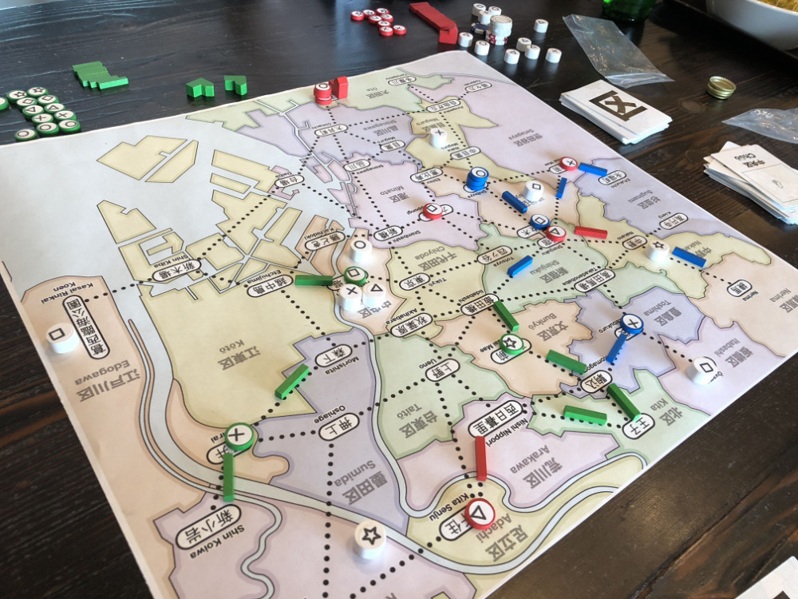

# Playtest #4

Wed 22 Aug 2018

Participants: self, JeffB, SverreR

## Overview

* Testing:
	* More players
	* Explore endgame scoring

## Components

* 18"x20" board with Map of Tokyo
* 54 cards: 48 Ward cards + 6 wild cards
* Poker chips for money
* 15 stores per player (3 of each type)
* 15 track per player
* 2 dept stores per player
* 40 citizen tokens:
	* 10 ◯, 9 ⤫, 8 △, 7 ▢, 6 ⭒

## Rules

### Setup

* Deal 3 cards to each player
* Start with 25yen each

### Initial seeding

### Turns

At start of turn, randomly place a citizen on the map. Draw a card to determine the location. On the first turn, place 2 citizens on map (to seed).

Each turn choose an action:

* Pay 10yen + card, build a store in that ward or next to any of your track
	* Stores can be built on top of other players stores
* Pay 10yen + card, upgrade an existing store
* Pay 2yen + card to build 1 track that expands from shop or your track

After taking your action, you may optionally resolve the customers in a single ward. You must be able to match all customers in that ward with a shop.

At end of turn, draw 1 card

### Final turn

When last customer is placed, everyone takes one additional turn.

## Player actions

### Upgrading stores

Cost 10yen for each upgrade: 1-store -> 2-store -> 3-store -> dept store

* 1-store can satisfy 1 customer of that type
* 2-store can satisfy 2 customer of that type
* 3-store can satisfy 3 customer of that type
* dept store can satisfy 2 customers of any type, except for the type of the 3-store that it was upgraded from.

### Resolving customers

When resolving customers:

* Each segment of track used pays the owner of that segment 1yen.
* Each station with a store that resolves a customer pays 5yen to the owner of each store in that station for each customer resolved.
* Customers must go to the largest store that has the item they want. If they can't reach that store, then they cannot be resolved. If multiple stores are the same size, then the player may choose which one they go to.
* Customers cannot pass through a store of the matching resouce on their way to get to a larger store.
 
## Comments

Wild cards are time consuming:

* Need to mark the 3 regions that correspond to each wild card
* They are nice when you have them in your hand, but take took long when used to place customers

For scoring, use set collection for customers

Suggestion: Allow 2 tracks to be placed with the same action, but make it expensive: e.g., 20yen

Raise cost for dept stores to 20yen

Bad situation: when dept store is separated from rest of board since that dominates all resources that only have 1-stores on the board.

Should dept stores only provide 1 or each resource (and leave the original shops on the board).

Score rails based on the shops in the stations it is connected to. Similar to Brass. But in Brass, rails don't pay out during the game so they need the endgame bonus. Not sure its needed here.

Summary: (J / S / G)

* Shops on board: 10 / 5 / 6
* Dept stores: 1 / 0 /1
* Track: 2 / 8 / 6
* Citizens: 12 / 11 / 9 / 7 remaining on board
* Yen: 17 / 52 / 61

Citizens:

* Jeff: ◯◯ ⤫⤫⤫ △△△△△△ ▢ (12)
* Sverre: ⤫⤫⤫ ▢▢ ⭒⭒⭒⭒⭒⭒ (11)
* Gary: ◯◯◯◯◯◯ ⤫ ▢▢ (9)

Shops:

* Jeff: ◯◯◯+dept ⤫⤫ △ △△ ▢▢ (10)
* Sverre: ⤫ ▢ ⭒⭒⭒ (5)
* Gary: ◯◯◯+dept ⤫ ▢▢ (6)

Most of each customer for each resource:

* ◯: 6 - Gary
* ⤫: 3 - Jeff/Sverre tie
* △: 6 - Jeff
* ▢: 2 - Sverre/Gary tie
* ⭒: 6 - Sverre

## Suggestions/Actions

For next playtest:

* Test with more players
* Remove wildcards
* Allow purchasing multiple tracks with one action
