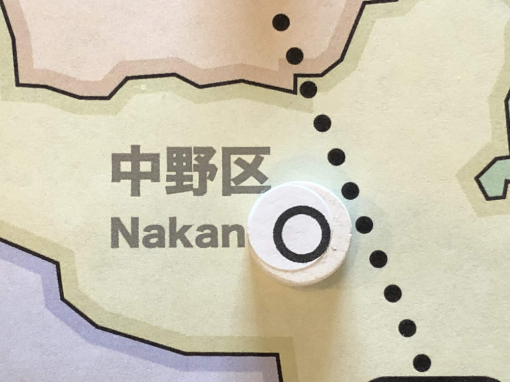
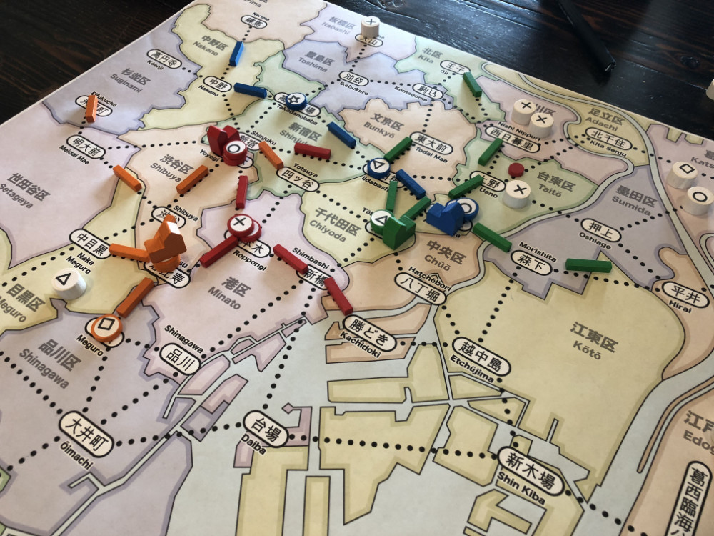

# Playtest #5

Thu 23 Aug 2018

Participants: self, AdamB, JeffB, SverreR

 

[Twitter post](https://twitter.com/hackerblinks/status/1032744357642657792)

## Overview

* Testing:
	* Having explicit starting locations
	* Explore endgame scoring
	* Resolving Customers: Must go to highest shop that is connected to that customer's starting location (without passing through matching shops)

## Components

* 18"x20" board with Map of Tokyo
* 48 Ward cards
* Poker chips for money
* 6 starting position cards: Ikebukuro, Ueno, Tokyo, Shimbashi, Akihabara, Ebisu (each 2 away from Shinjuku)
* 15 stores per player (3 of each type)
* 15 track per player
* 2 dept stores per player
* 40 citizen tokens:
	* 10 ◯, 9 ⤫, 8 △, 7 ▢, 6 ⭒

## Rules

### Setup

* Deal 3 cards to each player
* Start with 25yen each
* Randomly assign a starting station to each player

### Turns

At start of turn, randomly place a citizen on the map. Draw a card to determine the location. On the first turn, place 2 citizens on map (to seed).

If you have any unpaid loans at start of turn, you must pay 1yen to the bank as interest. You may pay off loans on the start of your turn (after paying interest).

You may take a loan for (for 10yen) before taking your action.

Each turn choose an action:

* Build a store
* Upgrade an existing store
* Build rail

After taking your action, you may optionally resolve the customers in a single ward. You must be able to match all customers in that ward with a shop.

At end of turn, draw 1 card

### Final turn

When last customer is placed, everyone takes one additional turn.

## Player actions

### Building stores

Requirements: must be in an:

* empty station, or
* station with a shop that matches the resource

The card spent must match the location of the station unless the player already has a track connection to that station.

Stores can be placed on other player's stores (as long as they match).

Cost: ¥10 + 1 card

### Upgrading stores

Upgrade: 1-store -> 2-store -> 3-store -> dept store

Cost 10yen for each upgrade except the final one to department store, which costs 20yen.

* 1-store can satisfy 1 customer of that type
* 2-store can satisfy 2 customer of that type
* 3-store can satisfy 3 customer of that type
* dept store can satisfy 2 customers of any (different) type, except for the type of the 3-store that it was upgraded from.

#### Department Store

Department store upgrade requirements:

* must be a 3-shop stack
* player must have at least one shop in that stack

Cost: ¥20 + 1 card + remove 1 shop from stack

Removed shop is returned to player (and can be re-built elsewhere)

Department stores count as 1 of every kind of resource

### Building rail

Requirements: must be connected to a station where you have a shop or where you are connected

Cost: 1 card (any card) +

* 2yen for 1st segment placed this turn
* 16yen for 2nd segment
* 128yen for 3rd segment

### Resolving customers

When resolving customers:

* Each segment of track used pays the owner of that segment 1yen.
* Each station with a store that resolves a customer pays 5yen to the owner of each store in that station for each customer resolved.
* Customers must go to the largest store that has the item they want. If they can't reach that store, then they cannot be resolved. If multiple stores are the same size, then the player may choose which one they go to.
* Customers cannot pass through a store of the matching resouce on their way to get to a larger store.

## Final Scoring

Consider the following possible scoring (including all is too cumbersome):

* 1vp for every 10円 (or ¥10)
* 1vp for each of your 1-shop
* 3vp for each player in a 2-shop stack
* 6vp for each player in a 3-shop stack
* 10vp for each dept store
* 1vp for each 1-shop that's part of your rail network
* 3 for each 2-shop
* 6 for each 3-shop
* 10vp for each dept store
* 1vp for each customer
* 3vp for each resource where you have the most
* 20vp if you have one of each resource

## Comments

Managing money was somewhat tedious. It would be nice not to have to have lots of tiny payouts.

Loans:

* Loans don't feel good.
* What is the max number of loans one can have at a time? 3?
* Spend entire turn to take a loan? (what problem is this trying to solve?)

Sometimes didn't have any good cards in hand.

Wildcards? Perhaps 2 of a kind = wild. Problem: there are many cards that don't have doubles.

J: cards didn't matter unless they match the location of a shop to play on

A: Have 2 actions/turn. Change "resolve customers" to be an action that you must explicity take.

Summary: (A / G/ J / S)

* Citizens: 11 / 5 / 6 / 6 + 12 remaining on board
* Yen: 4 / 21 / 29 / 22
* Loans: 3 / 1 / 2 / 0

## Suggestions/Actions

For next playtest:

* Simplify endgame scoring - only customers give VPs. Make players focus on resolving customers.
	* set collection: vp bonus for 1 of each type
* Give 2 general actions and make resolving customers an action that the player must take
* Restrict height in each region, so that dept stores are allowed in city center
* Resolving customers: You don't have to resolve all the customers, but you must move them all, dropping off customers as they are matched with stores. Unmatched customers are left at the last location.
* Remove starting locations. Allow players to place first shop anywhere.
