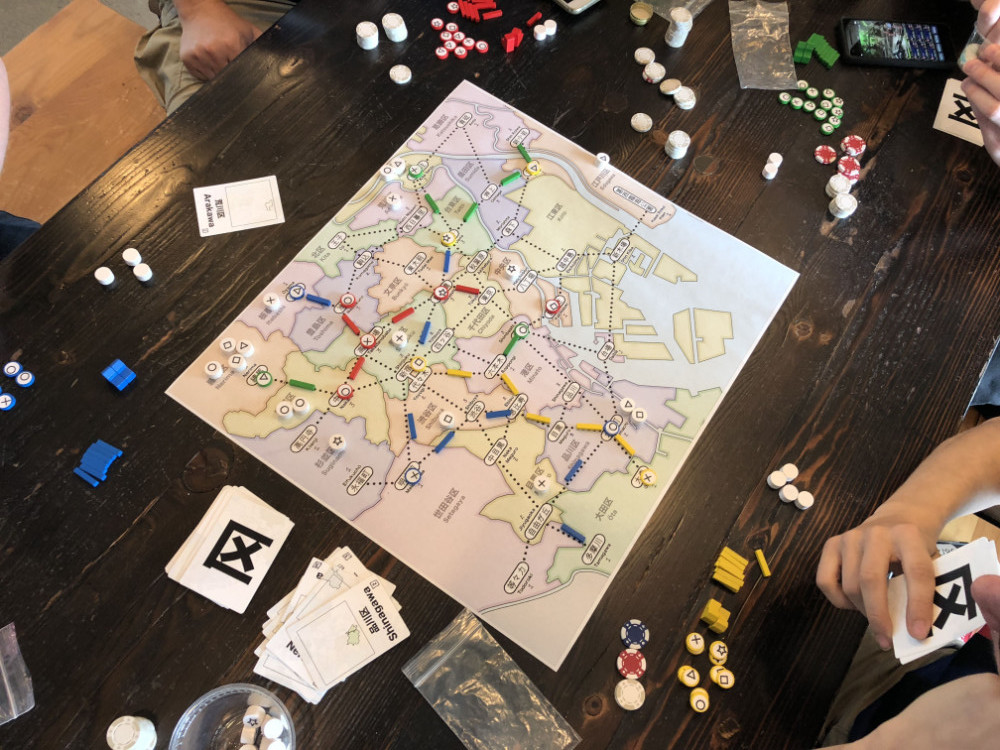

# Playtest #6

Fri 24 Aug 2018

Participants: self, AdamB, JeffB, SverreR, AdrianK

4-player game: Adrian/Gary combined

## Overview

* Testing:
	* Placing first shop anywhere as part of setup
	* Using doubles for wild card
	* 2 actions per turn
	* restricted height for stations
	* score only based on customers
	* seed at end of turn (instead of start)

## Components

* 18"x20" board with Map of Tokyo
* 48 Ward cards
* 15 stores per player (3 of each type)
* 20 track per player
* 2 dept stores per player
* 40 Customer tokens:
	* 10 ◯, 9 ⤫, 8 △, 7 ▢, 6 ⭐︎

## Rules

### Setup

* Deal 3 cards to each player

### Initial seeding

Each player seeds 2 customers (for 4-player) and then places a store for free anywhere on the board.

### Turns

Each turn take 2 different actions:

* Build a store
* Upgrade an existing store
* Build rail
* Lure customers
* Discard

At end of turn, draw back up to 3 cards

### Final turn

When last customer is placed, everyone takes one additional turn. Restricted to 1 Lure action

## Player actions

### Building stores

Play card for ward, pay 10yen, place store on empty station.

### Upgrading stores

On top of one of your shops. Pay 20 for 1st upgrade, 40 for 2nd, 80 for 3rd

### Build Rail

For this action, thef irst section is free, 2nd costs 20yen, 3rd costs 100yen. 

### Lure customers

Play card for matching ward to lure customers.

### Discard

Discard any number of cards and draw back up to 3

## Comments

Add action to trigger income.

Draw up to 5 cards in hand (instead of 3)

Add more cards to deck (to adjust probs and reduce shuffling)

Score:

* Adam: ◯◯ ⤫⤫ △△ ⭐︎
* Jeff: ◯◯◯◯◯◯◯◯ △ ⭐︎
* Sverre: ⤫ △△△ ▢▢ ⭐︎
* Gary/Adrian: ⤫⤫ △△ ▢▢▢▢ ⭐︎

Scoring possibilities (A / J / S / GA):

* Raw count: 7 / 10 / 7 / 9
* Triangle score: 10 / 38 / 11 / 17
* Squaring score: 13 / 65 / 15 / 25
* 1pt per max resource: 0 / 1 / 1 / 1
* 1pt per max-tied resource: 2 / 1 / 1 / 1

Triangle and Square scoring encourage players to focus on a single resource type.

Triangle score:
1=1; 2=3; 3=6; 4=10;5=15;6=21; 7=28; 8=36

Squaring score:
1=1; 2=4; 3=9; 4=16; 5=25; 6=36; 7=49; 8=64

## Suggestions/Actions

For next playtest:

* 5 cards / hand
* Add more cards to deck (to ensure that there are at least 2 for each ward)
* Fix scoring
* Remove money
