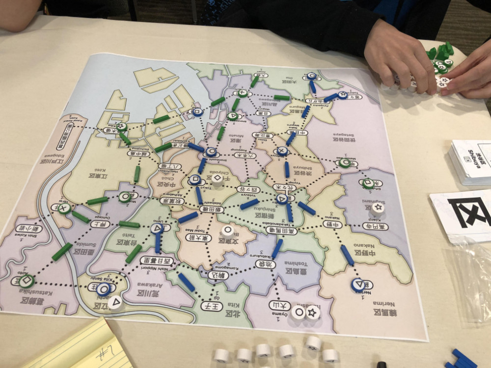
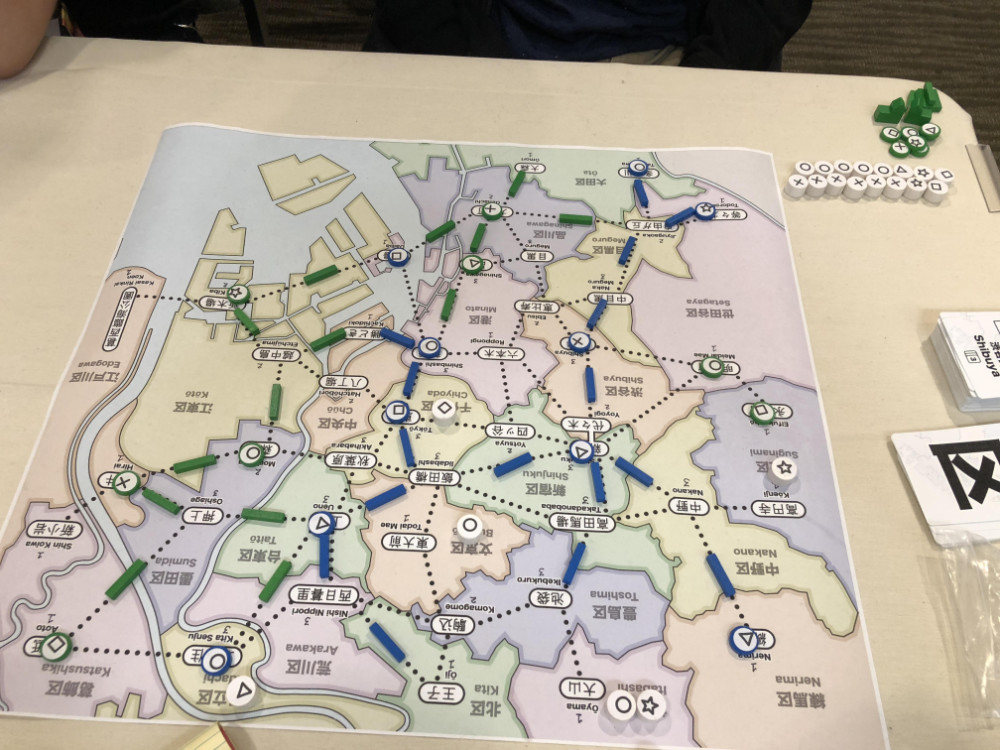

# Playtest #7

Sun 2 Sept 2018 (at PAX)

Participants: self, AdrianK

## Overview

* Testing:
	* Removing money and replacing with card-draw income
	* Endgame scoring: If tie, then remove the customer type that you have the most of and count the rest.
	* 2-player

## Components

* 18"x20" board with Map of Tokyo
* 72 Ward cards
* 15 stores per player (3 of each type)
* 20 track per player
* 2 dept stores per player
* 40 Customer tokens:
	* 10 ◯, 9 ⤫, 8 △, 7 ▢, 6 ⭒

## Rules

### Setup

* Deal 5 cards to each player

### Initial seeding

Each player seeds 3 customers (for 2-player) and then places a store for free anywhere on the board.

### Turns

Each turn choose 2 different actions:

* Pay a card, build a store in that ward
* Pay a card, upgrade a store in that ward
* Pay a card, lure customers from that ward
* Pay any 1 card to build 1 track; pay 3 cards to build 2 connected track
* Take income: draw up to 5 cards, or draw 1 card if you already have 5 cards. Taking this action ends your turn immediately.

### Final turn

When last customer is placed, everyone takes one additional turn.

Restricted to 1 Lure action

## Comments

Clarification: can't split track when adding 2 during the same action - the 2nd must continue from the end of the first.

Experimented with allowing the same action twice. It allowed Adrian to take 2 customer actions to get multiple customers (which felt like a big move), but otherwise it probably isn't worthwhile.

Having to take an action for income didn't feel bad. And it made income from track more exciting.

Score:

* Adrian: ◯◯◯◯◯ ⤫⤫⤫⤫⤫⤫ △ ▢▢ ⭒⭒ = 16
* Gary: ◯◯◯ ⤫⤫⤫ △△△△△△ ▢▢▢▢ ⭒⭒ = 18
* Left on board: ◯◯ △ ▢ ⭒⭒

Duration: 1:15 hr (3:30-4:45 - Includes explanation and discussion)

## Suggestions/Actions

For next playtest:

* Adjust endgame scoring to make choice of customers more interesting
