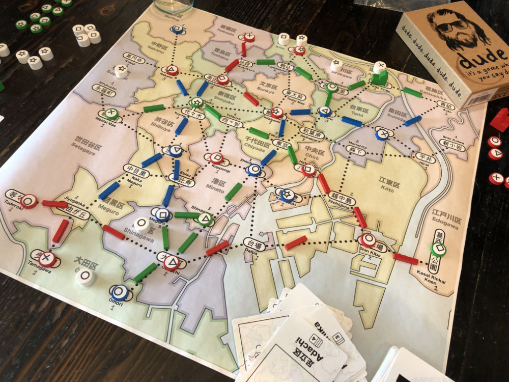

# Playtest #8

Fri 7 Sept 2018

Participants: self, JeffB, AdamB

   

## Overview

* Testing:
	* New endgame scoring: drop customer type that you have the most of and count the rest.
	* Add 5 extra customers: Adding 2 ◯, 1 ⤫, 1 △, 1 ▢ (no extra ⭒s)

## Components

* 18"x20" board with Map of Tokyo
* 72 Ward cards
* 15 stores per player (3 of each type)
* 15 track per player
* 2 dept stores per player
* 45 Customer tokens:
	* 12 ◯, 10 ⤫, 9 △, 8 ▢, 6 ⭒

## Rules

### Setup

* Deal 5 cards to each player

### Initial seeding

Each player seeds 2 customers and then places a store for free anywhere on the board.

### Turns

Each turn take 2 different actions:

* Pay a card, build a store in that ward
* Pay a card, upgrade a store in that ward
* Pay a card, lure customers from that ward
* Pay any 1 card to build 1 track; pay 3 cards to build 2 connected track
* Take income: draw up to 5 cards, or draw 1 card if you already have 5 cards. Taking this action ends your turn.

### Final turn

When last customer is placed, everyone takes one additional turn (2 actions).

## Comments

Scoring felt good and forced players to worry about the kind of customers they were luring.

Playing cards in outlying areas felt good because they became wildcards. With only 2 stations in some of these wards, one player would be cut out.

Being able to inject stations into existing lines to prevent other players from resolving customers to their store felt good.

Played well. First candidate for final rules.

Need to playtest this version more before making scoring or action rule changes.

Score:

* Adam: ◯◯◯ ⤫⤫⤫ △△△ ▢▢▢▢ ⭒⭒⭒ = 12 (remove ▢)
* Jeff: ◯◯◯ ⤫⤫ △△ ▢▢ = 6 (remove ◯)
* Gary: ◯◯◯◯ ⤫⤫⤫⤫ △△△△ ▢ = 9 (remove ◯, ⤫ or △)

Duration: 1 hr (11:47 - 12:46)

## Suggestions/Actions

For next playtest:

* Is Kita Senju overpowered? It may need to be reduced to only 2-stores depending on following playtests.
	* Adachi is has 4 cards (so more customers will appear there)
	* Adachi only has 1 station (so no competition within the ward)
	* Adachi allows department stores (so once a dept is built, no one else can really get these customers)
	* Ueno is in a similar situation, but it only has 2 cards in the deck
* Upgrade Jiyugaoka to allow 2-stores?
* Remove a few customers at start of game so that each player has the same number of turns.
* Can players start with only 2 of each store type?
