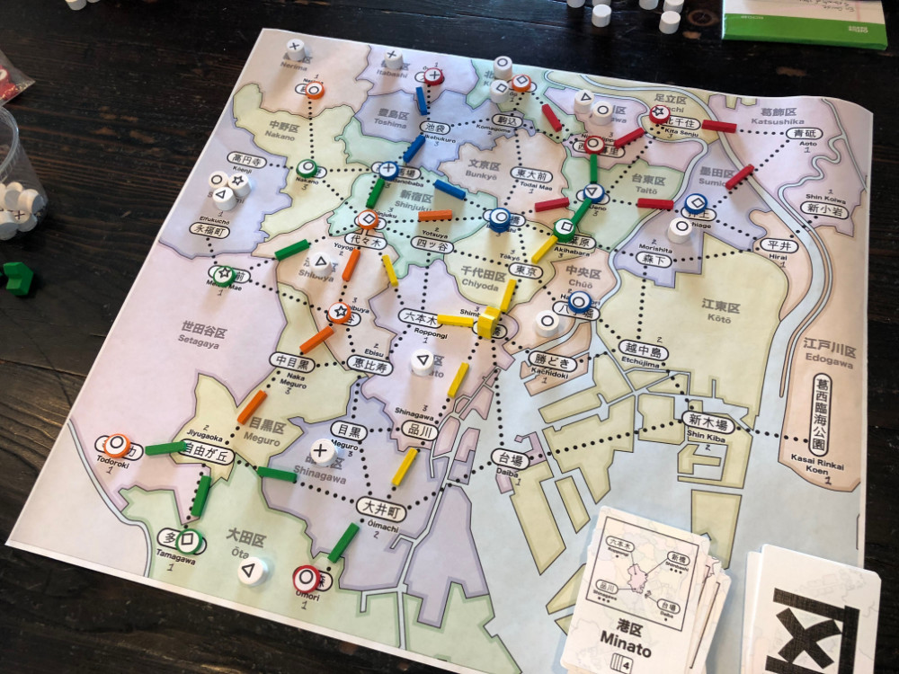
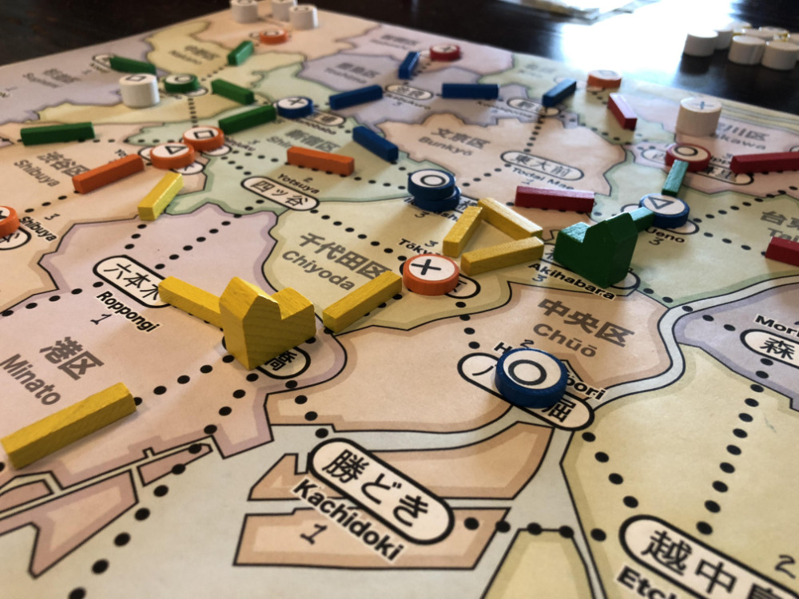
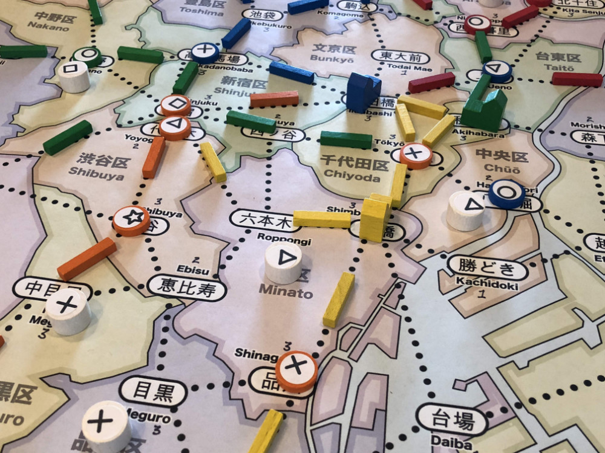
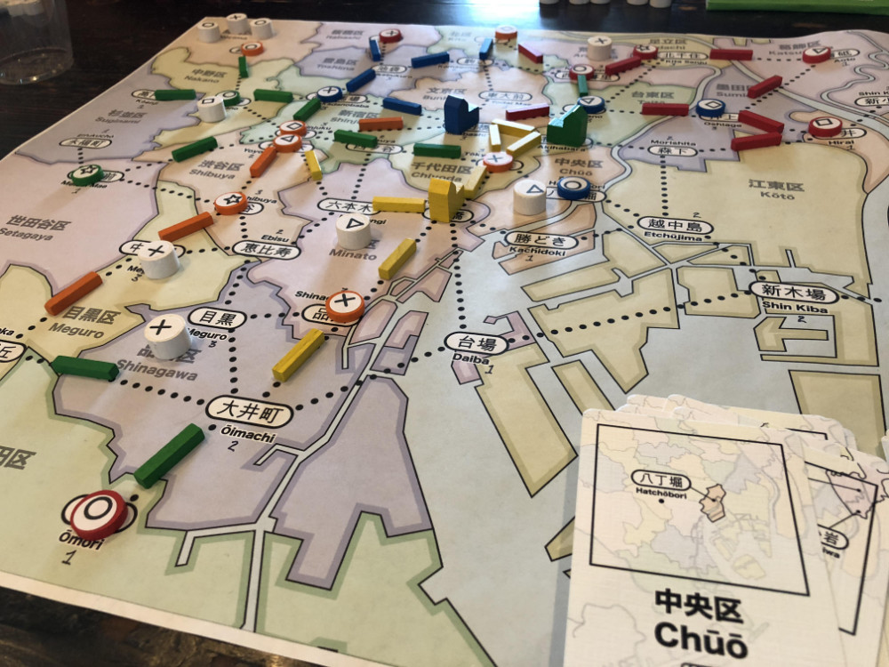

# Playtest #9

Tue 11 Sept 2018

Participants: self, JeffB, AdamB, SverreR, JoshO'M

       

## Overview

* Testing:
	* 5-player
	* 10 stores per player: 2 each of ◯, ⤫, △, ▢ and ⭒

## Components

* 18"x20" board with Map of Tokyo
* 72 Ward cards
* 10 stores per player (2 of each type)
* 15 track per player
* 2 dept stores per player
* 45 Customer tokens:
	* 12 ◯, 10 ⤫, 9 △, 8 ▢, 6 ⭒

## Rules

### Setup

* Deal 5 cards to each player

### Initial seeding

Each player seeds 1 customer (for 5-player) and then places a store for free anywhere on the board.

### Turns

Each turn take 2 different actions:

* Pay a card, build a store in that ward
* Pay a card, upgrade a store in that ward
* Pay a card, lure customers from that ward
* Pay any 1 card to build 1 track; pay 3 cards to build 2 connected track
* Take income: draw up to 5 cards, or draw 1 card if you already have 5 cards. Taking this action ends your turn.

### Final turn

When last customer is placed, everyone takes one additional turn (with 2 final actions).

## Comments

Adam played a winning strategy by building a dept store early and then gathering lots of customers.

Game felt too short with 5 players because there were fewer turns per player (8).

We apparently missed some of the customer actions at the end of the player turns, so we need some rules guidance on how to handle that.

* "Whoops, I guess that was your last turn" is not satisying.

The initial setup felt a bit odd because we went from seeding customers at the start of the turn directly into "now we do it at the end". The setup should feel more different from the main game turns.

* Adam's suggestion: Place all customers and then have players choose starting location in reverse-player order.
* Is is possible to remove this setup step entirely? Players would then be at the mercy of their starting cards.

What if players only started with 5 stores?

* To make it more obvious that you need to focus on building dept stores.
* Would this mean that 2-stores become less useful - you don't want to tie up 2 store tokens unless you're planning on upgrading to a dept store. If so, then the 2-spot stations on the map are effectively the same as the 1-spot stations, and we really only need to distinguish between stations that allow a dept store and those that do not.

Need to combine Build and Upgrade into a single action so that you can't Build and Upgrade in a single turn.

Possibly make dept stores more difficult to build:

* By require a min amount of track connecting to the station before a dept store can be built
* e.g., 3 track connected around station. Can be owned by any player.

### Further Thoughts

Some thoughts on Department Stores et al.

Having only 5 stores, and requiring a 2-stack to upgrade to a dept store, leads to the situation where someone could play 5 single stores and then be stuck.

"Tell people not to do that" is not a satisfying answer.

Another problem with 2-stack stores and only 5 stores to work with is that the 2-spot stations become (effectively) the same as the 1-spot stations.

There's no reason to build a 2-stack store unless you intend to go up to a dept store.

But if Dept Stores could be upgraded from a single store, and match only 1 customer (of any kind), then it's easier to upgrade, players can't get stuck, and the delta between dept stores and normal stores would still be large, but not too large.

So that implies that the map should only mark the locations that are allowed to have dept stores. No need to mark *, ** and ***.

That means that the start of the game would likely be: place a station during setup and then upgrade to a dept store on their first turn (if possible).

And the rest of the game would be: (1) where to build rail - to my store and around other stores, (2) where to build my 2nd dept store, and (3) where to place my remaining stores to gain customers/block the other players.

Possible 60 customer distribution: 16, 14, 12, 10, 8

I would like the upgrade to Dept Store to be  a little more difficult than just playing a matching card.

Possibly a min track requirement before the upgrade to dept store is allowed. I.e., it must have 3 connected track. That feels more theme-y. (Note: Adam doesn't like this idea)

## Suggestions/Actions

For next playtest:

* Test with only 5 stores per player (one of each type)
* Add more customers (possibly up to 60 for a longer game)
* Adjust initial seeding at start of game
* Combine Build/Upgrade into a single action
