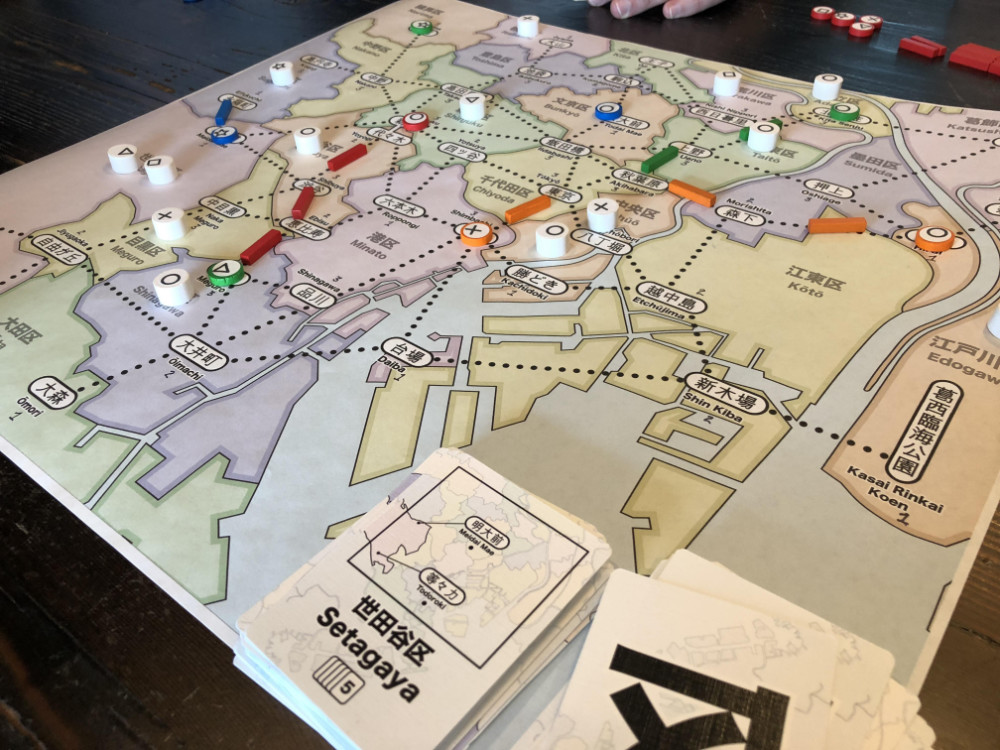
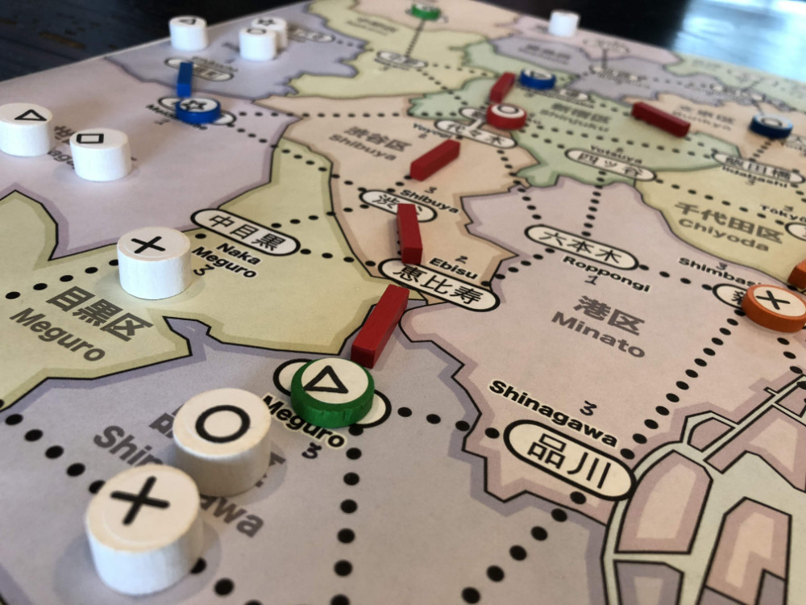
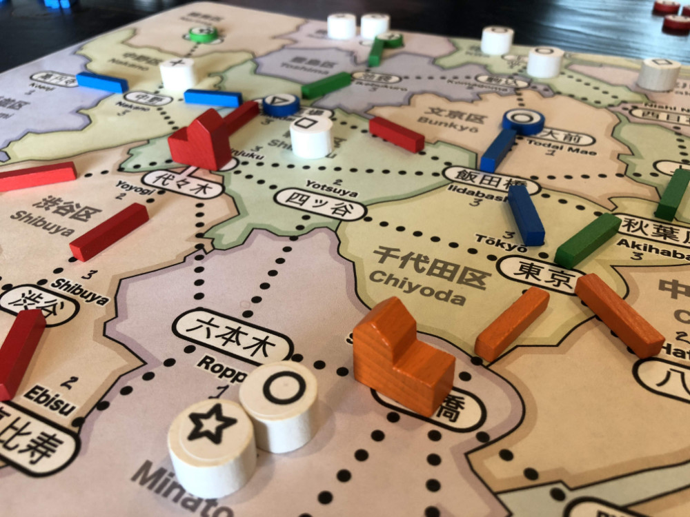
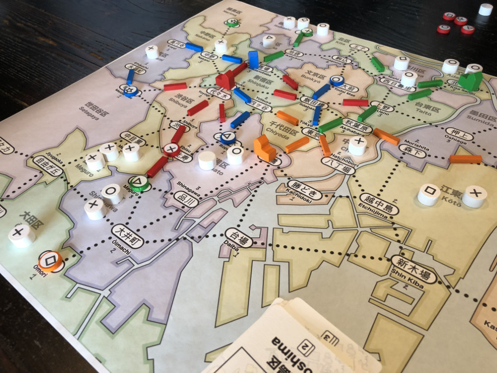
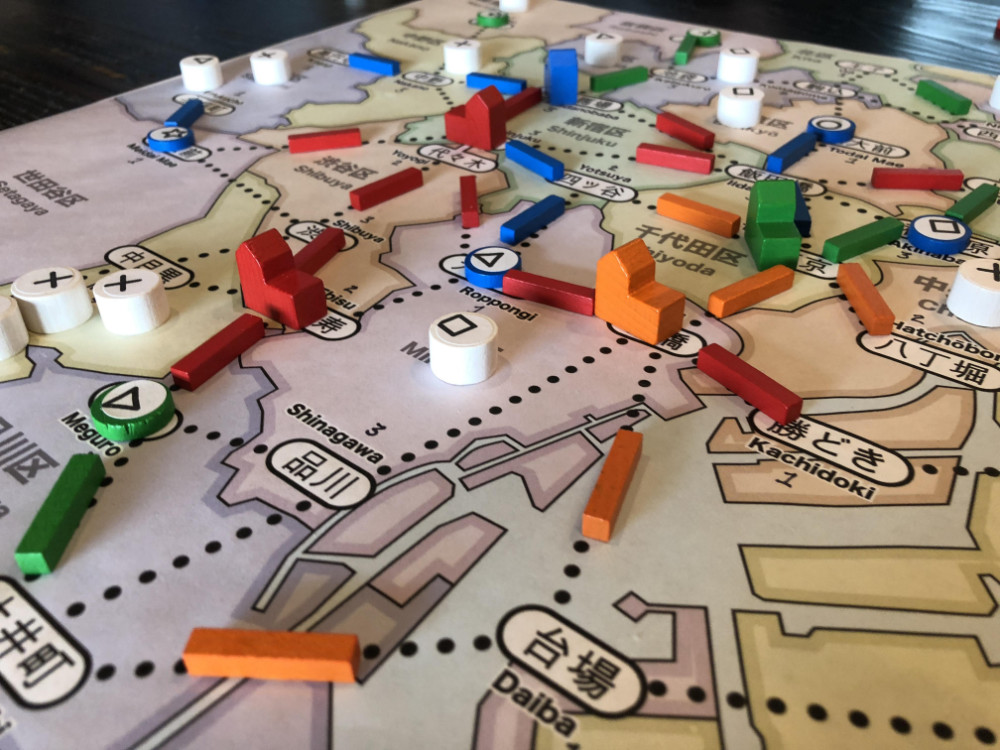
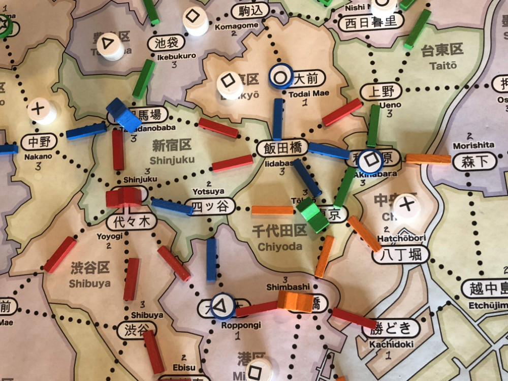
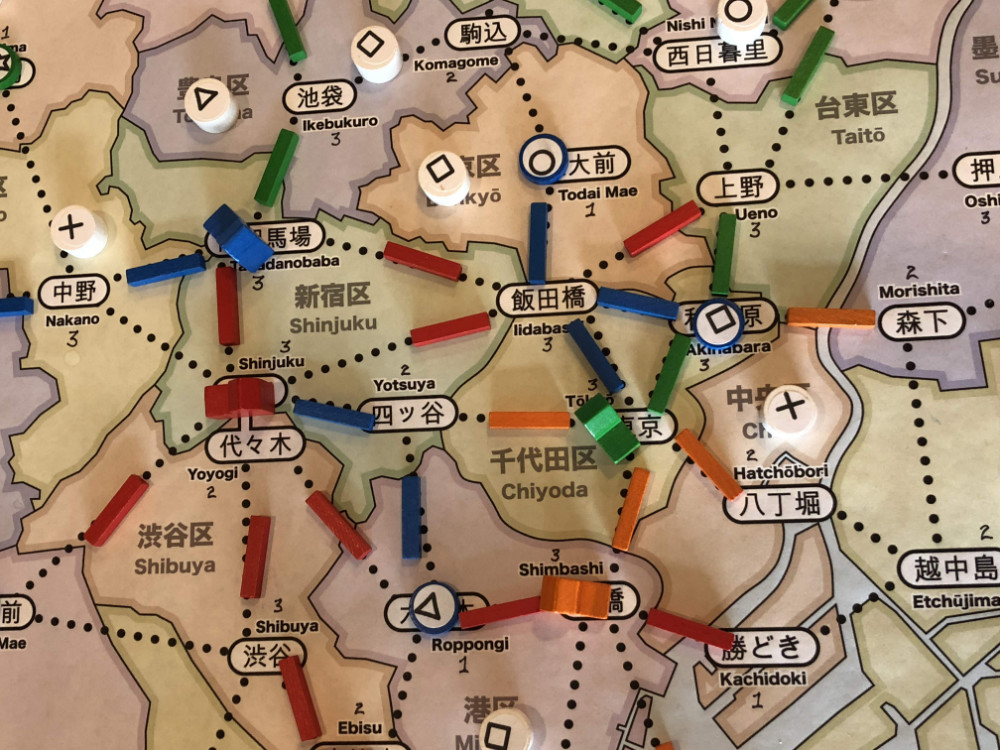
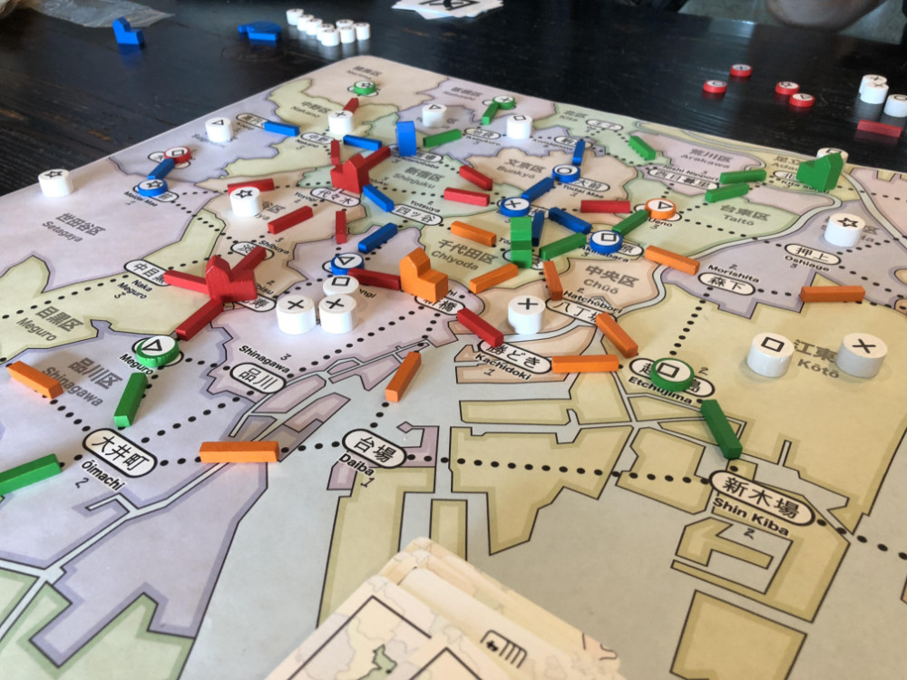
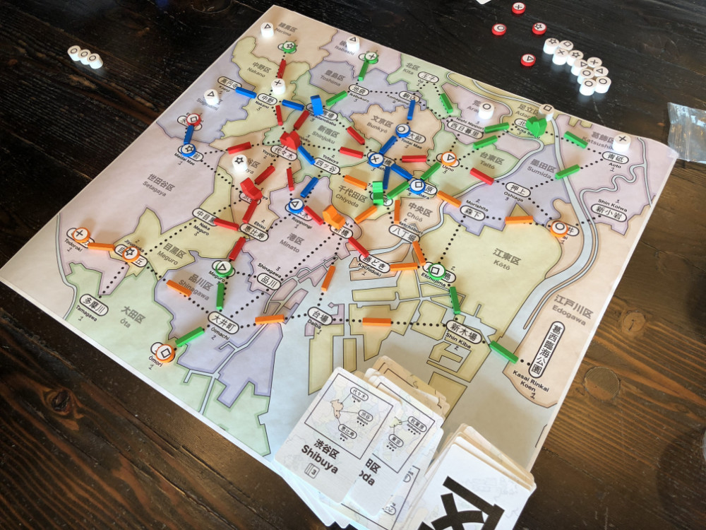
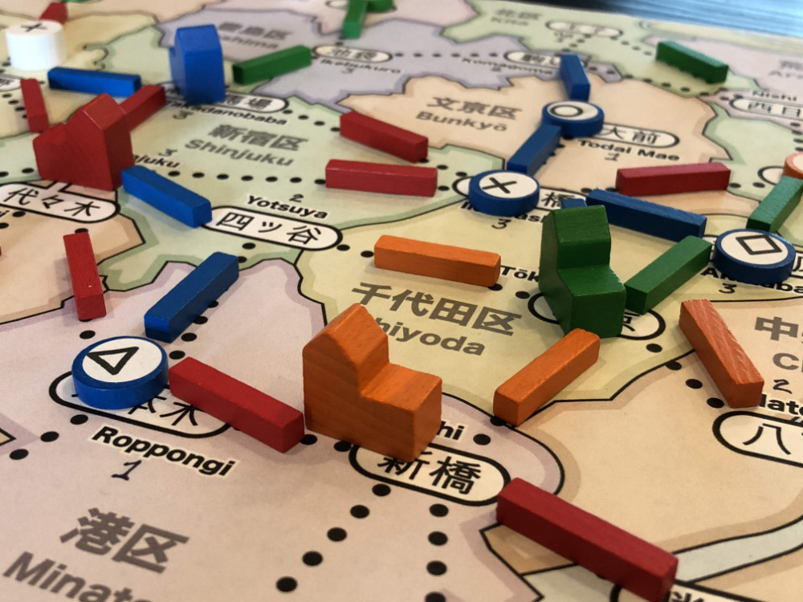

# Playtest #10

Wed 12 Sept 2018

Participants: self, AdamB, JeffB, JoshO'M

         

## Overview

* Testing:
	* 5 stores per player: 1 each of ◯, ⤫, △, ▢ and ⭒
	* 1 upgrade to dept store
	* dept store upgrade costs 1 customer (VP)
	* no free store at start of game.
	* At start of game, add customers equal to number of players
	* 60 customers: 16, 14, 12, 10, 8
	* First n/2 players only get 1 action on their first turn.

## Components

* 18"x20" board with Map of Tokyo
* 72 Ward cards
* 5 stores per player (1 of each type)
* 15 track per player
* 2 dept stores per player
* 60 Customer tokens:
	* 16 ◯, 14 ⤫, 12 △, 10 ▢, 8 ⭒

## Rules

### Setup

* Deal 5 cards to each player

### Turns

Each turn take 2 different actions:

* Pay a card, build a store in that ward
* Pay a customer, upgrade a store to a dept store
* Pay a card, lure customers from that ward
* Pay any 1 card to build 1 track; pay 3 cards to build 2 connected track
* Take income: draw up to 5 cards, or draw 1 card if you already have 5 cards. Taking this action ends your turn.

### Final turn

When last customer is placed, everyone takes one additional turn.

## Comments

Note: Spent customers are removed from game since there should be exactly enough customers so that each player has the same number of turns.

However, we apparently missed some of the upkeep since we didn't end on the right turn.

* Adam: ◯◯◯◯ ⤫⤫⤫ △△ ▢▢▢ ⭒ = 9 (remove ◯)
* Josh: ◯◯◯ ⤫ △△ ▢▢▢ ⭒⭒ = 8 (remove ◯ or ▢)
* Jeff: ◯◯◯ ⤫⤫ △△ ▢ ⭒⭒ = 7 (remove ◯)
* Gary: ◯◯ ⤫⤫⤫⤫ △ ▢▢ ⭒⭒ = 7 (remove ⤫)

GOOD: Game has multiple viable strategies that work

GOOD: Decision when to transition to gaining VPs from building economy

Possibly reduce track based on # of players.

### Further Discussion

AB: Is the upkeep an issue?

JOM: Would it be easier to remember at the beginning of one's turn?

I think it would be marginally easier because you care more: if you drop the customer at the beginning of your turn, you might be able to take advantage of that on your turn.

GK: The reason for it at the end is so that it doesn't distract the player from their planned actions (and as a reminder to take your turn). But the incentive to see if a new customer arrives in a good location is probably good enough [for a player to remember at the start of their turn].

And if you forget, you primarily hurt yourself (as opposed to the next player).

JOM: right, that's the flip side

but I agree that it will almost certainly cause your turn to take a bit longer as you reconsider your options

GK: Certainly in some cases, but many cases won't be relevant to your immediate plans.

## Suggestions/Actions

For next playtest:

* Place customer at start of turn
* Reduce track
