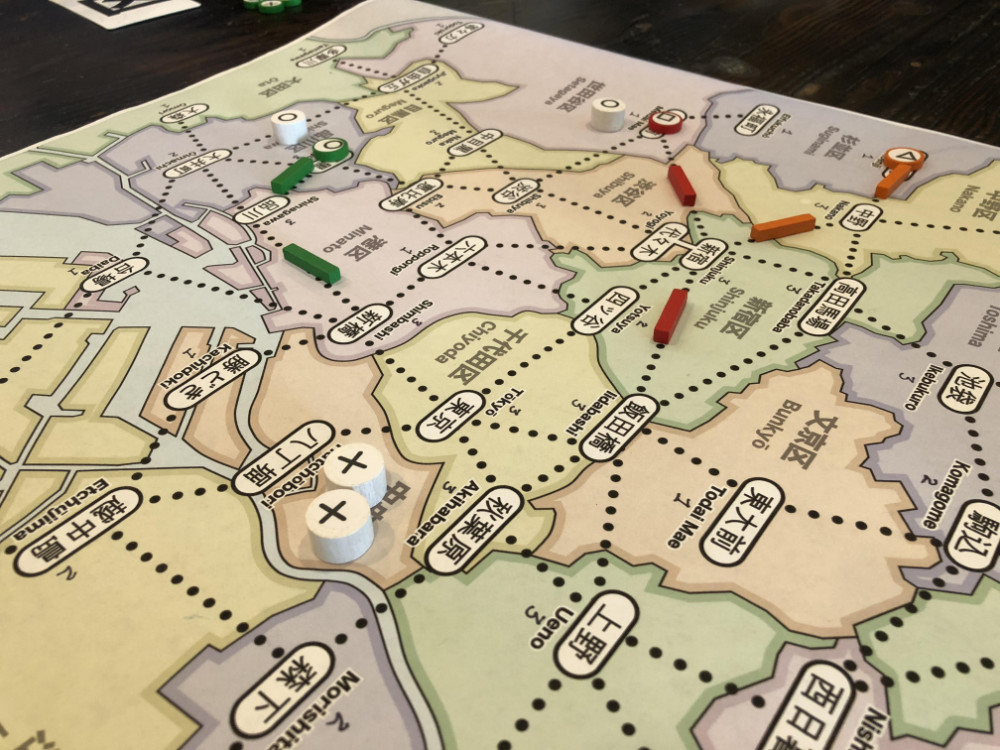
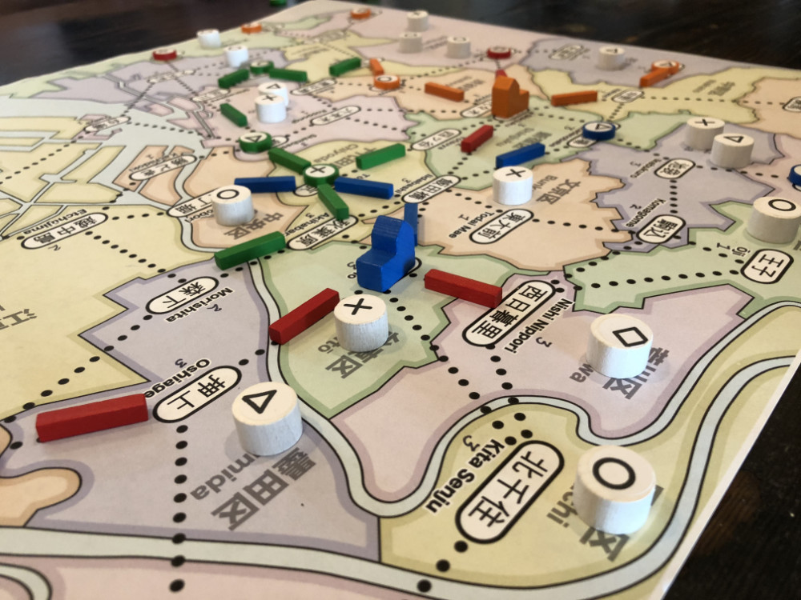
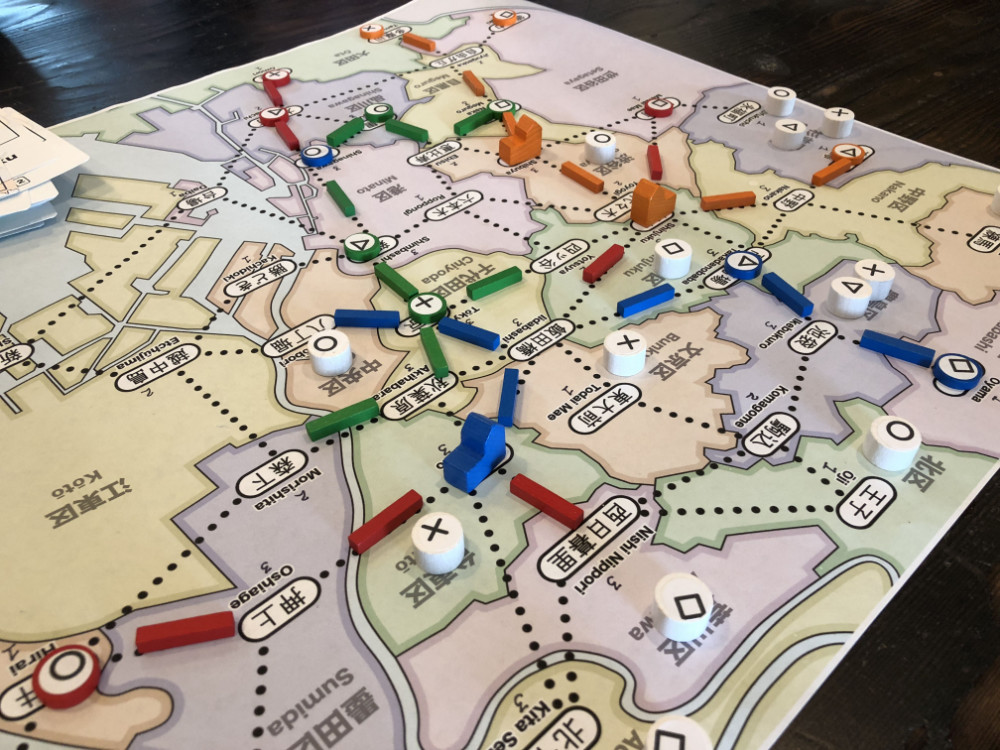
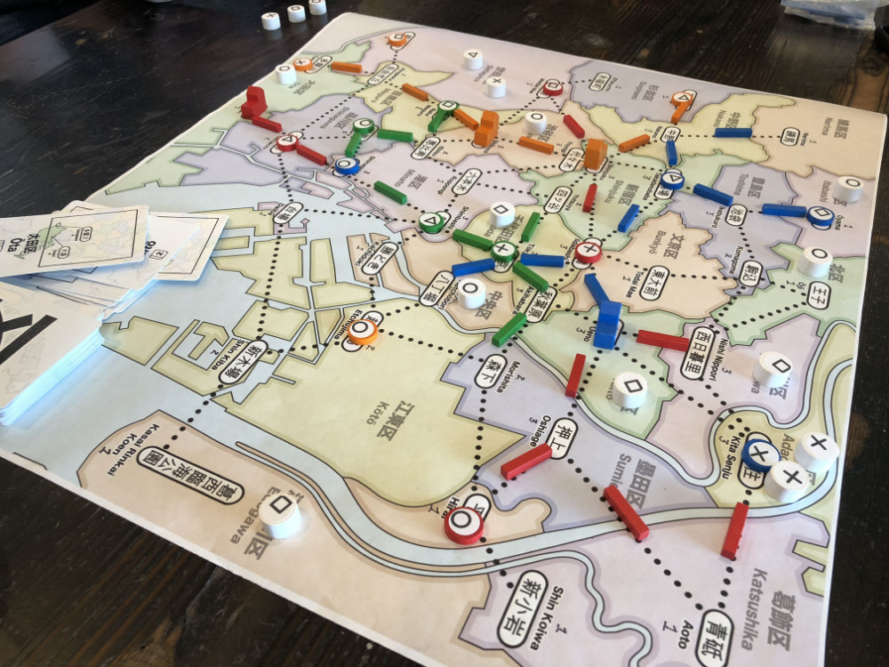

# Playtest #11

Thu 13 Sept 2018

Participants: self, AdamB, JeffB, JoshO'M

   

## Overview

* Testing:
	* No starting setup phase.
	* Place 1 customer at start of each turn
	* 48 customers (same for 2,3,4-player)
	* 4 customer types (remove ⭒)
	* 15/12/9 track for 2/3/4-player
	* Otherwise, same as playtest 10: players have 1 store per type and 2 dept stores; dept stores are the 1st upgrade and give 1 wild

## Components

* 18"x20" board with Map of Tokyo
* 72 Ward cards
* 4 stores per player (1 of each type)
* 15/12/9 track for 2/3/4-player
* 2 dept stores per player
* 48 Customer tokens:
	* 15 ◯, 13 ⤫, 11 △, 9 ▢

## Rules

### Setup

* Deal 5 cards to each player

### Turns

Place a random customer at start of turn

Each turn take 2 different actions:

* Pay a card, build a store in that ward
* Pay a customer, upgrade a store to a dept store
* Pay a card, lure customers from that ward
* Pay any 1 card to build 1 track; pay 3 cards to build 2 connected track
* Take income: draw up to 5 cards, or draw 1 card if you already have 5 cards. Taking this action ends your turn.

### Final turn

When last customer is placed, everyone takes one additional turn.

## Comments

Customers are currently public information. Consider whether or not they should be hidden.

Needed to shuffle cards twice during game.

Oops! Accidentally had one extra ▢ for 10 ▢ total (49 total customers).

Mid-game switch to allowing dept store everywhere because one player played all their stores on places where dept stores can't be built.

* "Feel bad" moment - can't build dept store

Ran out of actions to do at endgame. If you can't get a customer, then there's nothing good to do. No track or stores.

Need to have more than 4 stores per player.

How to have more customers without having the game take too long?

Another feel bad moment: If the number of customers is supposed to be exact then players feel bad at the end of the game when they discover that the count is off.

* "Who forgot to draw a customer during their turn?"
* Also, players not sure what to do with the customers that they sacrifice for the dept store.
* Solution: Put customers back in the bag/cup so that the total number of turns varies a bit.

Game duration: ~1hr

* Jeff: ◯◯ ⤫ △△ ▢ = 4 (remove ◯ or △)
* Josh: ◯◯ ⤫ △ ▢ = 3 (remove ◯)
* Adam: ◯ ⤫⤫⤫ △△△ ▢▢▢▢ = 7 (remove ▢)
* Gary: ◯◯◯◯◯ ⤫⤫⤫ △△△△ ▢ = 8 (remove ◯)

Leftover track: 0 except for Josh: 1, Gary: 1

### Further Discussion

What felt bad?

Stuck. No track or stores.

JB: Possible dept store fix: ability to move store

Lack of endgame actions.

JOM: I can only cycle cards

JB: Maybe have customers come twice as fast near end of game.

Action to draw customers. Play <n> cards to place <n> random customers.

AB: Add screen to hide customers to discourage AP behavior.

## Suggestions/Actions

For next playtest:

* More stores per player: 7/6/5 for 2/3/4-player
* Allow stores to be moved (you can build from your pool or from your existing stores)
* Dept Store upgrade costs 1 matching card + 1 matching customer
* Put paid customer back into bag/cup so it gets drawn again later
* Summon action: discard N cards to place N customers
* Bypass action: play a card during Lure to bypass all stations in the matching ward
