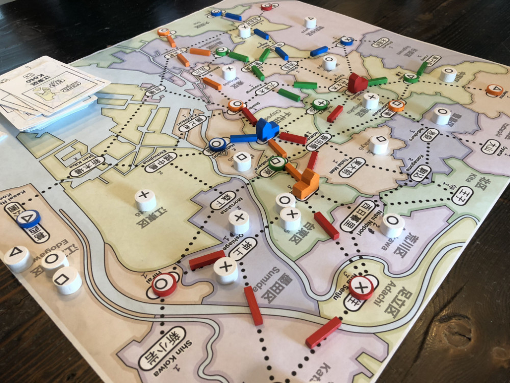

# Playtest #12

Fri 14 Sept 2018

Participants: self, SverreR, JeffB, AdamB

## Overview

* Testing:
	* More stores per player: 7/6/5 for 2/3/4-player
	* Build store allows you to move an existing store
	* New Action: Summon: discard N cards to place N random customers
	* Dept store costs 1 matching card + 1 matching customer
	* Can play a card during Lure to Bypass all stations in that ward.

## Components

* 18"x20" board with Map of Tokyo
* 72 Ward cards
* 7/6/5 for 2/3/4-player
* 15/12/9 track for 2/3/4-player
* 2 dept stores per player
* 48 Customer tokens:
	* 15 ◯, 13 ⤫, 11 △, 9 ▢

## Rules

### Setup

* Deal 5 cards to each player

### Turns

Place a random customer at start of turn

Each turn take 2 different actions:

* **Build**: Pay a card, build a store in that ward
* **Upgrade**: Pay a card and a customer, upgrade a store to a dept store
* **Lure**: Pay a card, lure customers from that ward
* **Expand**: Pay any 1 card to build 1 track; pay 3 cards to build 2 connected track
* **Summon**: Discard N cards to place N random customers
* **Income**: draw up to 5 cards, or draw 1 card if you already have 5 cards. Taking this action ends your turn.

### Final turn

When last customer is placed, everyone takes one additional turn.

## Comments

Game duration: 52 min (12:00 - 12:52)

* Sverre: ◯◯ ⤫ △△ ▢ = 4 (remove ◯ or △)
* Jeff: ◯◯ ⤫ △△ ▢▢ = 5 (remove ◯, △ or ▢)
* Adam: ◯◯ △△ ▢▢ = 4 (remove ◯, △ or ▢)
* Gary: ◯ ⤫ △△ = 2 (remove △)

Summon not very useful. Not a satisfying action to do. Would rather do things that work toward VPs.

Game is low scoring. It would be nice to add more customers (= scoring potential) without making the game much longer.

### Further Discussion

JonS and EmilyR watched and gave comments at end.

Fewer wildcards made it harder to do actions at the end of the game.

More wildcards:

AB: Possibly 3 different cards = wild. Or 5 different cards.

ER: Or 3 diff colors since each card has a color associated with it.

Possibly more track.

## Suggestions/Actions

For next playtest:

* Try 5 cards wild
* Different player count
* Possibly more track
* Use ⭐︎ instead of ▢ since they are easier to distinguish from ◯ at a distance.
