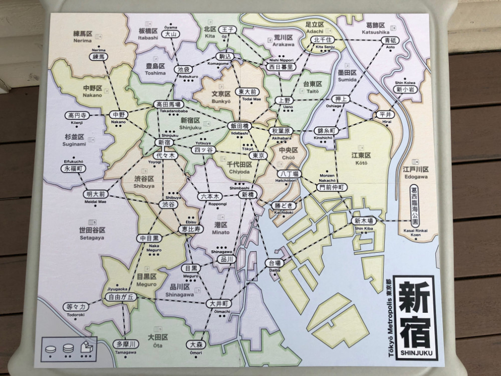
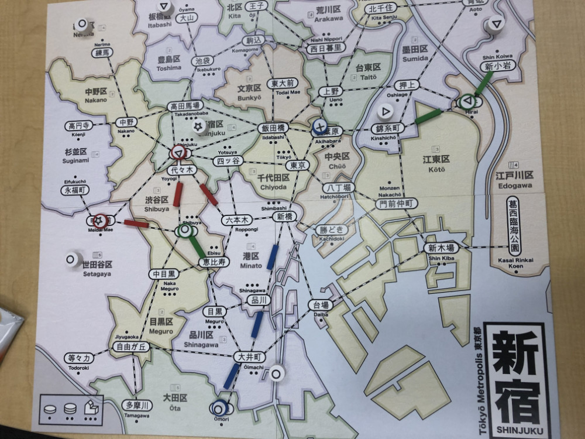
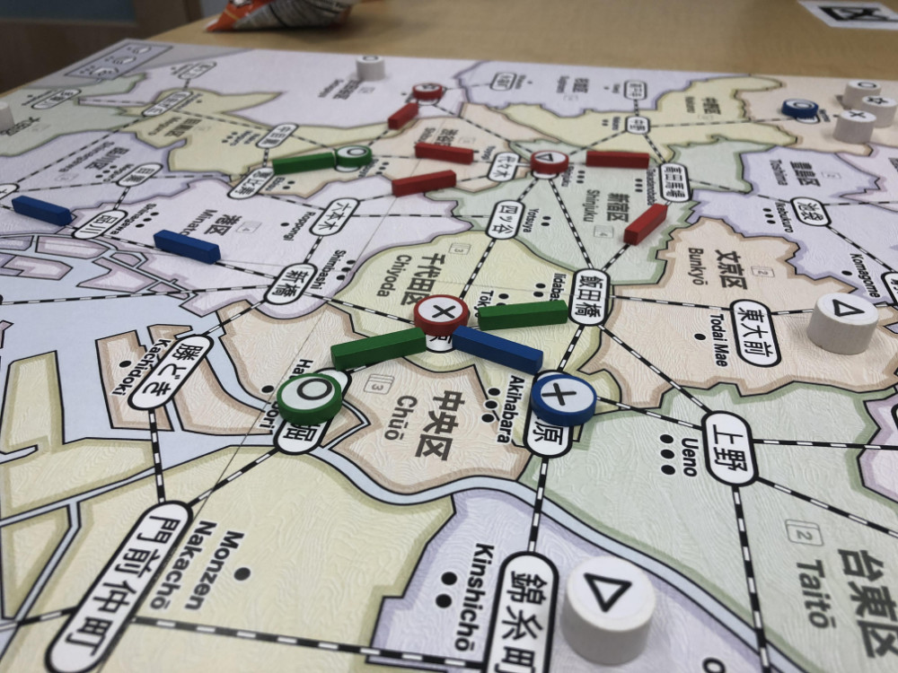
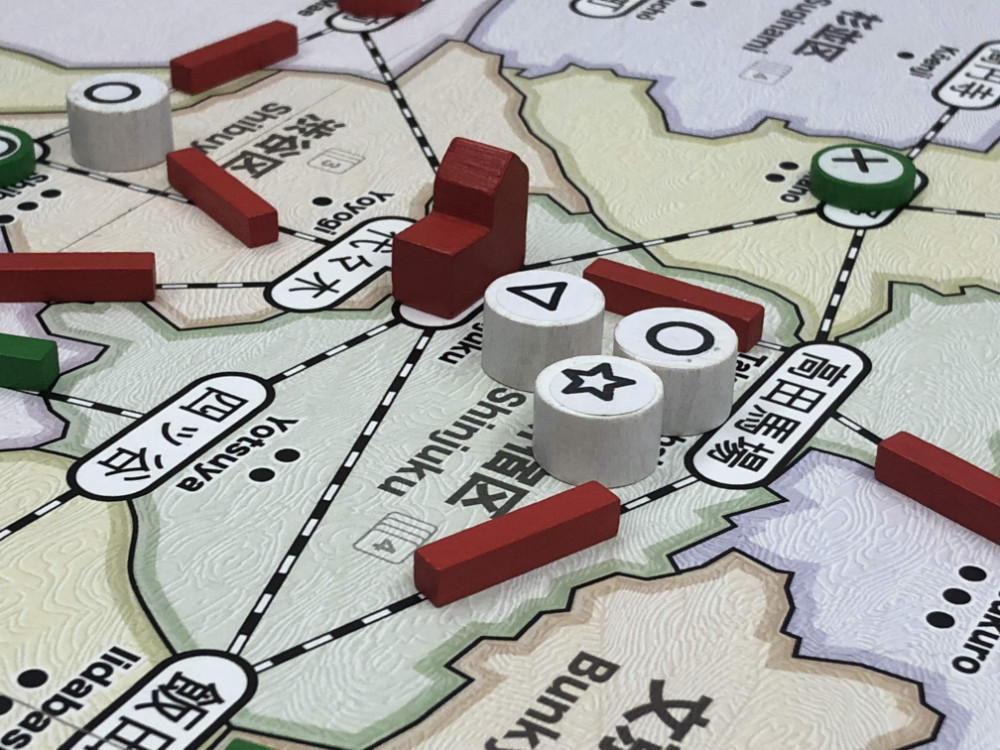
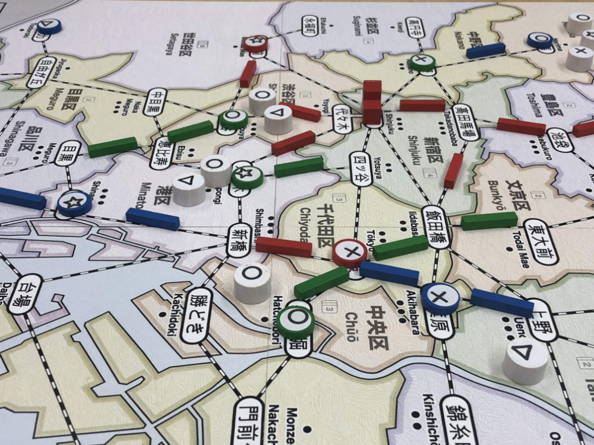
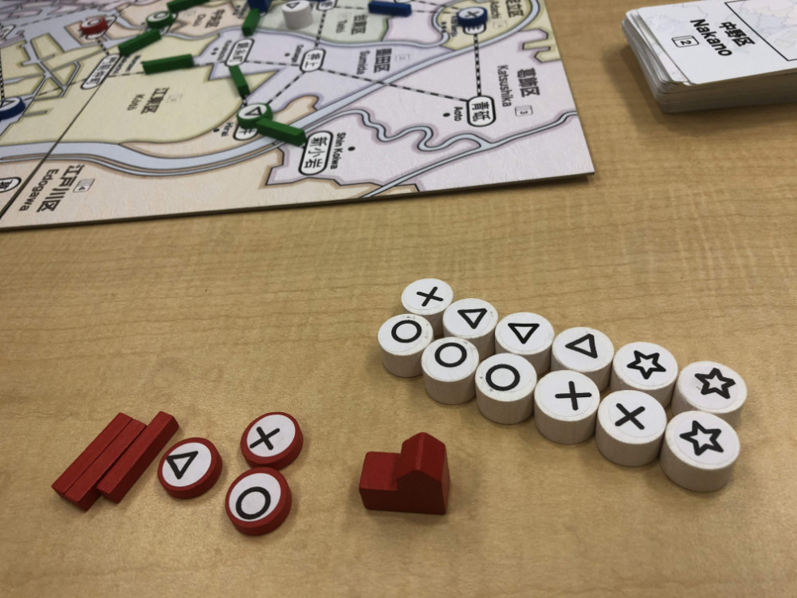
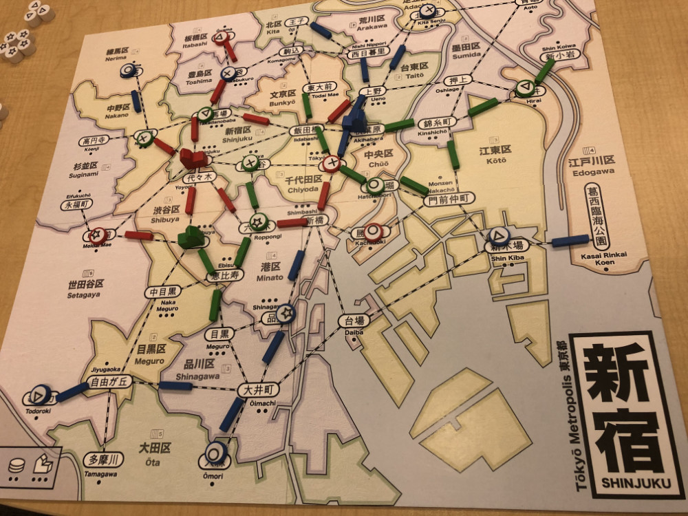

# Playtest #13

Mon 17 Sept 2018

Participants: self, JohnB, PeterW

First test with folding map:

     

## Overview

* Testing:
	* 3 player
	* 5 cards = wildcard
	* Bypass during Lure
	* Short game: randomly remove 12 customers for 48

## Components

* 18"x20" board with Map of Tokyo
* 72 Ward cards
* 7/6/5 for 2/3/4-player
* 15/12/9 track for 2/3/4-player
* 2 dept stores per player
* 60 Customer tokens:
	* 19 ◯, 16 ⤫, 14 △, 11 ⭐︎

## Rules

### Setup

* Deal 5 cards to each player

### Turns

Place a random customer at start of turn

Each turn take 2 different actions:

* **Build**: Pay a card, build a store in that ward
* **Upgrade**: Pay a customer, upgrade a store to a dept store
* **Lure**: Pay a card, lure customers from that ward
* **Expand**: Pay any 1 card to build 1 track; pay 3 cards to build 2 connected track
* **Income**: draw up to 5 cards, or draw 1 card if you already have 5 cards. Taking this action ends your turn.

### Final turn

When last customer is placed, everyone takes one additional turn.

## Comments

Game can be long for people who suffer from AP.

* John: ◯◯◯◯◯ ⤫⤫⤫ △△△△△ ⭐︎ = 9 (remove ◯ or △)
* Peter: ◯◯◯◯◯◯ △△△ ⭐︎⭐︎⭐︎⭐︎⭐︎ = 8 (remove ◯)
* Gary: ◯◯◯◯ ⤫⤫⤫⤫⤫⤫⤫ △△△△△ ⭐︎⭐︎⭐︎⭐︎⭐︎ = 13 (remove ⤫)

Need to hide customers behind a screen to help reduce AP tendencies.

John: Is dept store in center too powerful?

I had the opportunity to use Bypass on Nerima when I had 3 Nerima cards in hand. And I forgot. The rule is not used often enough to be remembers, so it doesn't appear to worth the extra rules weight.

### Further Discussion

The economy/income curve in Shinjuku is supposed to be that you draw 5 cards for income, but those 5 cards are worth more later in the game (when you have more stations) than at the beginning.

This extra value comes in the form of being more likely to get a card where you have a station (because it becomes a wildcard).

Fewer stations mean fewer wildcards, so late game income currently isn't significantly better than early game income. (edited)

Leading to frustration at the end of the game where you need wildcards to resolve customers.

Possible solutions: add more stations or add more wildcard opportunities.

*More stations*: I'm adding 1 more station for the 4 player game. So that means 8/7/6 stations for a 2/3/4-player game. This should help a bit without removing the interesting decisions associated with having a limited number of stations.

*More wildcards*: Most of the proposed ways (i.e., doubles, or 3 different cards) to add more wildcards do not follow the desired income curve: they're just as likely early game as near the end.

Wildcards need to be based on the player's stores (or track) for them to feel like income.

And so that they become more likely as the game progresses.

Thus, *half-wildcards*. These are cards for wards that you have a direct connection to from any of your stations. There must be rail on the connection, but it can be any player's rail.

Two half-wildcards can be played as a wildcard.

Also, how to have more customers appear in the game: A burst of customers whenever a dept store is built. Or (via Adam) a new customer whenever any store is built.

## Suggestions/Actions

For next playtest:

* Remove Bypass
* Test same ruleset
