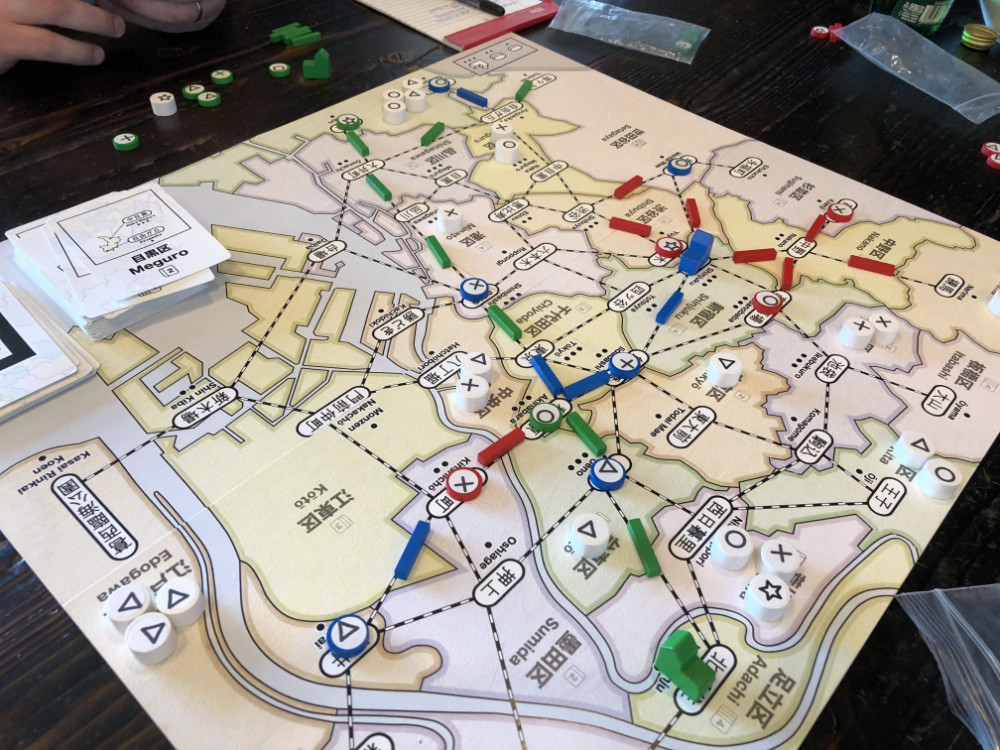
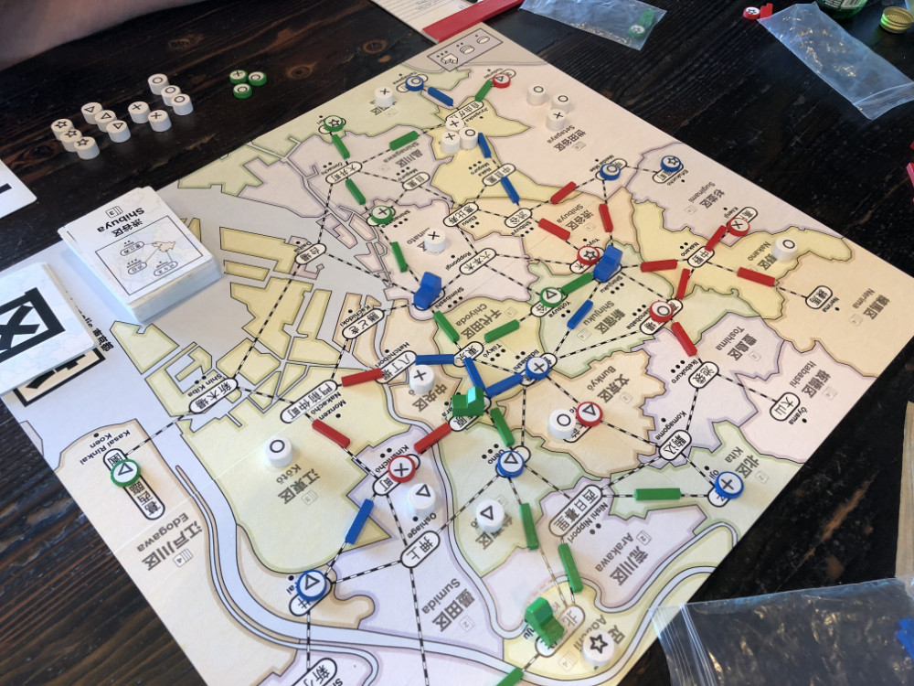

# Playtest #14

Wed 19 Sept 2018

Participants: self, AdamB, JeffB

    

## Overview

* Testing:
	* Place a new customer every time a store is built.
	* Slightly more track: 16/13/10 for 2/3/4-player
	* 1 more station: 8/7/6 for 2/3/4-player
	* You gain an income action whenever you give another player a customer during Lure
	* 5 diff cards = wildcard

## Components

* 18"x20" board with Map of Tokyo
* 72 Ward cards
* 8/7/6 for 2/3/4-player
* 16/13/10 track for 2/3/4-player
* 2 dept stores per player
* 60 Customer tokens:
	* 19 ◯, 16 ⤫, 14 △, 11 ⭐︎

## Rules

### Setup

* Deal 5 cards to each player

### Turns

Place a random customer at start of turn

Each turn take 2 different actions:

* **Build**: Pay a card, build a store in that ward
* **Upgrade**: Pay a card and a customer, upgrade a store to a dept store
* **Lure**: Pay a card, lure customers from that ward
* **Expand**: Pay any 1 card to build 1 track; pay 3 cards to build 2 connected track
* **Income**: draw up to 5 cards, or draw 1 card if you already have 5 cards. Taking this action ends your turn.

### Final turn

When last customer is placed, everyone takes one additional turn.

## Comments

Can build on existing shop? No.

* Adam: ◯◯◯ ⤫⤫ △△△ ⭐︎⭐︎⭐︎ = 8 (remove ◯, △ or ⭐︎)
* Jeff: ◯◯◯ ⤫⤫⤫⤫ △△△ ⭐︎⭐︎⭐︎⭐︎ = 10 (remove ⤫ or ⭐︎)
* Gary: ◯◯◯◯◯ ⤫⤫⤫⤫ △△△△△△ ⭐︎⭐︎⭐︎ = 12 (remove △)

At end of game:

* Adam had 3 stores and 0 track remaining
* Jeff had 2 department stores and 2 track remaining. No dept stores were built.
* Gary had 0 stores and 5 track remaining.

Higher scores without the game taking too long. Yay!

BAD: Adding 1 customer for each store was a bit tedious. Esp. during the early game.

Clarify: you may discard when taking the free Income action.

Being able to take Income when you give another player a customer during Lure didn't feel worth it. Extra rule and it didn't make giving a VP feel better. I.e., if you going to give another player a VP, then it'll be because you get a VPs as well, and getting an Income action will not make you more likely to give someone else a VP.

16 customers left on board at end of game. Some stranded (no track) others just loewr prio.

Feel bad: too many customers arrived early in the game, so if you didn't build a lot of stores early you got left out. Hard to recover.

## Suggestions/Actions

For next playtest:

* Draw a burst of customers when dept stores are built (instead of 1 every time a store is built).
