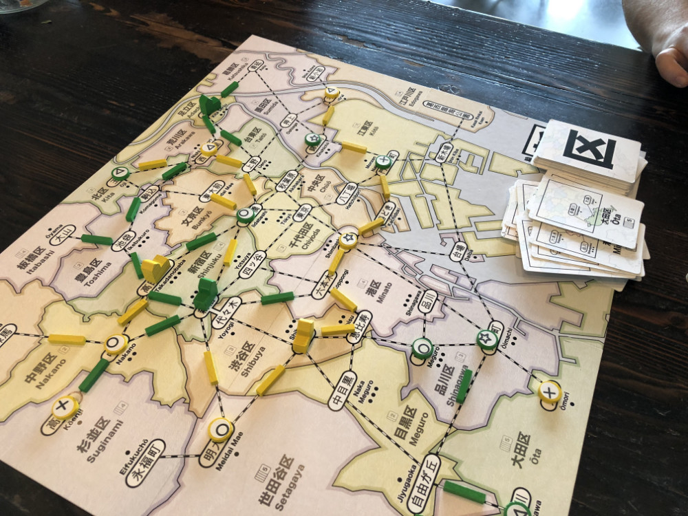

# Playtest #15

Thu 20 Sept 2018

Participants: self, JeffB

     

## Overview

* Testing:
	* 2 player
	* Place a burst of customers when a dept store is built. Burst = 4/3/2 customers for 2/3/4-player
	* 5 diff cards = wildcard

## Components

* 18"x20" board with Map of Tokyo
* 72 Ward cards
* 8/7/6 for 2/3/4-player
* 16/13/10 track for 2/3/4-player
* 2 dept stores per player
* 60 Customer tokens:
	* 19 ◯, 16 ⤫, 14 △, 11 ⭐︎

## Rules

### Setup

* Deal 5 cards to each player

### Turns

Place a random customer at start of turn

Each turn take 2 different actions:

* **Build**: Pay a card, build a store in that ward
* **Upgrade**: Pay a card and a customer, upgrade a store to a dept store
* **Lure**: Pay a card, lure customers from that ward
* **Expand**: Pay any 1 card to build 1 track; pay 3 cards to build 2 connected track
* **Income**: draw up to 5 cards, or draw 1 card if you already have 5 cards. Taking this action ends your turn.

### Final turn

When last customer is placed, everyone takes one additional turn.

## Comments

* Jeff: ◯◯◯◯◯ ◯◯◯◯◯ ⤫⤫⤫⤫⤫ ⤫⤫⤫ △△△△△ △△ ⭐︎⭐︎⭐︎⭐︎⭐︎ ⭐︎⭐︎ = 22 (remove ◯)
* Gary: ◯◯◯◯◯ ◯◯◯◯ ⤫⤫⤫⤫⤫ ⤫⤫⤫ △△△△△ △△ ⭐︎⭐︎⭐︎⭐︎ = 19 (remove ◯)

Burst of customers worked well and felt good. It wasn't as tedious as adding customers after each regular store.

Targetting ⭐︎ customers worked well as a strategy (because of their limited number).

Using 5 different cards as a wildcard has never been used in a playtest. No need to keep it as a rule.

Being able to move stores serves as an interesting "attack" during late game when you have a lot of wildcards. Play a card to move a store, then play a card to lure customers.

* If there's a need to reduce the frequency of this, then the cost to move a store can be increased to 2 cards: one for the store's current location and then another for it's new location.

Game could have ended a few turns early, so the game needs to consume more customers. Increase the number of customers that arrive in the burst.

I can bump that up to 5 or have 3 dept stores in a 2-player game.
... or both, I suppose.

This playtest was 2 player x 2 dept x 4 customers = 16 customers

Assuming that everyone builds all their dept stores:

* 4 players x 2 dept = 8 events x 3 = 24 customers
* 3 players x 2 dept = 6 events x 4 = 24 customers
* 2 players x 3 dept = 6 events x 4 = 24 customers

## Suggestions/Actions

For next playtest:

* Update dept store burst to 4/4/3 for 2/3/4-player
* Update number of dept stores to 3 in 2-player game
