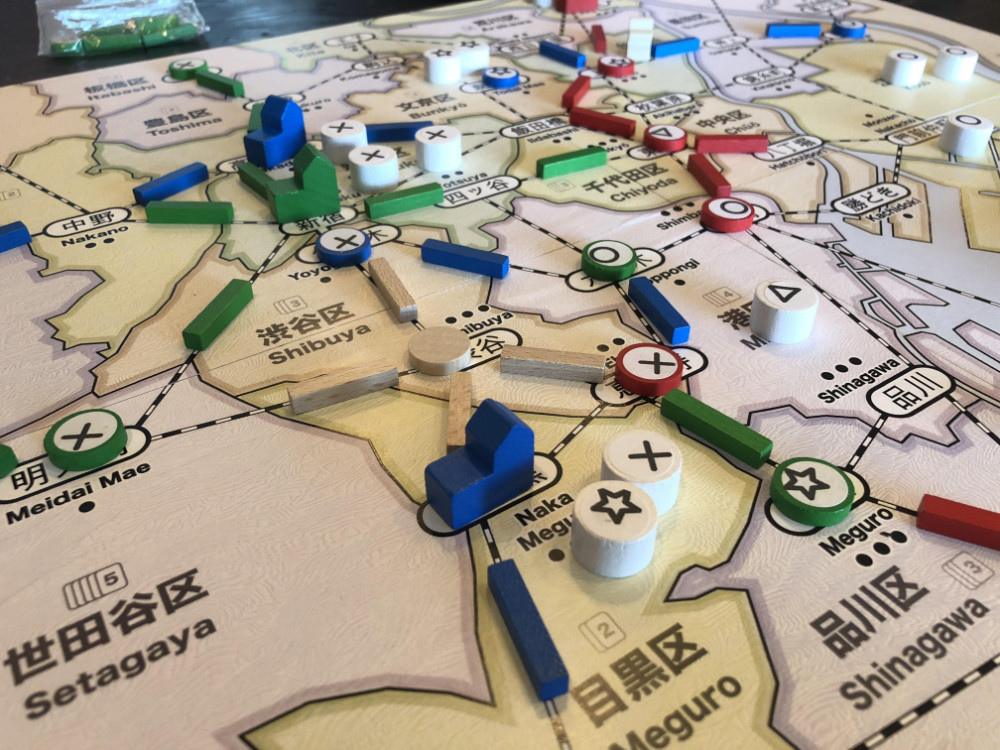

# Playtest #16

Mon 24 Sept 2018

Participants: self, AdamB, JeffB

## Overview

* Testing:
	* Hachiko Expansion:
		* Shibuya + 4 neutral track
		* Reunite Action: Move Hachiko to Shibuya, taking customers (as with Lure) and give income to anyone who owns track Hachiko uses (incl player who took action).

## Components

* 18"x20" board with Map of Tokyo
* 72 Ward cards
* 8/7/6 stores per player for 2/3/4-player
* 16/13/10 track per player for 2/3/4-player
* 3/2/2 dept stores per player for 2/3/4-player
* 60 Customer tokens:
	* 19 ◯, 16 ⤫, 14 △, 11 ⭒

## Rules

### Setup

* Deal 5 cards to each player

### Turns

Place a random customer at start of turn

Each turn take 2 different actions:

* **Build**: Pay a card, build a store in that ward
* **Upgrade**: Pay a matching card and a matching customer, upgrade a store to a dept store
* **Lure**: Pay a card, lure customers from that ward
* **Expand**: Pay any 1 card to build 1 track; pay 3 cards to build 2 connected track
* **Income**: draw up to 5 cards, or draw 1 card if you already have 5 cards. Taking this action ends your turn.

### Department Stores

When a department store is built, it triggers a burst of new customers: 4/4/3 customers for 2/3/4-player game.

### Final turn

When last customer is placed, that player finishes their turn and then everyone (incl the person who drew the last customer) takes one additional turn.

## Comments

Shinjuku and Yoyogi are not the same station, so you cannot connect through them.

The neutral track around Shibuya (with the expansion) makes it harder for more than 1 player to build connections.

Should players be allowed to connect through neutral track?

* Yes? (but test)

Should the connection between Shinjuku and Yoyogi be described as "neutral" track?

Income on your turn. You should draw the cards and set them aside until your turn ends. This should be made consistent with the normal Income action.

Note: we initially forgot to have the burst of customers after dept stores were built. We fixed that when the 3rd dept store was built (by having a very large burst)

* Adam: ◯◯◯◯ ⤫⤫⤫⤫⤫ △△△△ ⭒⭒⭒⭒ = 12 (remove ⤫)
* Jeff: ◯◯◯◯ ⤫⤫⤫⤫⤫ △△△△ ⭒⭒⭒⭒ = 12 (remove ⤫)
* Gary: ◯◯◯◯ ⤫⤫⤫⤫⤫ △△△ ⭒⭒⭒ = 10 (remove ⤫)

Tied! With the exact same set of customers.

Need to either (a) be OK with ties, or (b) have a tie-breaker that strictly orders all of the players (for example turn order).

Hachiko. Not a negative, but not a core part of the game. Works as an expansion.

Natural color of wood is hard to see against the map.

Hachiko was used a lot in the start of the game because he was in the same location as customers.

Got stuck in Taito with no customers, so no one wanted to move. Stayed there until end of game.

When Hachiko is in a location without customers, then the only benefit is the Income. But if everyone gets income, then there's less reason for you to do it (you'd rather someone else does it). And moving Hachiko with no customers possibly gives the next player a better position if Hachiko lands on a location with customers.

Should Hachiko only give Income to the player who uses Hachiko (as opposed to everyone)?

Note: With Hachiko, there can be 2 income actions in the same turn, so we need to address this in the rules: Do income actions end your turn, or do you need to set the new cards aside until the end of your turn?

## Suggestions/Actions

For next playtest:

* Try Hachiko only giving Income to the player who takes the action
* Track can be expanded through neutral connections
* Final tie-breaker based on turn order: 1st player wins over 2nd player wins over 3rd ...
* Taking the Income action doesn't end your turn immediately, but you don't get the new cards until the end of your turn. Any drawn cards should be set aside facedown until the your turn ends.
