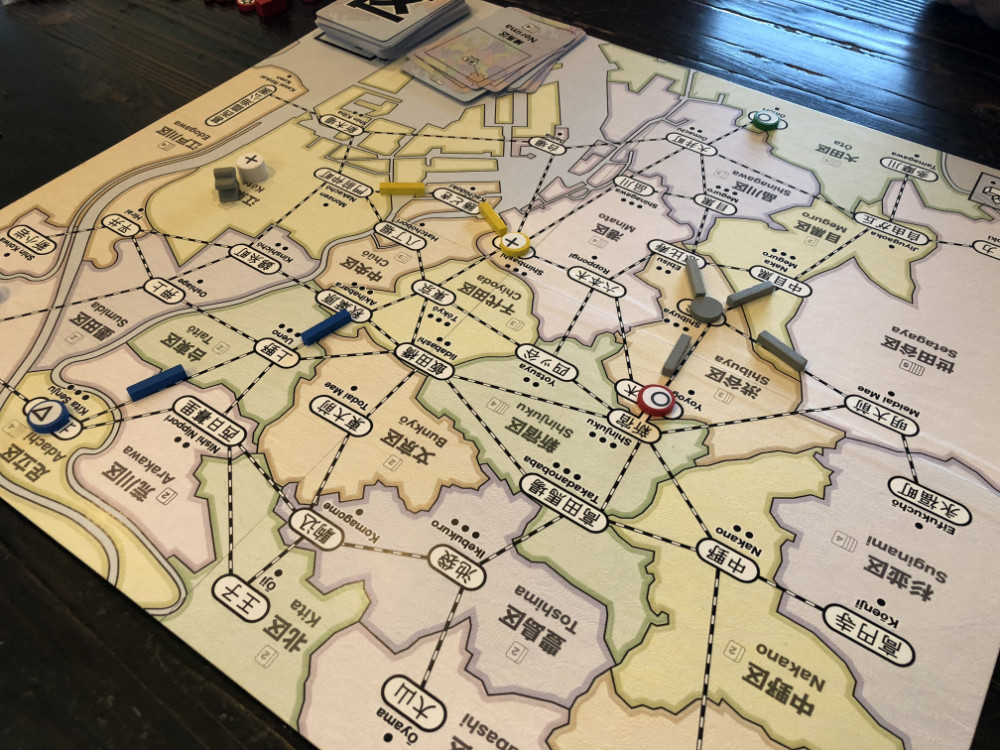
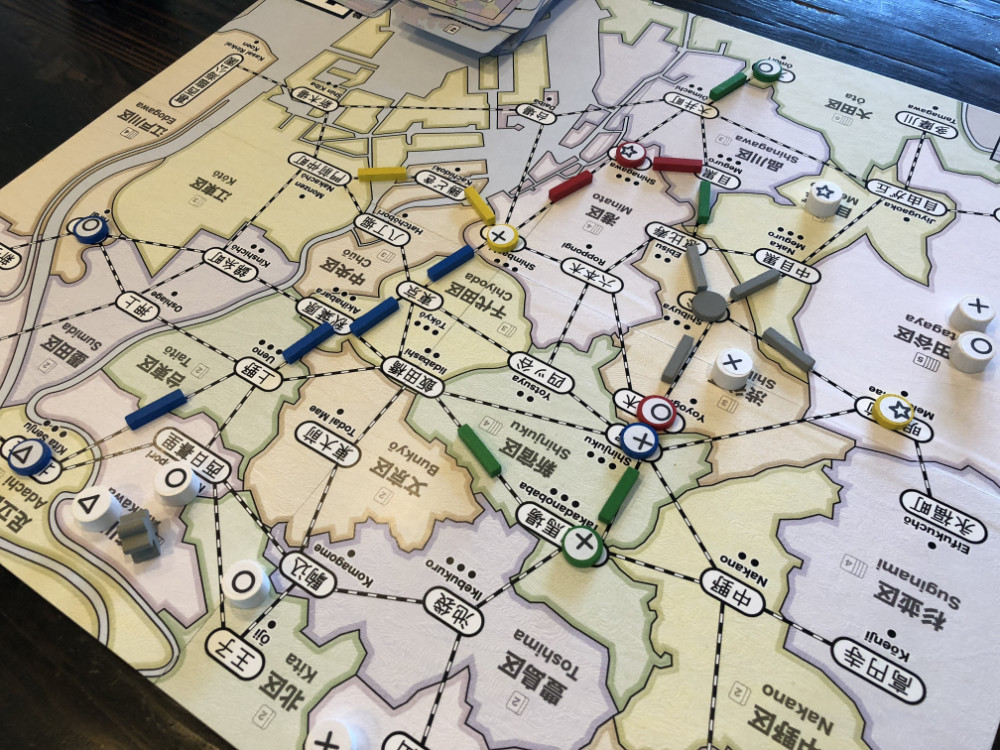
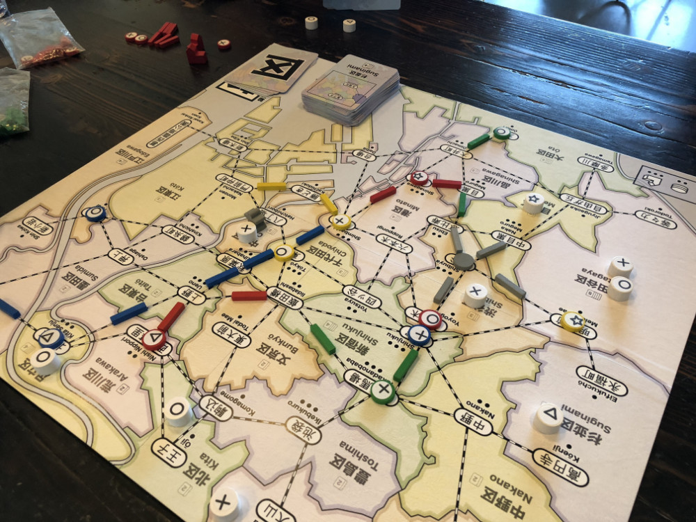
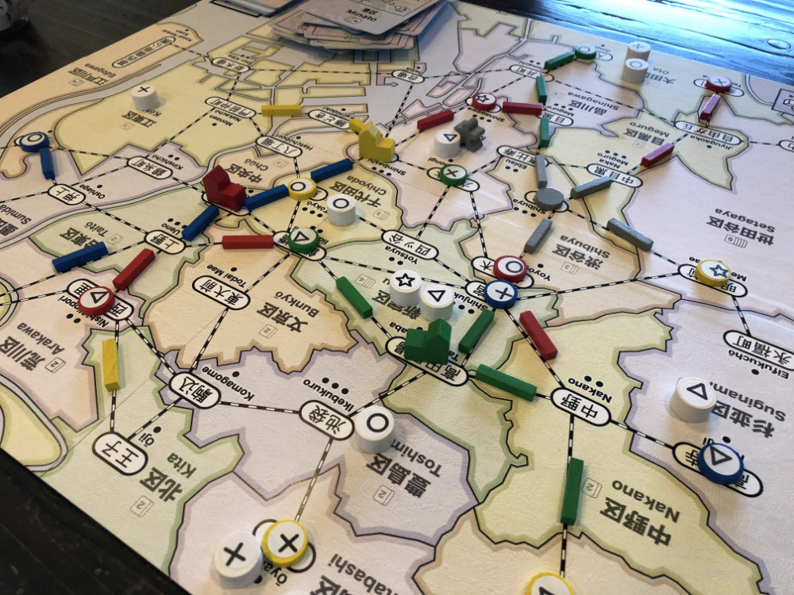
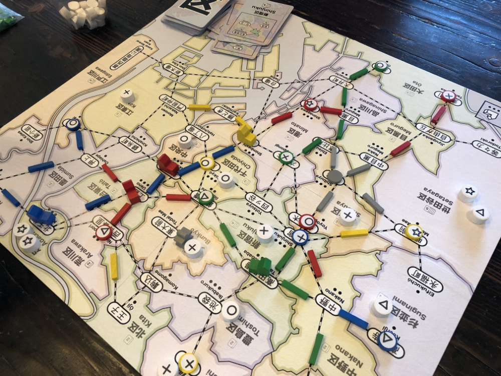
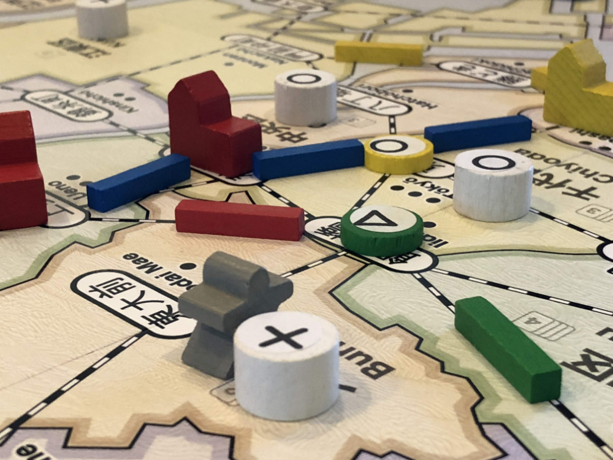
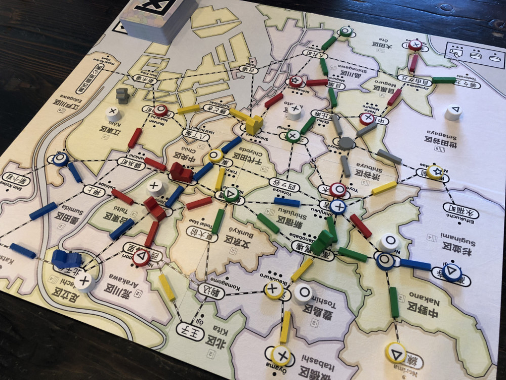

# Playtest #17

Tue 25 Sept 2018

Participants: self, AdamB, JeffB, SverreR

      

## Overview

* Testing:
	* Place single track anywhere (to resolve placement issues around neutral track) Double track can be anywhere but the 2 segments must be connected
	* Hachiko expansion: Remove neutral track around Shibuya. Hachiko starts in Shibuya. If H is in Shibuya at the start of your turn, then you place Hachiko with your customer placement. When you Lure from a ward with Hachiko, it doesn't cost a card, but you must take Hachiko with the other customers and end the Lure in Shibuya.

## Components

* 18"x20" board with Map of Tokyo
* 72 Ward cards
* 8/7/6 stores per player for 2/3/4-player
* 16/13/10 track per player for 2/3/4-player
* 3/2/2 dept stores per player for 2/3/4-player
* 60 Customer tokens:
	* 19 ◯, 16 ⤫, 14 △, 11 ⭐︎

## Rules

### Setup

* Deal 5 cards to each player

### Turns

Place a random customer at start of turn

Each turn take 2 different actions:

* **Build**: Pay a card, build a store in that ward
* **Upgrade**: Pay a matching card and a matching customer, upgrade a store to a dept store
* **Lure**: Pay a card, lure customers from that ward
* **Expand**: Pay any 1 card to build 1 track; pay 3 cards to build 2 connected track
* **Income**: draw up to 5 cards, or draw 1 card if you already have 5 cards. Taking this action ends your turn.

### Department Stores

When a department store is built, it triggers a burst of new customers: 4/4/3 customers for 2/3/4-player game.

### Final turn

When last customer is placed, that player finishes their turn and then everyone (incl the person who drew the last customer) takes one additional turn.

## Comments

Hachiko good.

* Jeff: ◯◯◯ ⤫⤫ △△ ⭐︎⭐︎⭐︎ = 7 (remove ◯ or ⭐︎)
* Adam: ◯◯◯◯◯◯ ⤫⤫⤫⤫ △△ ⭐︎⭐︎ = 8 (remove ◯)
* Gary: ◯◯◯ ⤫⤫⤫ △△ ⭐︎⭐︎⭐︎ = 8 (remove ◯, ⤫ or ⭐︎)
* Sverre: ◯◯ ⤫⤫⤫ △△△ ⭐︎⭐︎ = Dropped out before end

Only 5 of the 8 possible dept stores were built.

Leftover stores: Gary ⤫⭐︎; Sverre ◯⤫⭐︎; none for others

Leftover track: Gary 1; none for others

## Suggestions/Actions

For next playtest:

* Hachiko: Remove track around Shibuya
* Seed more during burst
