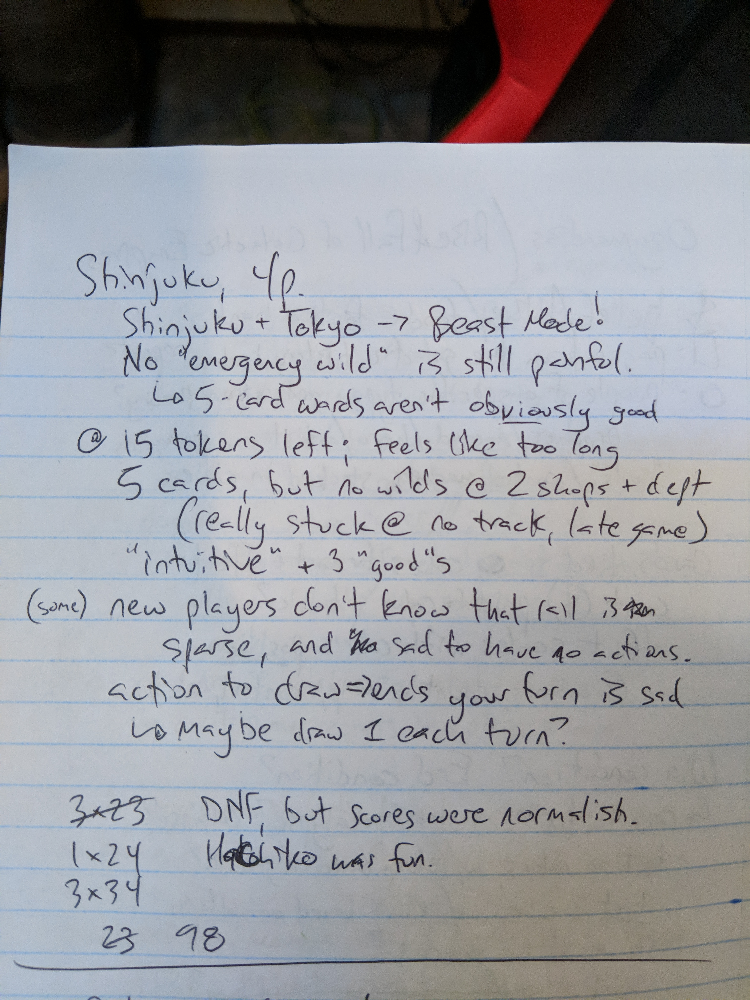

# Playtest #18

Tue 25 Sept 2018

Participants: AdamB, ??, ??, ??

 

## Overview

* Testing:
	* New players	
	* Hachiko Expansion without neutral track around Shibuya

## Components

* 18"x20" board with Map of Tokyo
* 72 Ward cards
* 8/7/6 stores per player for 2/3/4-player
* 16/13/10 track per player for 2/3/4-player
* 3/2/2 dept stores per player for 2/3/4-player
* 60 Customer tokens:
	* 19 ◯, 16 ⤫, 14 △, 11 ⭐︎

## Rules

### Setup

* Deal 5 cards to each player

### Turns

Place a random customer at start of turn

Each turn take 2 different actions:

* **Build**: Pay a card, build a store in that ward
* **Upgrade**: Pay a matching card and a matching customer, upgrade a store to a dept store
* **Lure**: Pay a card, lure customers from that ward. If Hachiko is there, then it doesn't cost a card, but you must end in Shibuya.
* **Expand**: Pay any 1 card to build 1 track; pay 3 cards to build 2 connected track
* **Income**: draw up to 5 cards, or draw 1 card if you already have 5 cards. Taking this action ends your turn.

### Department Stores

When a department store is built, it triggers a burst of new customers: 4/4/3 customers for 2/3/4-player game.

### Final turn

When last customer is placed, that player finishes their turn and then everyone (incl the person who drew the last customer) takes one additional turn.

## Comments

Shinjuku + Tokyo -> Beast Mode!

No "emergency wild" is still painful. The 5-card wards aren't obviously good to new players.

@15 tokens left, felt too long

Player stuck with 5 cards, but no wilds @ 2 shops + dept store. Really stuck because no track in late game - spent it all in early game).

New players don't know that rail is sparse, and sad to have no actions later in game.

Comment: action to draw => ends turn is sad. Maybe draw 1 each turn?

Did not finish, but scores were normalish. Did not explain endgame scoring to players, so just used each customer = 1 VP.

Hachiko was fun.

## Suggestions/Actions

For next playtest:

* Create starter game (with fewer customers) for teaching and first-time players. Easier scoring.
* Create strategy guide for players.
