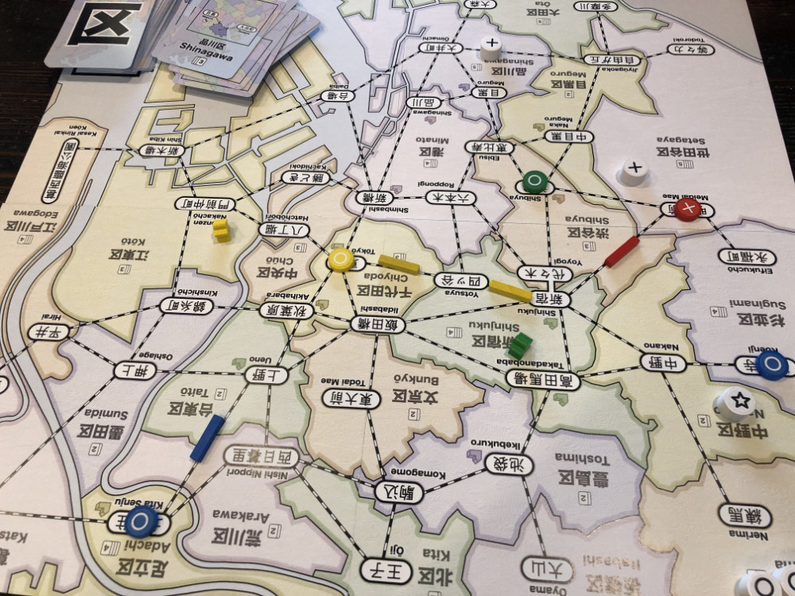
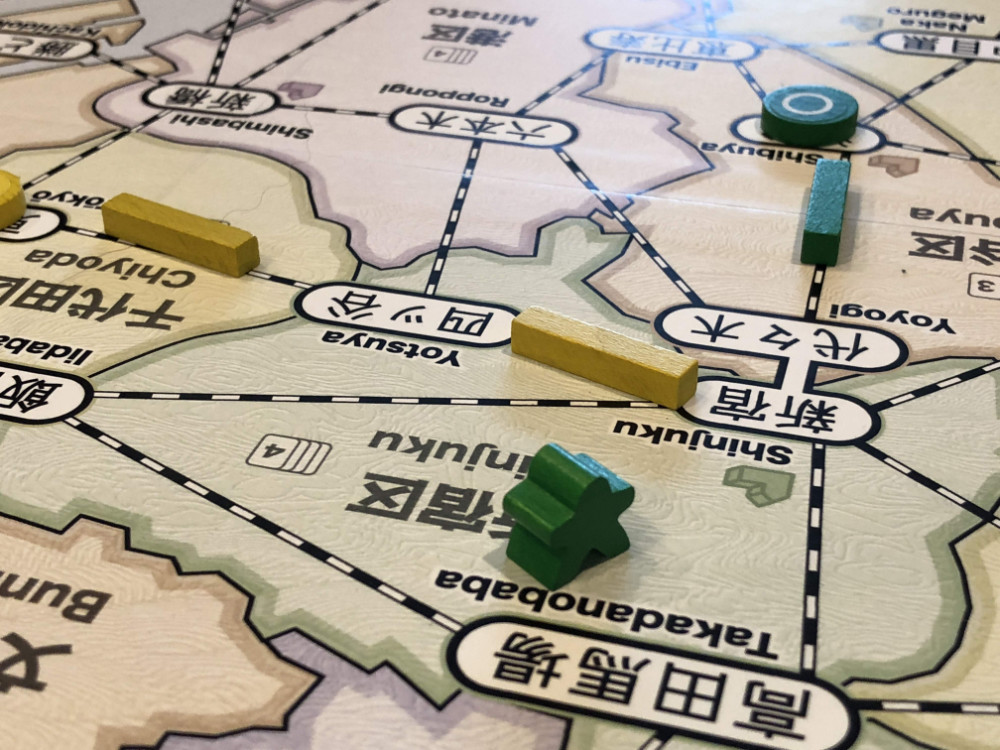
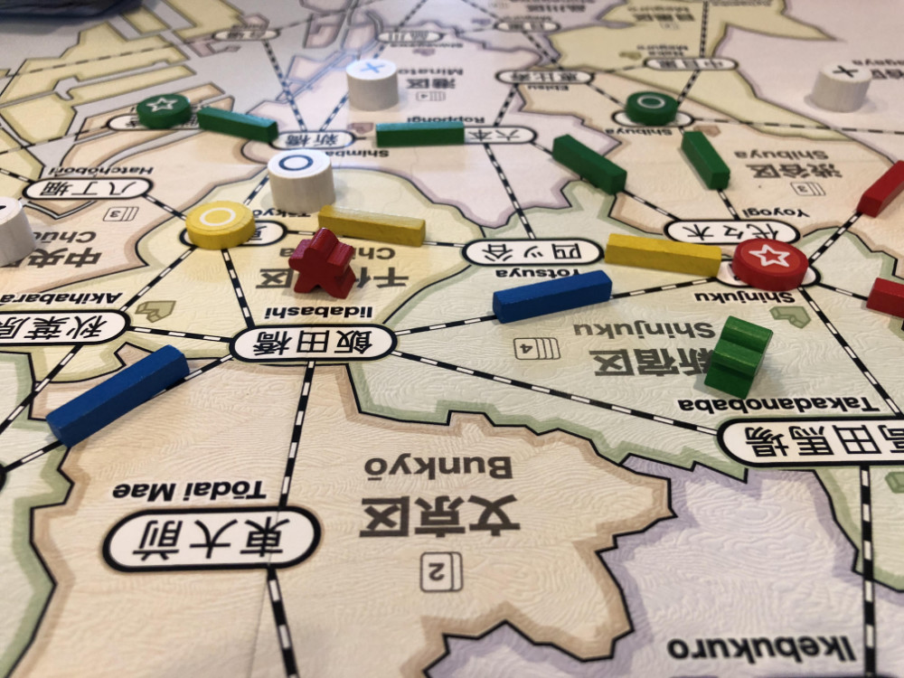
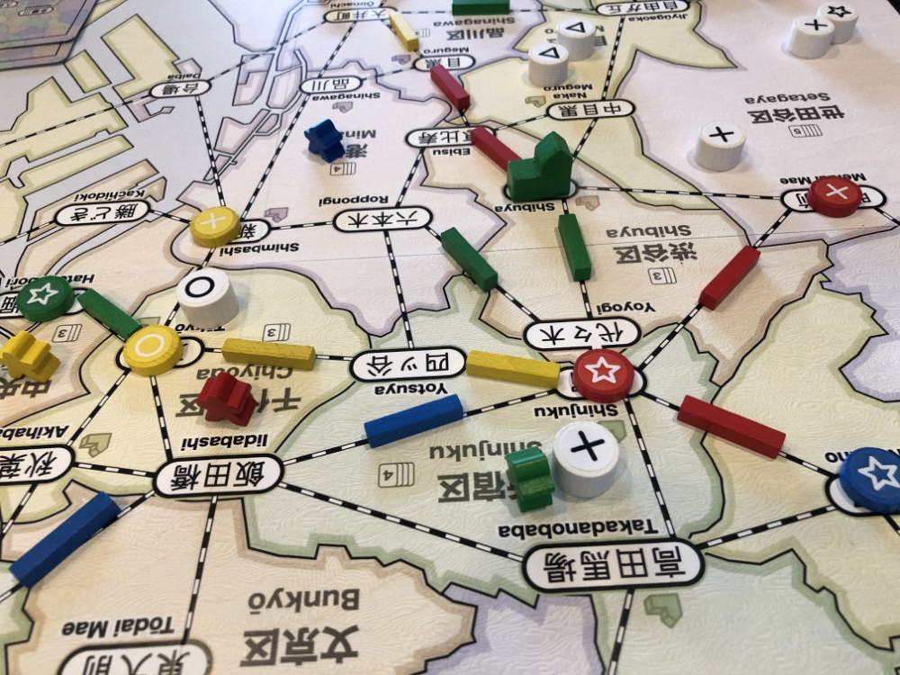
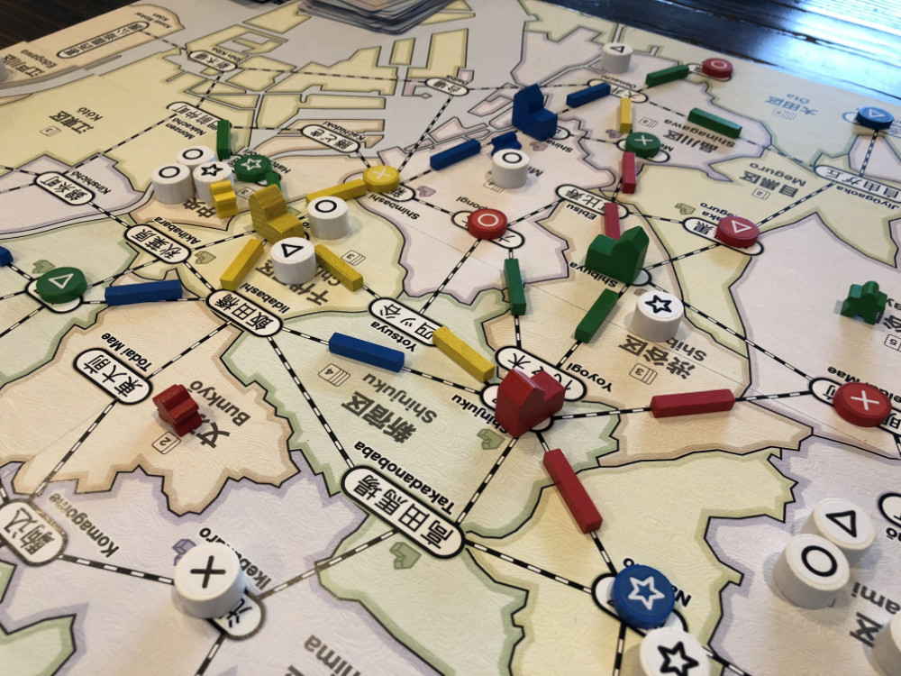
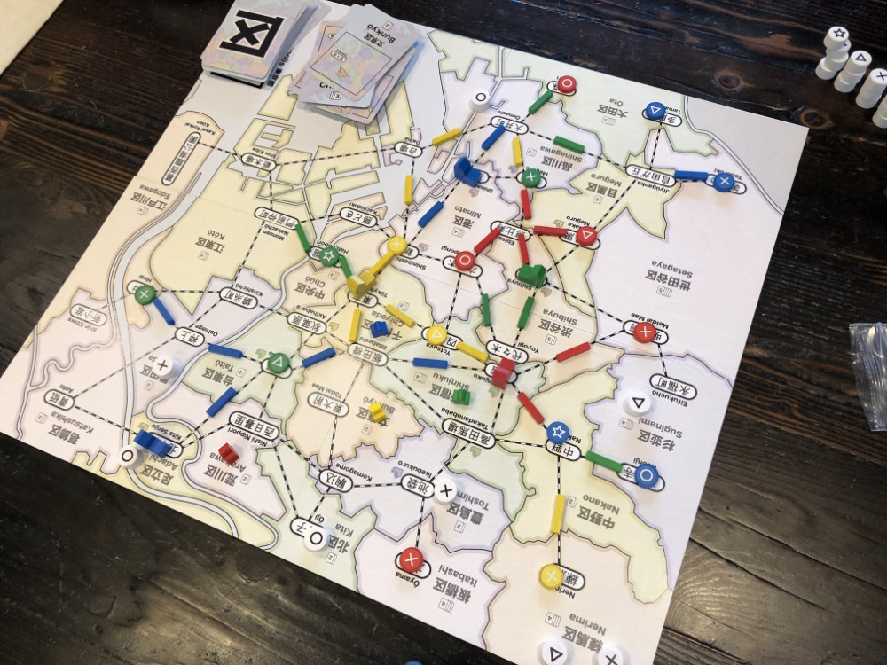

# Playtest #19

Mon 1 Oct 2018

Participants: self, JeffB, AdamB, SverreR

     

## Overview

* Testing Chairman expansion:
	* If Chairman is in your pool, then you can place wherever you want at start of turn.
	* Chairman moves with other customers in that ward.
	* Matches any department store (replaces customer that would have gone there)
	* Ward with your Chairman is wild for you.
	* Action: You can move your chairman to a neighboring space

## Components

* 18"x20" board with Map of Tokyo
* 72 Ward cards
* 8/7/6 stores per player for 2/3/4-player
* 16/13/10 track per player for 2/3/4-player
* 3/2/2 dept stores per player for 2/3/4-player
* 60 Customer tokens:
	* 19 ◯, 16 ⤫, 14 △, 11 ⭐︎

## Rules

### Setup

* Deal 5 cards to each player

### Turns

Place a random customer at start of turn

Each turn take 2 different actions:

* **Build**: Pay a card, build a store in that ward
* **Upgrade**: Pay a matching card and a matching customer, upgrade a store to a dept store
* **Lure**: Pay a card, lure customers from that ward.
* **Expand**: Pay any 1 card to build 1 track; pay 3 cards to build 2 connected track
* **Income**: draw up to 5 cards, or draw 1 card if you already have 5 cards. Taking this action ends your turn.

### Department Stores

When a department store is built, it triggers a burst of new customers: 4/4/3 customers for 2/3/4-player game.

### Final turn

When last customer is placed, that player finishes their turn and then everyone (incl the person who drew the last customer) takes one additional turn.

## Comments

Chairman: goal is to increase wildcard opportunities

Chairman in same location as your dept store is dangerous: you don't get an extra wildcard and everyone else can use it to skip your dept store.

* Adam: ◯◯◯◯ ⤫⤫⤫ △△△ ⭐︎⭐︎⭐︎⭐︎ = 10
* Jeff: ◯◯◯◯ ⤫⤫⤫⤫ △△△ ⭐︎ = 8
* Sverre: ◯◯ ⤫⤫⤫ △△△△ ⭐︎⭐︎ = 7
* Gary: ◯◯◯ ⤫⤫ △△ ⭐︎⭐︎⭐︎ = 7

Spending an action to move the Chairman might be too expensive.

## Suggestions/Actions

For next playtest:

* Chairman: Add option to move chairman for free once per turn (no action)
* Chairman can skip any store (not just dept stores)
