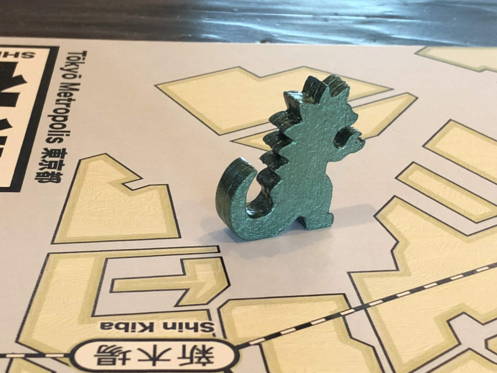
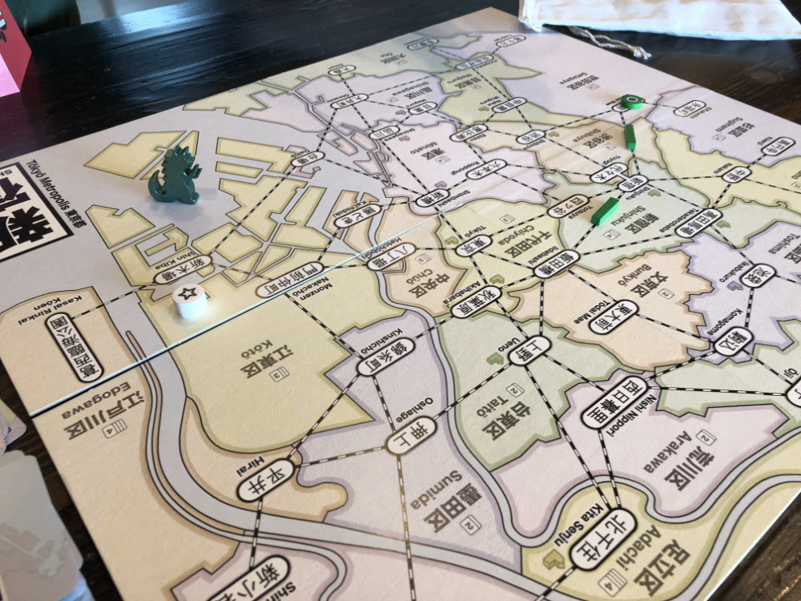
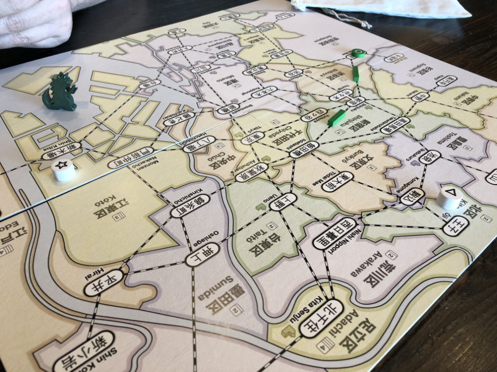
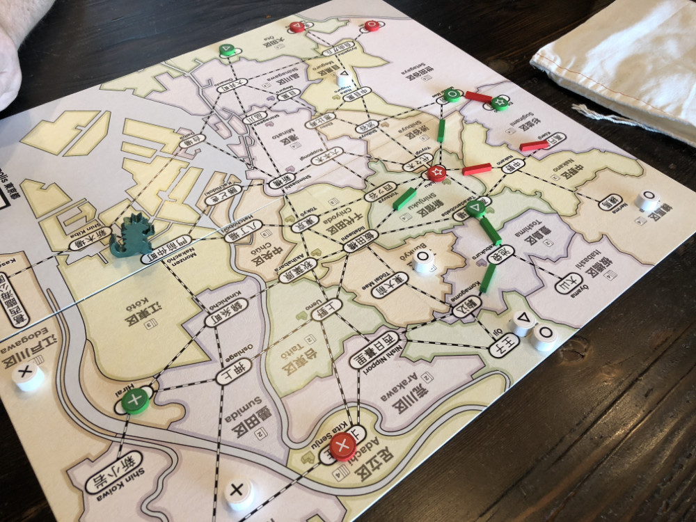
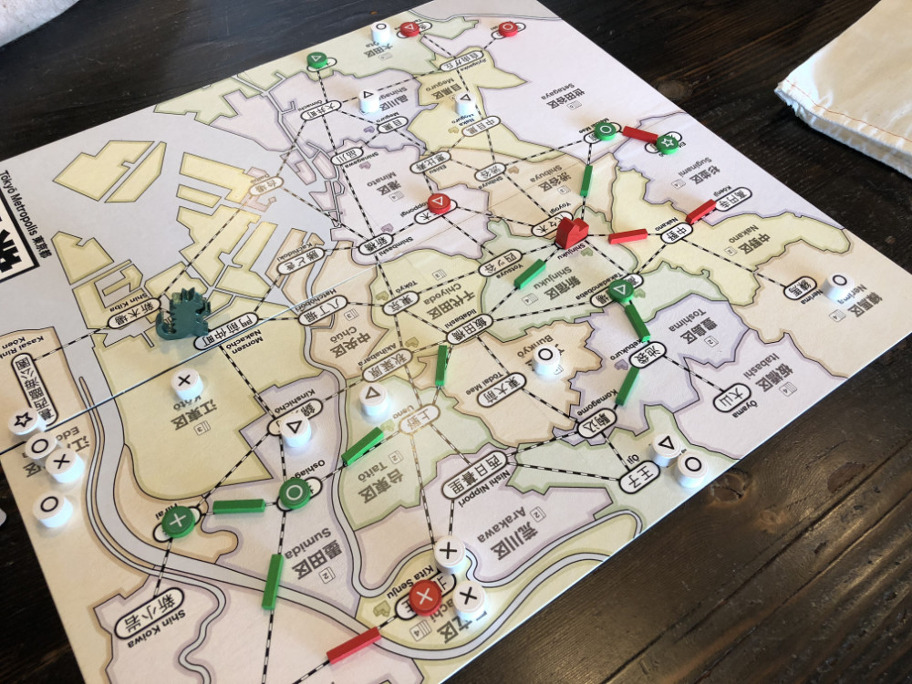
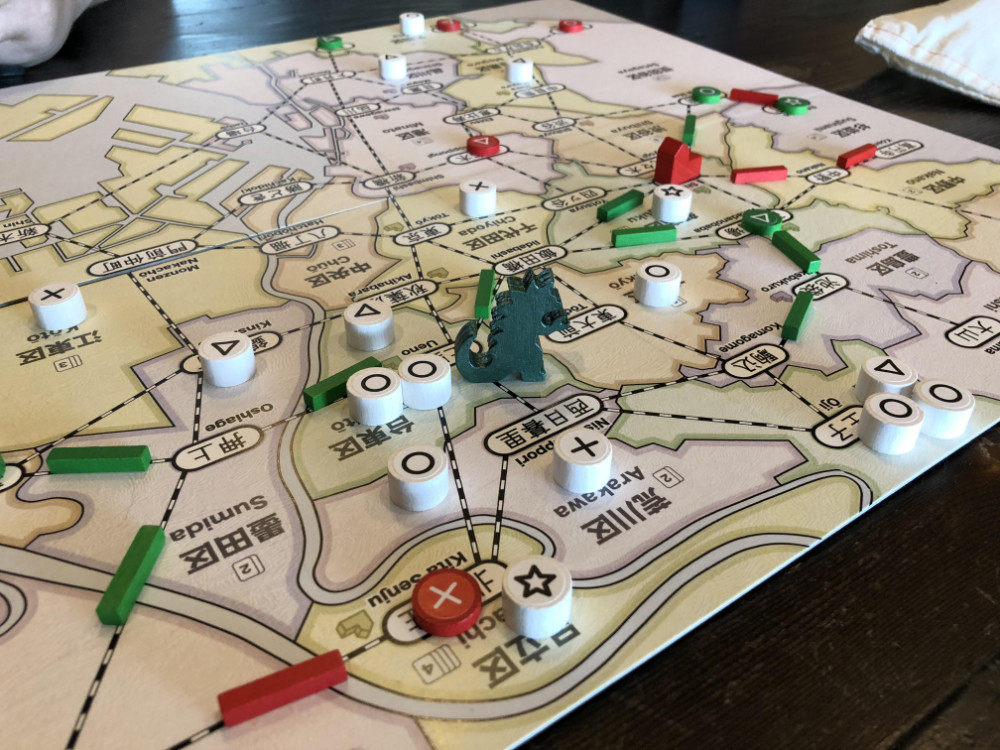
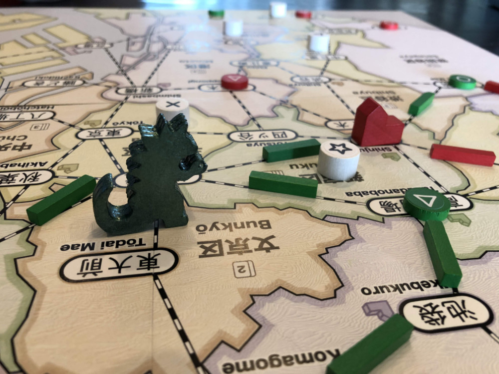
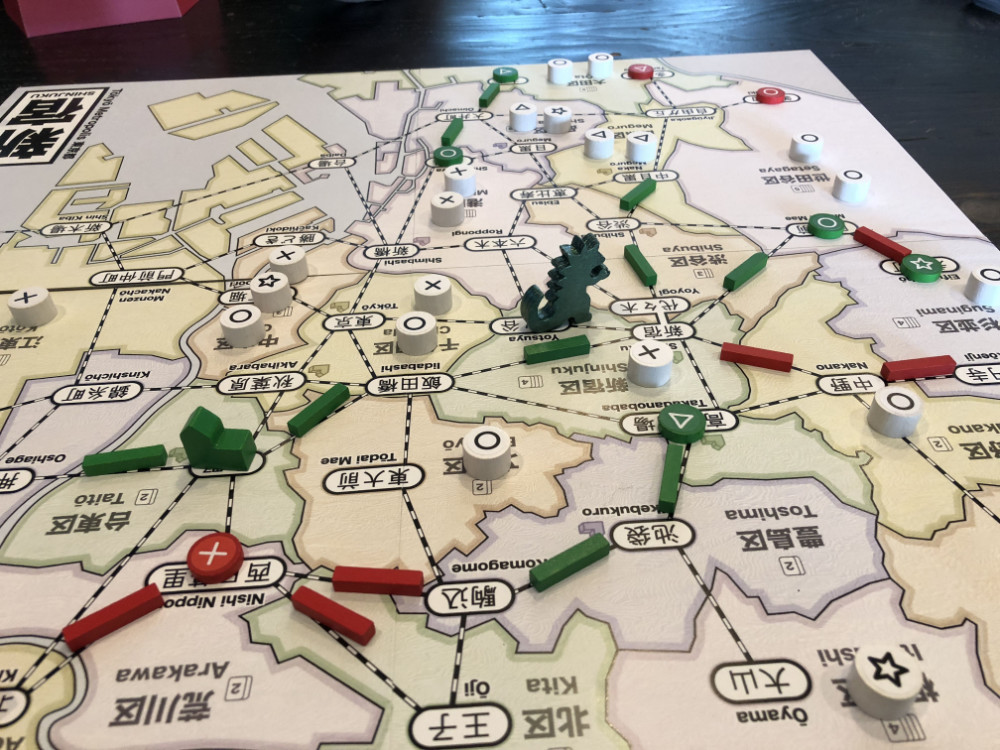
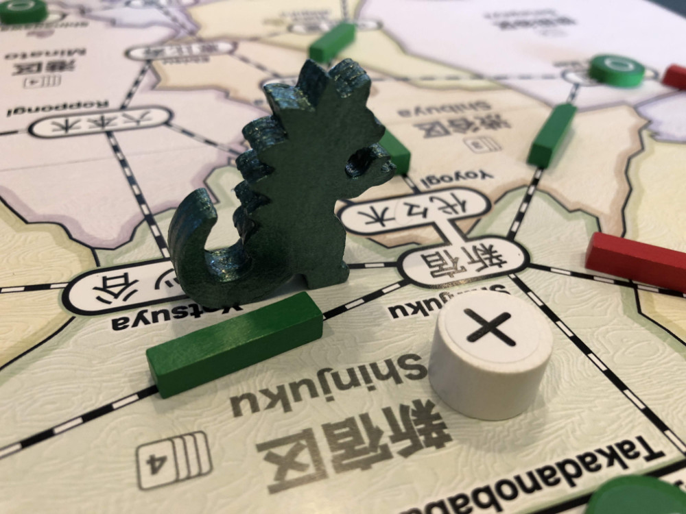

# Playtest #20

Wed 3 Oct 2018

Participants: self, JeffB

        

## Overview

* Testing Kaiju expansion
	* Play matching card to move Kaiju into a neighboring ward and destroy something.
	* Kaiju starts in water. Need wildcard to move it out.
	* Kaiju action: Play a card matching Kaiju action to (optionally) move Kaiju into neighboring ward and (optionally) destroy something in that ward.
		* Destroyed customers are removed from game
		* Destroyed stores and track are returned to player

## Components

* 18"x20" board with Map of Tokyo
* 72 Ward cards
* 8/7/6 stores per player for 2/3/4-player
* 16/13/10 track per player for 2/3/4-player
* 3/2/2 dept stores per player for 2/3/4-player
* 60 Customer tokens:
	* 19 ◯, 16 ⤫, 14 △, 11 ⭒

## Rules

### Setup

* Deal 5 cards to each player

### Turns

Place a random customer at start of turn

Each turn take 2 different actions:

* **Build**: Pay a card, build a store in that ward
* **Upgrade**: Pay a matching card and a matching customer, upgrade a store to a dept store
* **Lure**: Pay a card, lure customers from that ward.
* **Expand**: Pay any 1 card to build 1 track; pay 3 cards to build 2 connected track
* **Income**: draw up to 5 cards, or draw 1 card if you already have 5 cards. Taking this action ends your turn.

Expansion action:

* **Kaiju**: Pay a card that matches Kaiju's location to move Kaiju into neighboring space, destroy one item.

### Department Stores

When a department store is built, it triggers a burst of new customers: 4/4/3 customers for 2/3/4-player game.

### Final turn

When last customer is placed, that player finishes their turn and then everyone (incl the person who drew the last customer) takes one additional turn.

## Comments

Kaiju is an action and can only be taken once/turn.

* Jeff: ◯◯◯◯◯◯ ⤫⤫⤫⤫ △△△△△△△ ⭒⭒⭒⭒ = 14
* Gary: ◯◯◯◯◯◯ ⤫⤫⤫⤫⤫⤫⤫ △△△△△ ⭒⭒⭒⭒ = 15

Adam: It's odd to allow Lure actions to pass through the location where the Kaiju is located.

Adam: Instead of destroying, have the Kaiju scare customers away.

* Into a neighboring ward. Player chooses. All customers must go to the same ward.
* No infrastructure desctruction

### Additional thoughts

Kaiju: Game goes on longer than expected because we build fewer dept stores and thus have fewer bursts of customers arriving. We only built 3 dept stores instead of the expected 4-5, so we had 4-8 fewer customers arrive and 2-4 extra turns/player.

Any variant/expansion that allows destruction needs to account for the fact that fewer dept stores will be built, so there will be fewer bursts from that. Otherwise the game will last a bit too long.

## Suggestions/Actions

For next playtest:

* Kaiju:
	* Scares customers instead of destroying things
	* Lure actions cannot pass through Kaiju location
* What about 3 cards = wildcard?
	* PRO: Makes 5 non-wildcards (e.g., your first turn) not so bad
	* CON: Removes some incentive for building stores
	* Does it make it too easy to perform any action you want? Would that be bad?
