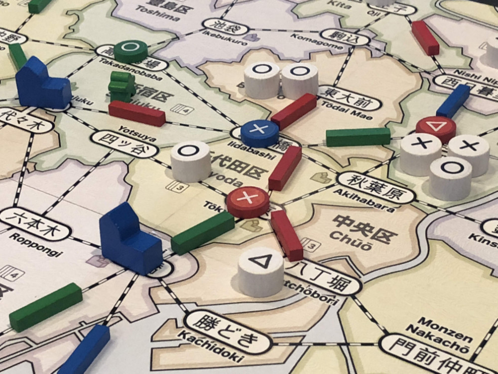

# Playtest #21

Fri 5 Oct 2018

Participants: self, JeffB, AdamB

   

## Overview

* Testing:
	* Any 3 cards = wildcard
	* Chairman expansion: Move once/turn for free
	* Kaiju expansion: Scare customers into neighboring ward - no destruction
	* Kaiju + Chairman expansion together

## Components

* 18"x20" board with Map of Tokyo
* 72 Ward cards
* 8/7/6 stores per player for 2/3/4-player
* 16/13/10 track per player for 2/3/4-player
* 3/2/2 dept stores per player for 2/3/4-player
* 60 Customer tokens:
	* 19 ◯, 16 ⤫, 14 △, 11 ⭐︎

## Rules

### Setup

* Deal 5 cards to each player

### Turns

Place a random customer at start of turn

(Chairman expansion) At any time during turn, you may move your Chairman into a neighboring location.

Each turn take 2 different actions:

* **Build**: Pay a card, build a store in that ward
* **Upgrade**: Pay a matching card and a matching customer, upgrade a store to a dept store
* **Lure**: Pay a card, lure customers from that ward.
* **Expand**: Pay any 1 card to build 1 track; pay 3 cards to build 2 connected track
* **Income**: draw up to 5 cards, or draw 1 card if you already have 5 cards. Taking this action ends your turn.

Expansion action:

* **Kaiju**: Pay a card that matches Kaiju's location to move Kaiju into neighboring space, scaring away customers.

### Wildcards

Cards that match locations where you have stores (or dept stores) are wild for you.

Any three cards can be used as a wild card.

### Department Stores

When a department store is built, it triggers a burst of new customers: 4/4/3 customers for 2/3/4-player game.

### Final turn

When last customer is placed, that player finishes their turn and then everyone (incl the person who drew the last customer) takes one additional turn.

## Comments

On first turn, you can always get a customer: 3 cards for wild to place store by customer. Place Chairman to match remaining card in hand and play that card to Lure.

Clarification: When customer should go onto space with Kaiju, the player gets to choose which neighboring ward it goes into. ISSUE: Decision possibly affected if player sees the customer type before choosing.

* Gary: ◯◯◯◯◯◯◯◯ ⤫⤫⤫⤫⤫⤫ △△ ⭐︎⭐︎⭐︎⭐︎⭐︎ = 11
* Jeff: ◯◯◯◯ ⤫⤫⤫⤫ △△△△ ⭐︎⭐︎⭐︎ = 11
* Adam: ◯◯◯ ⤫⤫⤫⤫ △△△△ ⭐︎⭐︎⭐︎⭐︎ = 11

3-way tied score. Tie resolved by player order (G wins). Older tie-breaking rules would have multiple rounds of tie-breaking between J and A since they both have 4+4+4+3.

Jeff: Chairman is great. Chaiman not needing action is good.

Adam: Kaiju great at the right moment

Gary: Kaiju used to good effect near endgame to herd customers in prep for a Lure action. Good because endgame can sometimes be Lure + no other good action.

Jeff: When draw customer @ Kaiju, move Kaiju

Gary: Having 3 cards = wild makes the "3-cards to build 2 track" action feel more expensive since those cards now have another possible use.

## Suggestions/Actions

For next playtest:

* When customer is placed at Kaiju location, then the Kaiju should move (to a location chosen by current player). Customer can then be placed in that ward. This effectively adds a random movement to the Kaiju.
* Multiple Kaiju that act differently and battle (destroying stuff) when they are in the same location.
