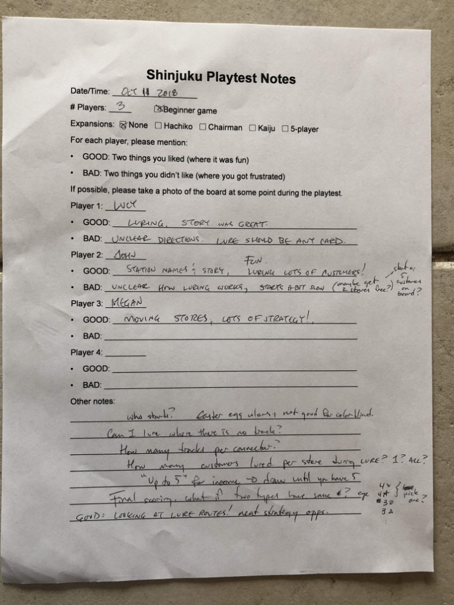

# Playtest #22

Thu 11 Oct 2018

Participants: Lucy, John, Megan

## Overview

* Testing:
	* Blind playtest of rules

## Components & Rules

Same as previous

## Comments

Lucy:

* POS: Luring, Story was great
* NEG: Unclear directions, Lure should be any card

John:

* POS: Station names & story; Fun luring lots of customers!
* NEG: Unclear how luring works, starts a bit slow (maybe get 2 stores free? or start with 5 customers on board?)

Megan:

* POS: Moving stores, lots of strategy!

Other notes:

Easter egg colors, not good for colorblind

Things to clarify in rules:

* Who starts?
* Can I lure where there is no track?
* How many tracks per connector?
* How many customers lured per store during lure? 1? all?
* "up to 5 for income" -> draw until you have 5
* Final scoring: what if two types have same #? e.g., 4x 4* 3o 3∆. pick one?

GOOD: Looking at lure routes! neat strategy opps.

## Suggestions/Actions

For next playtest:

* Update rule book to address ambiguity.
* Create "quickstart guide" with a brief overview of the rules.
