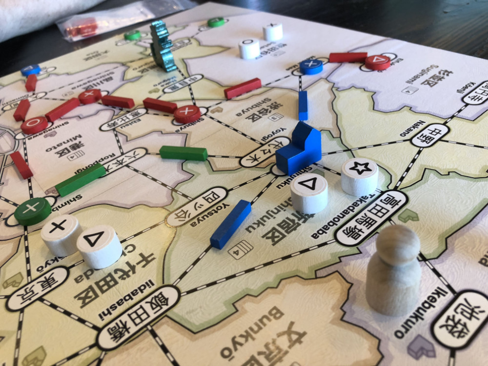

# Playtest #23

Fri 12 Oct 2018

Participants: self, JeffB, SverreR

     

## Overview

* Testing:
	* Empress expansion. Empress is placed randomly on board. Location is a wildcard for everyone. Player can move once/turn for free.
	* Kaiju: Player gets to move Kaiju for free is their customer lands on the Kaiju spot.
	* Kaiju + Empress expansion together

## Components & Rules

Same as previous

## Comments

Kaiju moving when customer lands there was interested because it added more "random" movement.

Only 3 dept stores were built. Jeff built his near end of game.

* Gary: 5◯ (6⤫) 5△ 5⭐︎ = 15
* Jeff: 4◯ 3⤫ (5△) 2⭐︎ = 9
* Sverre: 3◯ 3⤫ (4△) 3⭐︎ = 9

Empress works well. Similar to Chairman.

## Suggestions/Actions

For next playtest:

* 