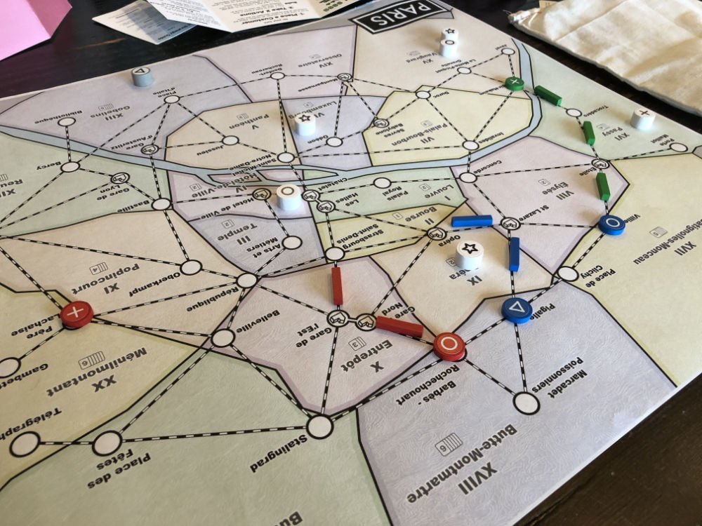
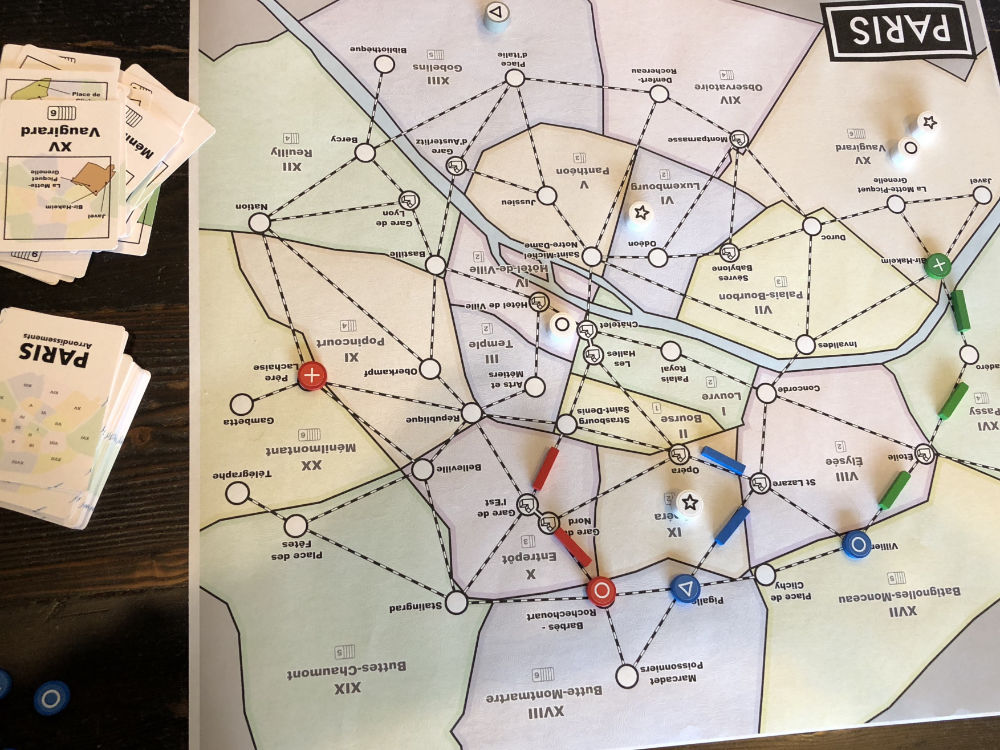
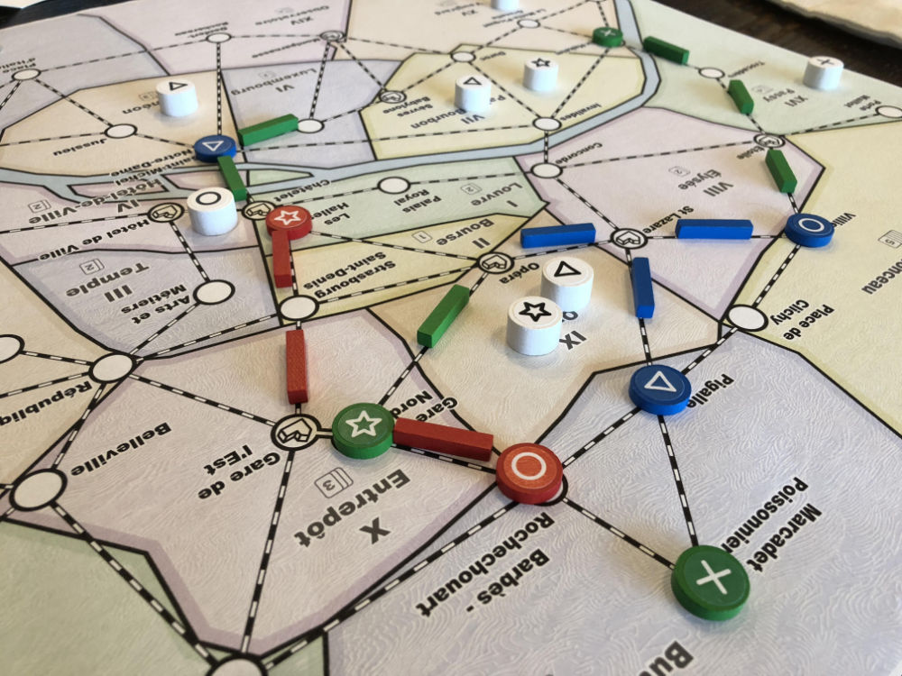
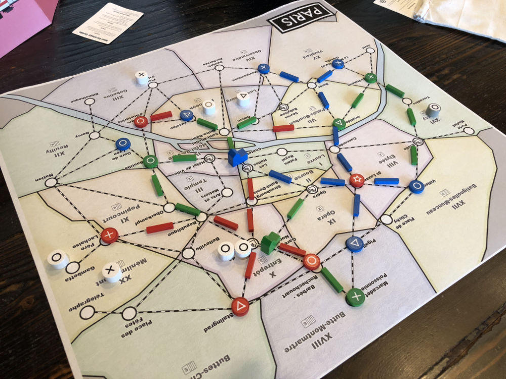
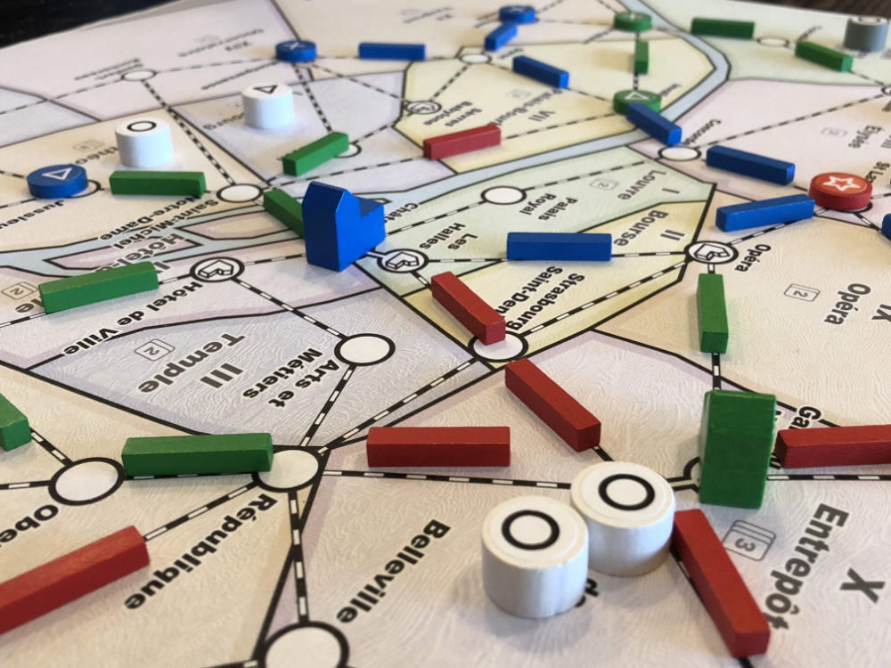

# Playtest #23

Thu 17 Jan 2019

Participants: self, JeffB, SverreR

      

## Overview

* Testing:
	* Paris map
	* Thief expansion - Thief customers that match a good and cancel out a matching customer in scoring: 4 thieves: 1/each type
	* Flash Mob expansion - Customer token that immediately draws <n> customers into that location: 4 mobs: 2/3/3/4

## Components & Rules

Same as previous

## Comments

No need to remove customers for Flash Mob. Rules are already written this way, but I accidentally did this when removing customers for the Thief.

* It would be nice (for consistency) if none of the expansions required removing customers during setup.

Paris Map:

* Need to place the dept store icon outside the circle on the map because it is covered up by a store during gameplay.

Oops! Forgot to have a burst of customers when we placed a dept store

* Corrected (after we noticed) by placing 2 customers per turn until end of game

During game, RobinS: How many of each customer type are in the bag?

* 60 customers: 18 ◯, 16 ⤫, 14 △, 12 ⭐︎
* It's in the rulebook, but should place that information on the board somewhere

Scores: 

* Jeff: 4◯ 5⤫ 4△ (4-1t)⭐︎ = 11 (-1thief; ignore 4◯)
* Sverre: 5◯ 5⤫ 4△ 3⭐︎ = 12 (ignore 5◯)
* Gary: 4◯ (5-1t)⤫ (5-1t)△ 0⭐︎ = 8 (-2thieves; ignore 4◯)

Game took longer than normal - ~1h20

* And felt like it should have been over since we all had our engines and were just trying to pick up the remaining customers.
* Why?
   * We forgot to burst the dept stores
   * Possibly took more time thinking about the new map?

During endgame, we had a bunch of single customers on the map. These are less interesting since you want to Move a group.

Sverre:

* Possibly have a larger number of small Flash Mobs

Jeff:

* Thief added an interesting decision to the game.

To make endgame more interesting:

* Add more customers
* Draw them faster from the bag
* Draw 2 customers/turn once the 2nd dept store is built
   * Should both go to the same location? or separate draws for each?
* This may have to be adjusted based on number of players

Possible expansions:

* "Lock" customers so they can't be Moved
* Pick up customers along the way (perhaps by playing a card)

## Suggestions/Actions

For next playtest:

* Add more customers (up to 80)
* Accelerate the customer draws after 2nd dept store is placed