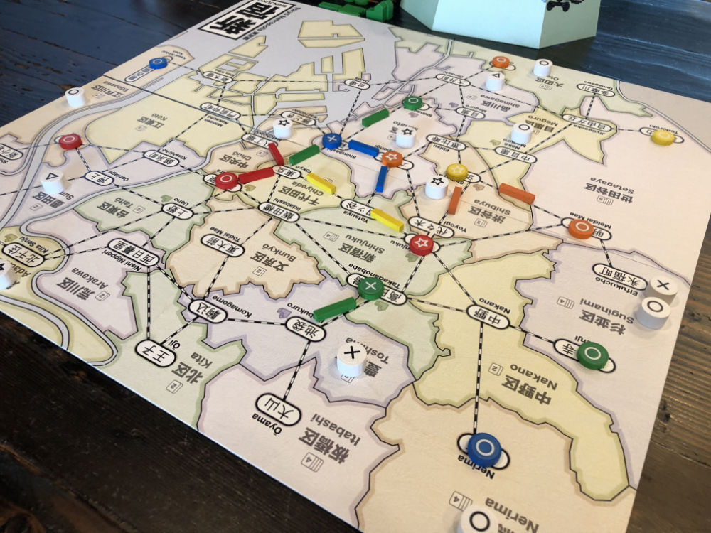
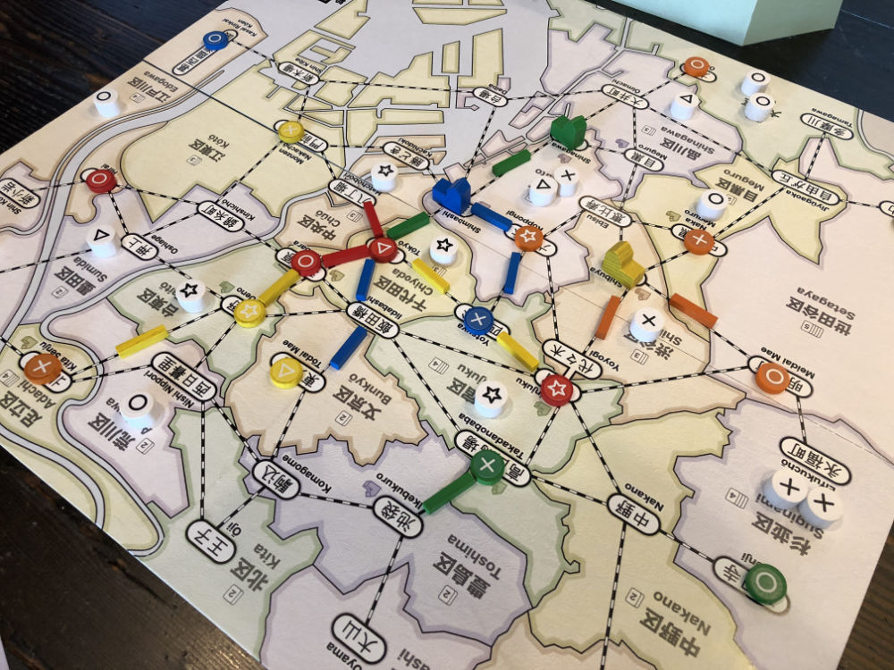
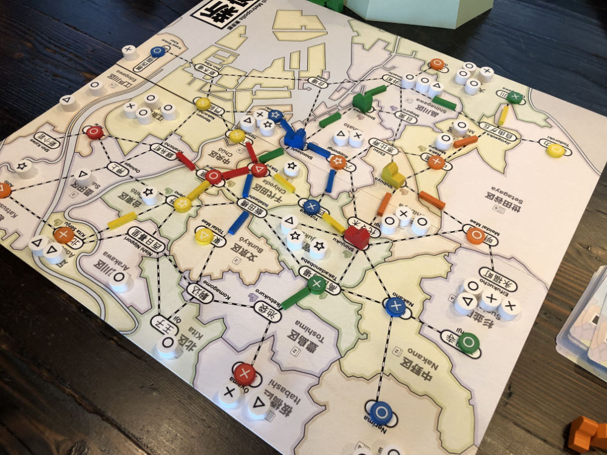
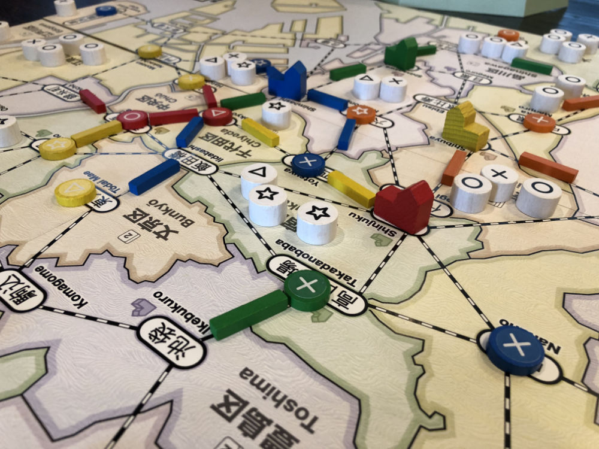
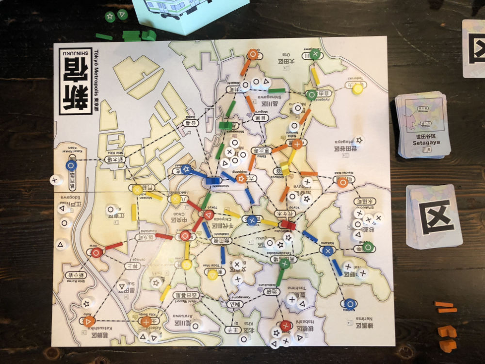

# Playtest #25

Fri 18 Jan 2019

Participants: self, JeffB, SverreR, SamH, LeonardR

      

## Overview

* Testing:
	* 5-player
	* Drawing multiple customers per turn after dept stores are built
	* 80 customers
	* Adjusting free income action

## Components & Rules

Baseline rules, except:

* 80 customers: 25 ◯,  22 ⤫,  18 △, 15 ⭒
* Draw 2 customers per turn after 2nd dept store is built; 3 per turn after 4th; ...
   * This replaces having a burst of customers appear when a dept store is built
* For free income action (when another player uses your track), no card discard before drawing. To see if this speeds up game.

## Comments

Scores: 

|          |  ◯  |  ⤫  |  △  |  ⭒  | Score |
| -------- | --- | --- | --- | --- | --- |
| Jeff     | ~5~ |  3  |  3  |  1  |  7  |
| Sverre   | ~4~ |  4  |  2  |  0  |  6  |
| SamH     | ~2~ |  2  |  2  |  2  |  6  |
| LeonardR |  1  | ~3~ |  0  |  1  |  2  |
| Gary     | ~2~ |  2  |  1  |  2  |  5  |

Two new players.

Needed to stop game early because of time. Just barely reached point where 3 customers/turn were being placed.

80 customers is too many (even with increased customer draw).

Ramping up the number of customers drawn feels good and is easy to remember.

* Having a burst of customers only after a dept store build was easy to forget.
* Need to balance the correct number and proper trigger (may change based on number of players).

Removing the discard before the free income action sped things up a bit, but also removed the ability to churn through cards to get a wildcard.

* Overall, this change didn't really help much and is not worth keeping (since it slightly complicates the description of the Income action).

Five players, but only 4 dept stores were built.

Lots of customers available, but players may have been hesitant to take them because they needed to pass through other player's stores. (I think this is kinda by-design).

Sam:

* POS: Fun to build dept stores and connections
* NEG: Not knowing where to build track at start of game

Leonard:

* NEG: Last player feels cheated since all the good spots are already taken
* NEG: Unlucky with cards
* NEG: Accelerated too fast

Sverre:

* NEG: Not sure it plays well with 5 players
 * _(perhaps because of beginning players taking longer?)_

Jeff:

* Alternate end conditions? E.g., after last customer, then keep going around until no one can take a Move action

## Suggestions/Actions

For next playtest:

* Figure out best # of customers to draw
* Reduce back to 60 customers
* Revert back to allowing discard before free draw.
