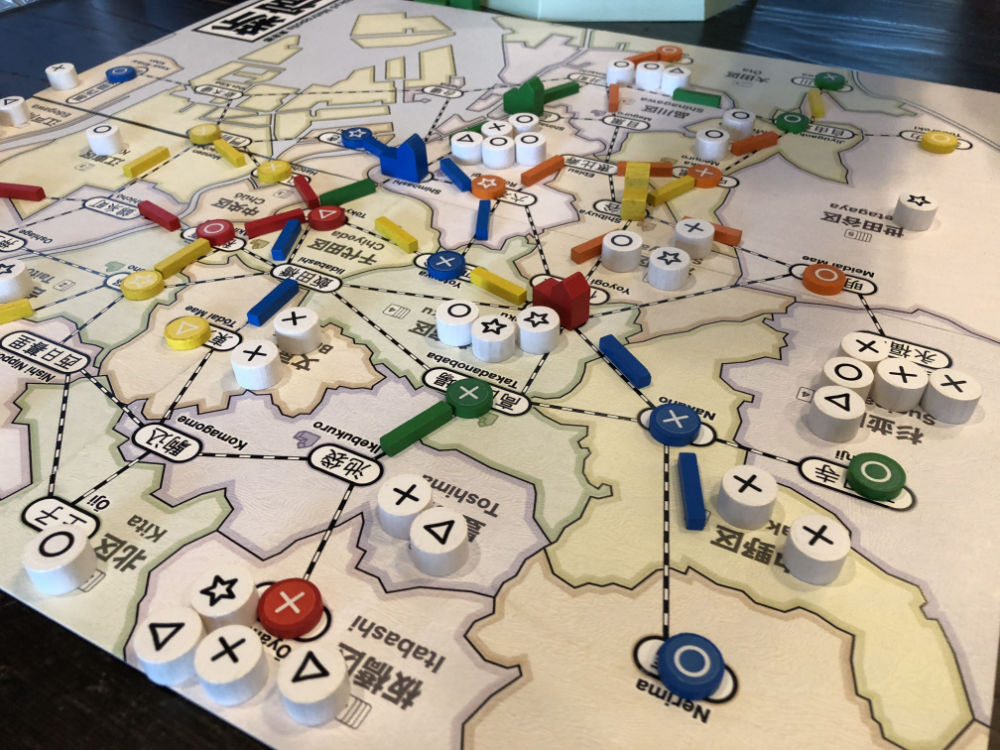

# Playtest #25

Fri 18 Jan 2019

Participants: self, JeffB, SverreR, SamH, LeonardR

      

## Overview

* Testing:
	* 5-player
	* Draw 2 customers per turn after 2nd dept store; 3/turn after 4th
	* For free income action, no card discard before drawing. To see if this speeds up game.

## Components & Rules

Same as previous

## Comments

Scores: 

|          |  ◯  |  ⤫  |  △  |  ⭐︎  | Score |
| -------- | --- | --- | --- | --- | --- |
| Jeff     |  5  |  3  |  3  |  1  |  7  |
| Sverre   |  4  |  4  |  2  |  0  |  6  |
| SamH     |  2  |  2  |  2  |  2  |  6  |
| LeonardR |  1  |  3  |  0  |  1  |  2  |
| Gary     |  2  |  2  |  1  |  2  |  5  |

## Suggestions/Actions

For next playtest:

* Figure out best # of customers to draw

