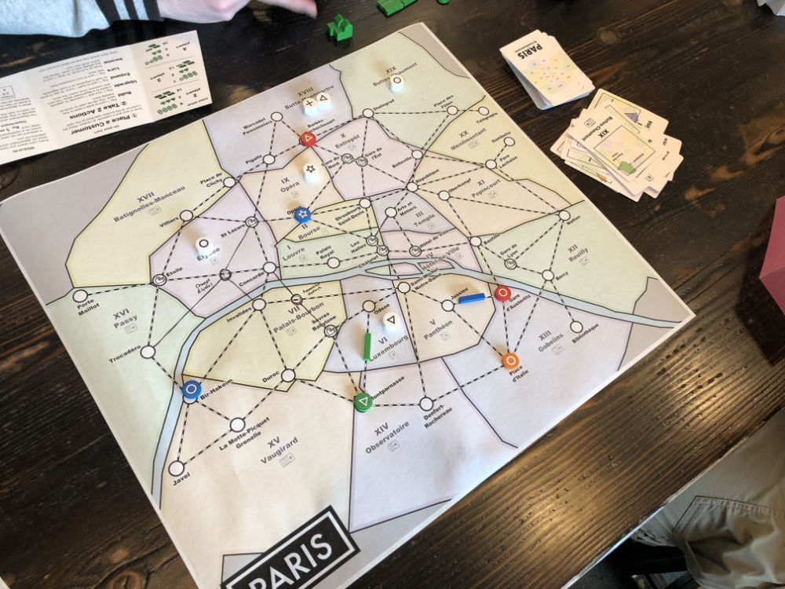
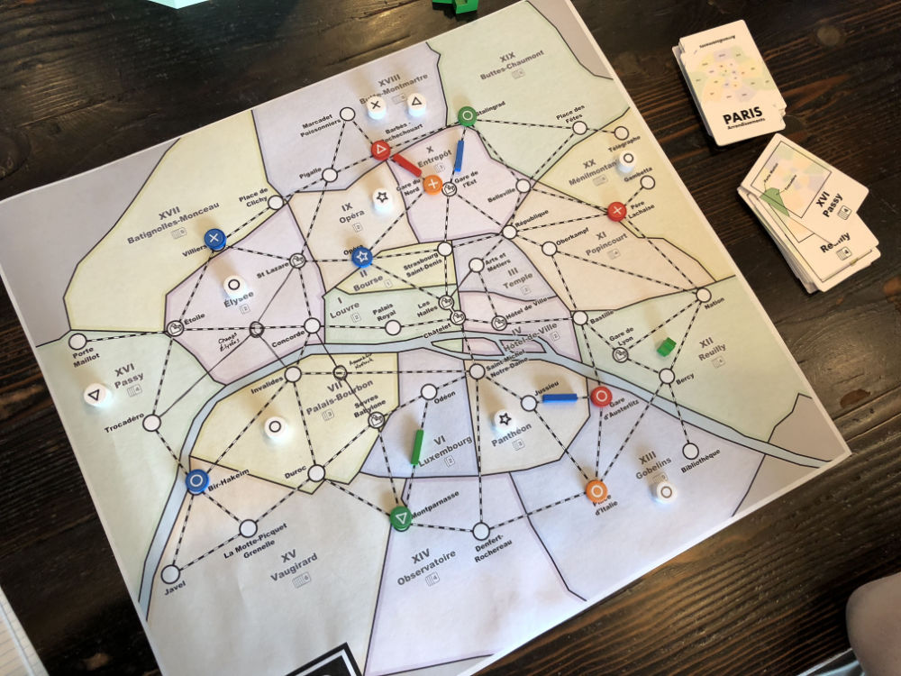
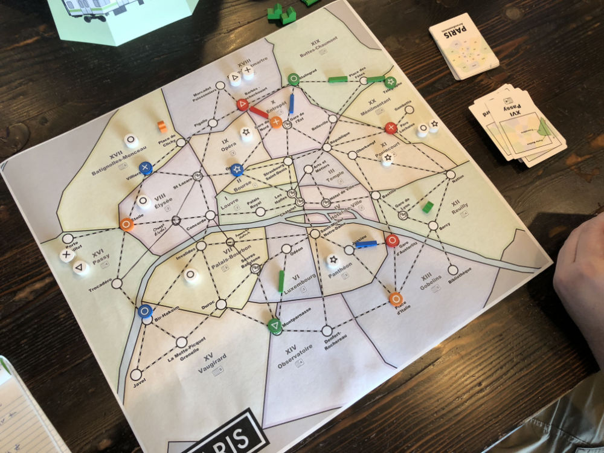
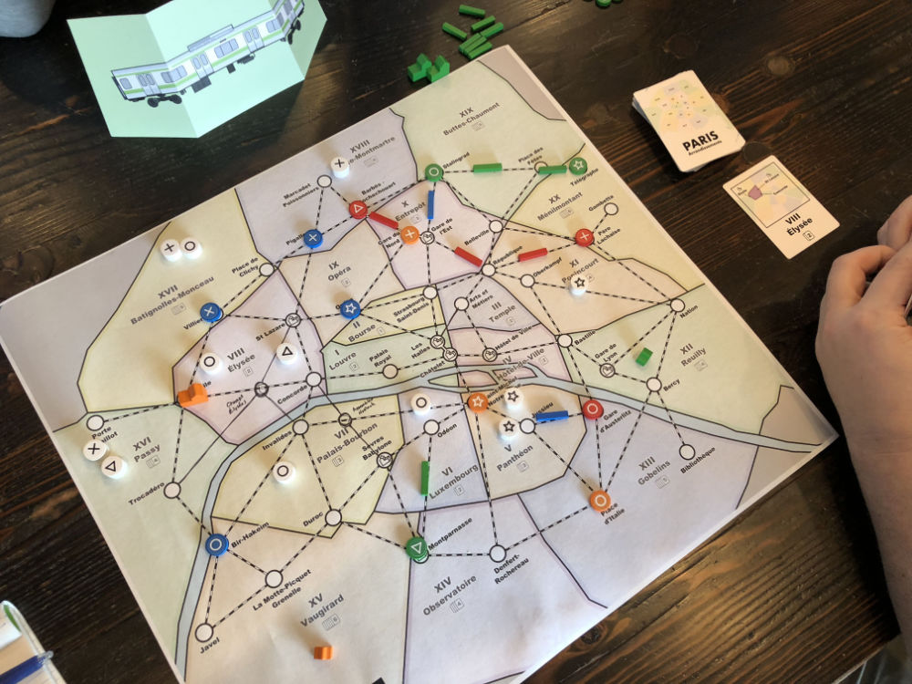
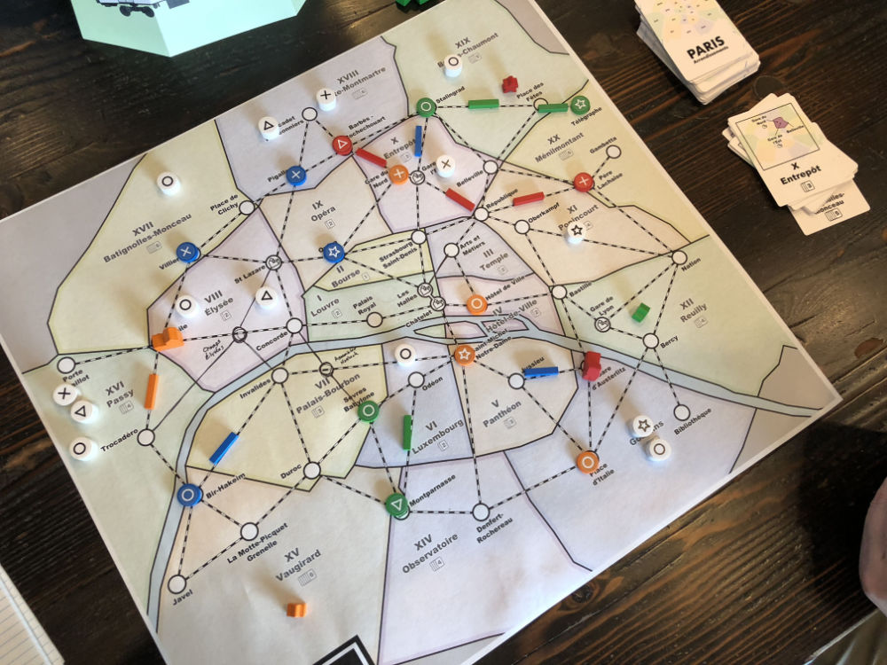
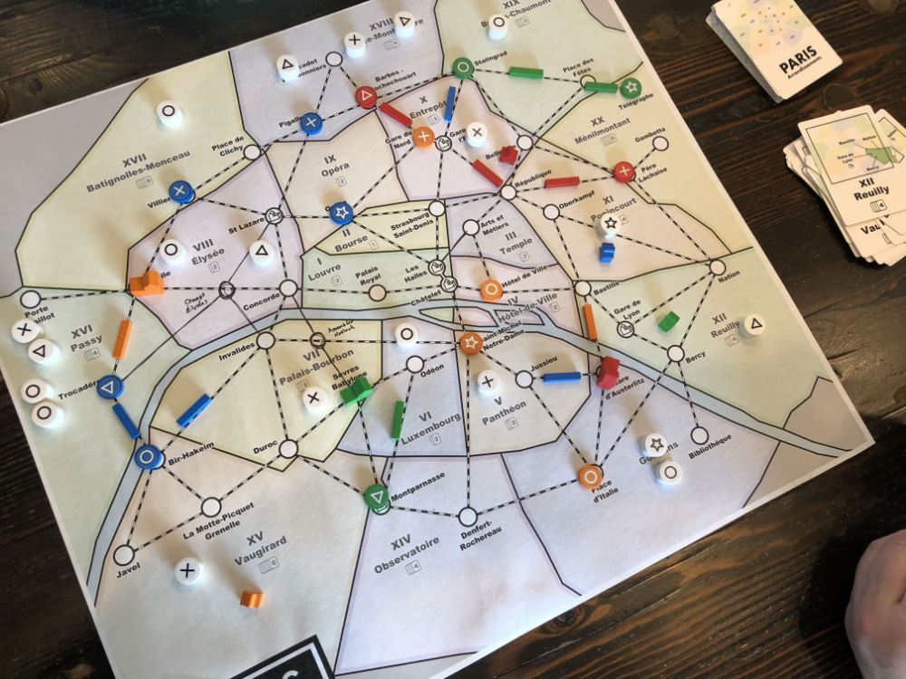
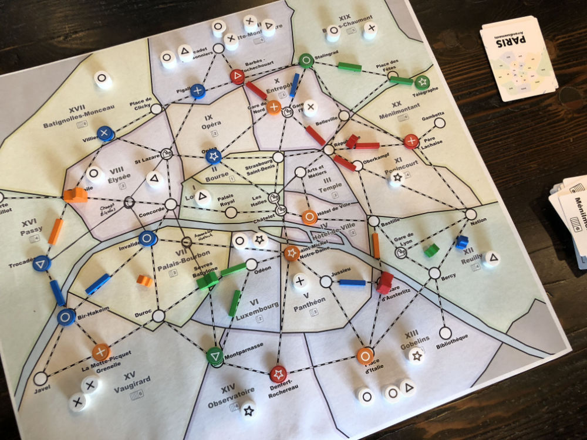

# Playtest #26

Wed 30 Jan 2019

Participants: JeffB, SverreR, SamH, OliverC

       

## Overview

* Testing:
	* Drawing multiple customers per turn after dept stores are built
	* Only 1 action on first turn for first few players.
	* Chairman expansion
	* Paris map

## Components & Rules

Baseline rules, except:

* 1 action on first turn for first n/2 players (rounded down)
* Draw 2 customers per turn after 2nd dept store is built
	* This replaces having a burst of customers appear when a dept store is built

## Comments

Two new players: one player playing their 1st game; another on 2nd.

Game stopped early (after about ~45 min) because of time. Startup took longer with rules explanation.

Scores: 

|         |  ◯  |  ⤫  |  △  |  ⭒  | Score |
| ------- | --- | --- | --- | --- | --- |
| Jeff    |  0  | ~1~ |  1  |  1  |  2  |
| Sverre  | ~2~ |  2  |  1  |  1  |  4  |
| SamH    | ~2~ |  2  |  1  |  1  |  4  |
| OliverC | ~1~ |  1  |  0  |  0  |  1  |

When upgrading to a dept store, it's a bit odd to remove the customer from the game. No obvious place to put it other than in the box. It would be easier to just put it back in the customer bag.

Track:

* Surprisingly little track built during game. This made it hard to Move customers to stores. Track was starting to be built near end of game, but we stopped early.
* Jeff: There were times I wanted to build track during the game but had no cards.
* New players reluctant to use other player's track?

Rule clarification: Can the Chairman be moved after taking an Income action?

* No, turn ends when Income action is taken. Otherwise, player will draw cards and then have to think a lot about their plan. We want to push this thinking so that players do it during other player's turns.

How to encourage more track building?

* Sam: Make some track a pre-req for building a store
* Jeff: Should building a single track be free (but still require an action)?

Track: The 1-card cost rule has been around for a while and may no longer be necessary:

* It was originally added before you were allowed to drop cards before income, so it was a way to get rid of unwanted cards in your hand.
* Having a track cost a card has sometimes been confusing for new players because they wonder if it matters which card they use (as it does for store building). And maybe they want to hoard cards because they don't know which ones they're going to need later.
* Having to spend an action to build track is already a significant cost
* Track is limited, so there is already negative pressure to spend too much
* Removing the card cost here also reduces the "feel-bad" for starting a turn with 0 cards, since you can place track and then draw Income.
* The 3-card for 2-track cost is also a rule oddity. Esp now that 3-cards = wildcard. There have been times where I needed to spend a wildcard + 2 other cards to get a double-track.
	* Making double-track cost a wildcard is simpler
	* This also makes wildcards more useful.

Track building rule can be simplified to:

* Build a single track by taking the Expand action.
* Optionally spend a wildcard on this action to build a double track.

## Suggestions/Actions

For next playtest:

* For Expand Track action: building single track does not cost a card; building 2 track costs 1 wildcard
* More testing of multiple customer draw
* The customer paid when building a dept store should be placed back in the customer bag.
