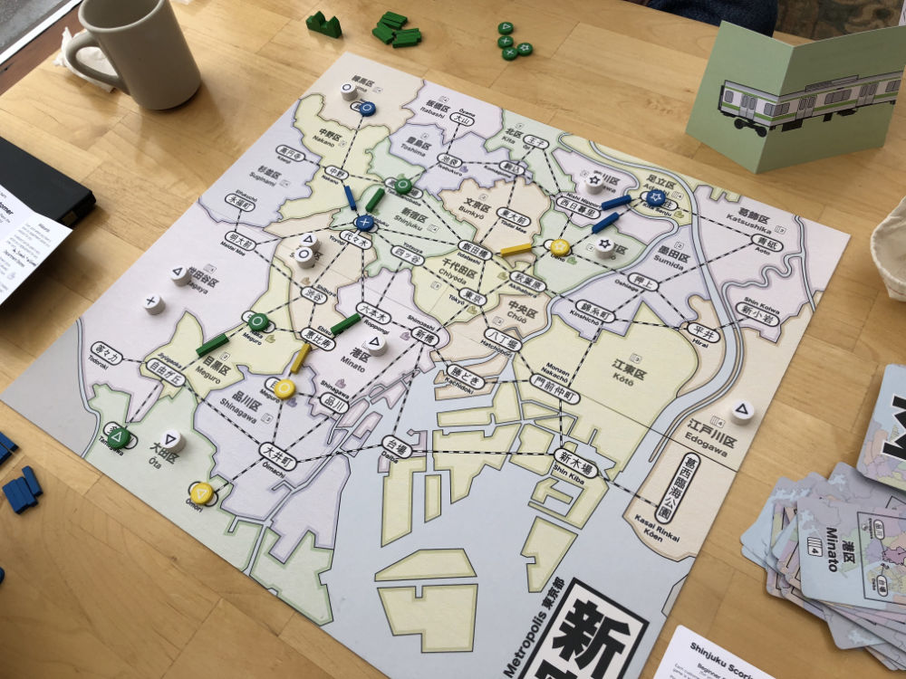
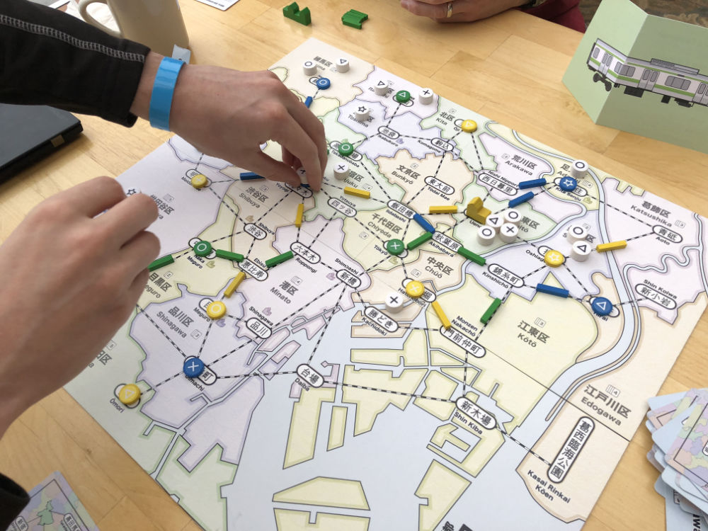
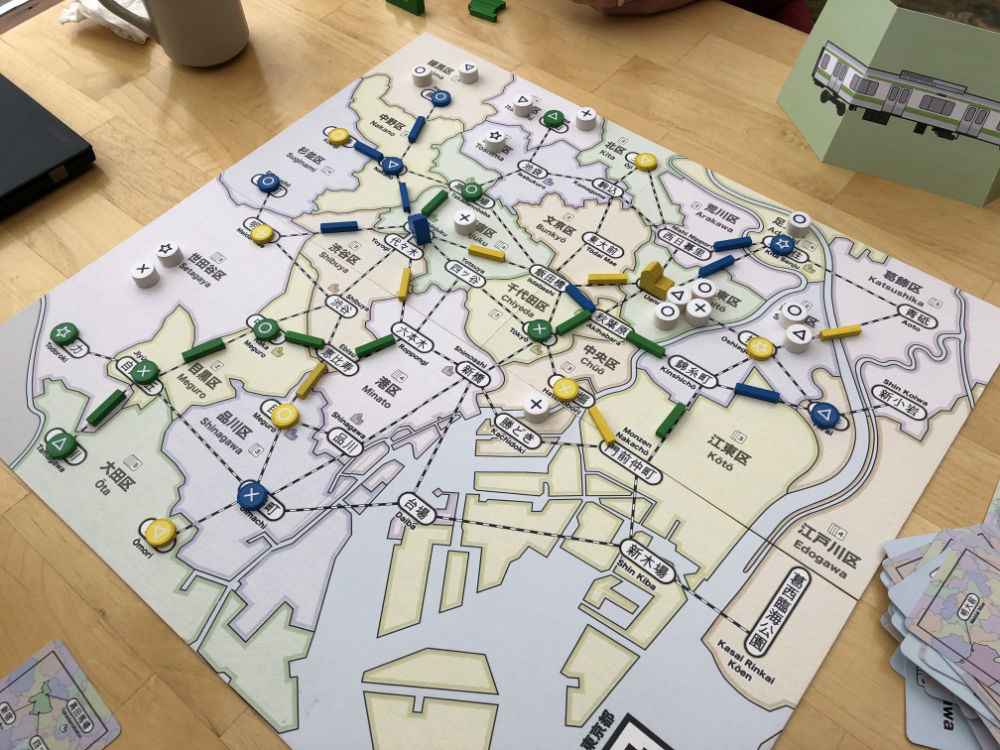
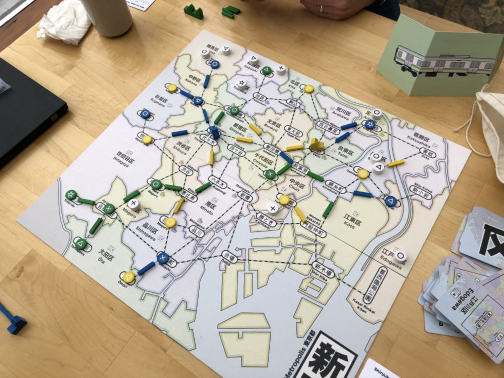
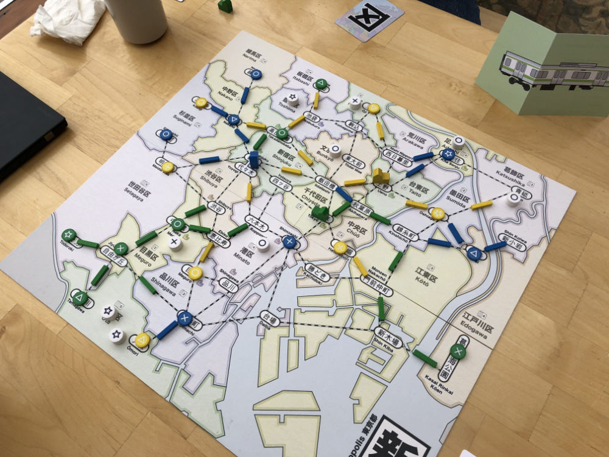

# Playtest #27

Fri 1 Mar 2019

Participants: JoshP, JohnM, self

     

## Overview

* Testing:
	* Drawing multiple customers per turn after dept stores are built
	* Only 1 action on first turn for first few players.

## Components & Rules

Baseline rules, except:

* 1 action on first turn for first n/2 players (rounded down)
* Draw 2 customers per turn after 3rd dept store is built
	* This replaces having a burst of customers appear when a dept store is built

## Comments

Scores: 

|         |  ◯  |  ⤫  |  △  |  ⭒  | Score |
| ------- | --- | --- | --- | --- | --- |
| Josh    | ~7~ |  5  |  7  |  3  | 15  |
| John    | ~5~ |  5  |  5  |  2  | 12  |
| Gary    |  3  | ~6~ |  2  |  6  | 11  |

Josh

* Board could be darker visually so that the pieces stand out
* Most fun: moving lots of customers
* Dissatisfying when there were few customers

John

* Good balance between complexity and time to play
* The stores could have stickers on both sides so that it is easier to sort them at the beginning of the game.

## Suggestions/Actions

For next playtest:

* Drawing 2 customers after 3 dept stores are build is good.
* Limiting action for first n/2 players is not necessary.
