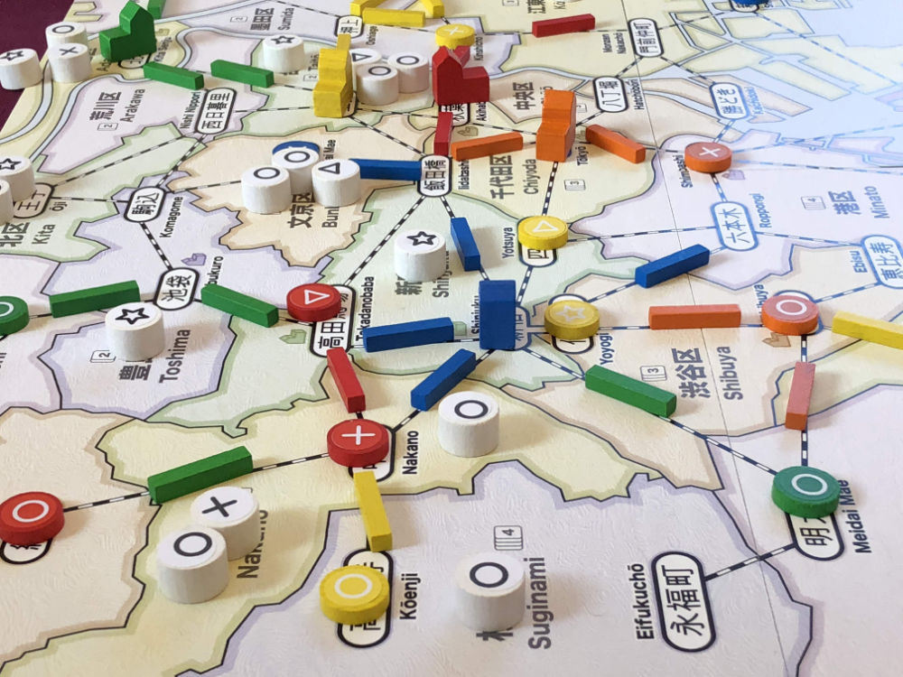

# Playtest #28

Thu 21 Mar 2019

Participants: AdamB, KenK, SverreR, ChrisM, JeffB

                   

## Overview

* Testing:
	* 5 players
	* 2 new players

## Components & Rules

Baseline rules, except:

* Draw 2 customers per turn after 3rd dept store is built
   * Place both customers into same location
* Per player: 2 dept stores, 5 stores, 9 track
* Throw the bag of customers at the next player so that they know it's their turn.

## Comments

Started with 3 player AdamB, KenK, self). Restarted when more people arrived.

Scores: 

|         |  ◯  |  ⤫  |  △  |  ⭒  | Score |
| ------- | --- | --- | --- | --- | --- |
| Adam    | ~3~ |  2  |  1  |  1  |  4  |
| KenK    |  3  | ~4~ |  2  |  3  |  8  |
| Sverre  | ~3~ |  3  |  2  |  2  |  7  |
| ChrisM  |  2  |  2  | ~3~ |  2  |  6  |
| Jeff    | ~3~ |  3  |  3  |  2  |  8  |

Patchwork track, because it's easy to place.

People keep saying "o" customers - not good theme

Feel bad - Sverre with only 2 cards. But he put himself that in that position.

Katsushika and Sumida. Colors too close. Hard to tell difference (across the water) in low light. Perhaps use a different pattern.

Slow with 5 players. Too much down time? But 2 new players.

Expansion: Hachiko would be much more powerful if it provided a new action that could earn customers.

After last customer is drawn, if another dept store is built, is the customer added to the bag?

* Does this customer get drawn nex turn?
* Does that restart the endgame?
* Probably better to just have the customer removed from game to avoid this problem.

Tie at end of game. How to resolve?

* After removing most common cust type: compare total # of customers
* User player #
* Player order from end of game
* # of pieces remaining (the player that used fewer wins), but this can still be a tie

Overall comment: Clumping customers is good

Liked having 2 customers drawn into same space.

## Suggestions/Actions

For next playtest:

* Cutomer paid for dept store is removed from game.
* Remove 5th player support from base game
