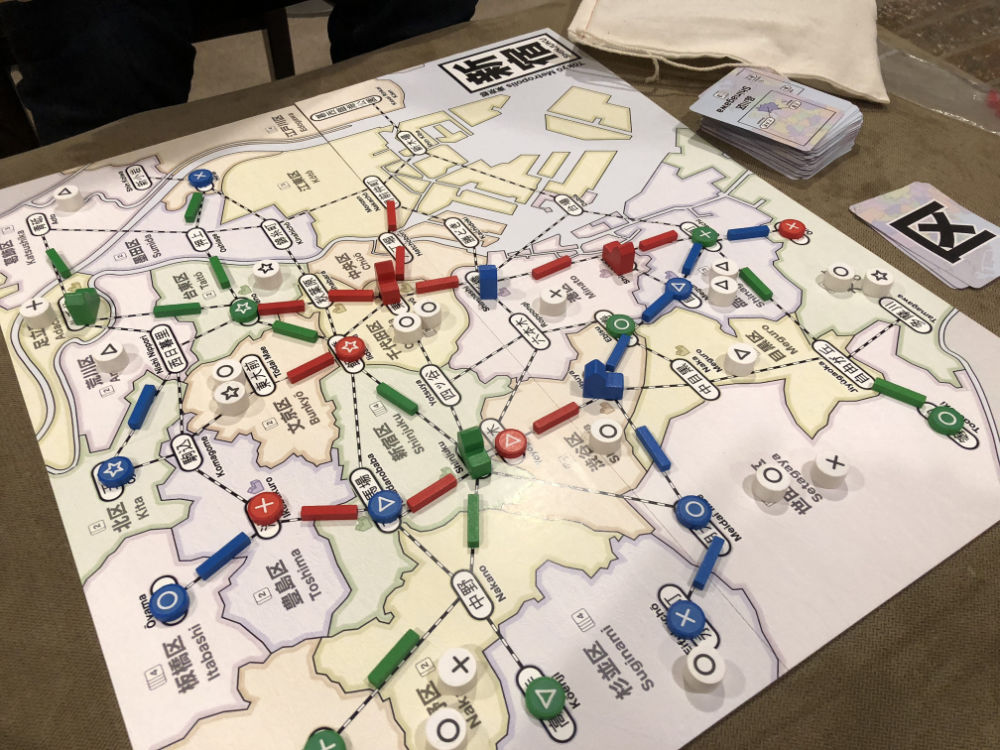

# Playtest #29

Thu 21 Mar 2019

Participants: KenK, JoshY, self

           

## Overview

* Testing:
	* 2 new players (1 first game, 1 second game)

## Components & Rules

Baseline rules

## Comments

Scores: 

|         |  ◯  |  ⤫  |  △  |  ⭒  | Score |
| ------- | --- | --- | --- | --- | --- |
| KenK    |  5  |  2  | ~6~ |  3  | 10  |
| JoshY   |  3  | ~4~ |  1  |  1  |  5  |
| Gary    | ~5~ |  5  |  4  |  4  | 13  |

Josh:

* Like realistic Tokyo map with stations

Ken:

* Likes "tokening" (cf 18xx games)
   * Use tokens/stations to define line, but can be used offensively to block/tax other players
   * Really enjoyed this aspect
   
## Suggestions/Actions

For next playtest:

* Customer paid for dept store is removed from game.

