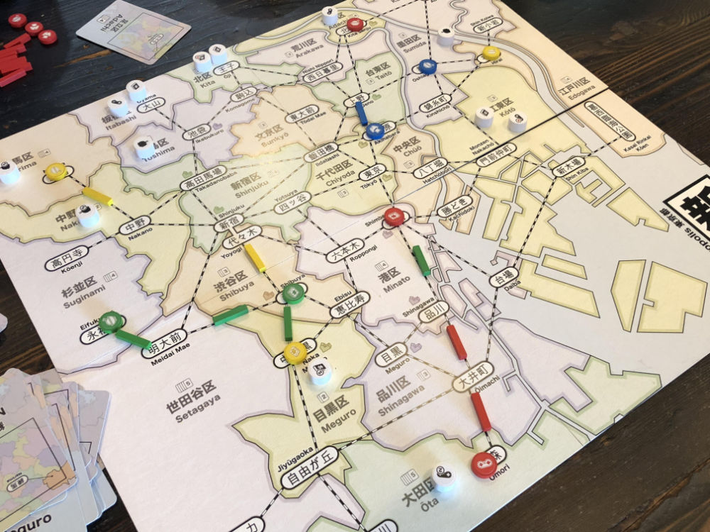
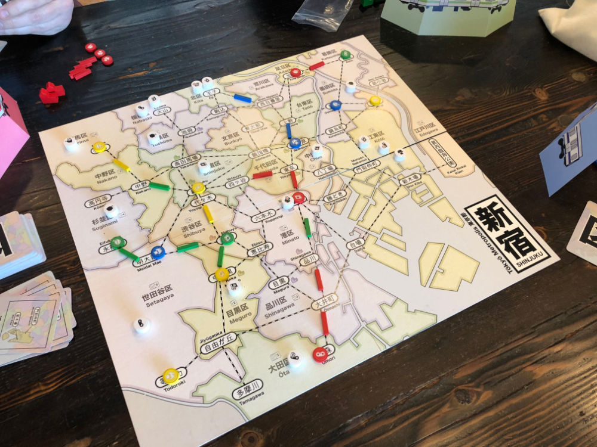
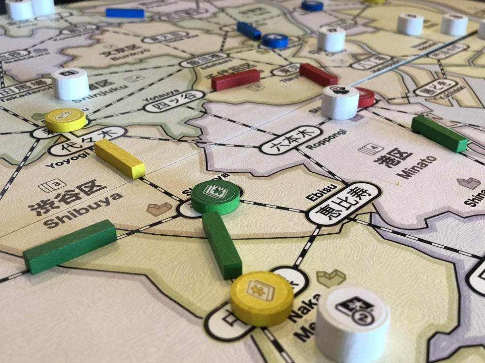
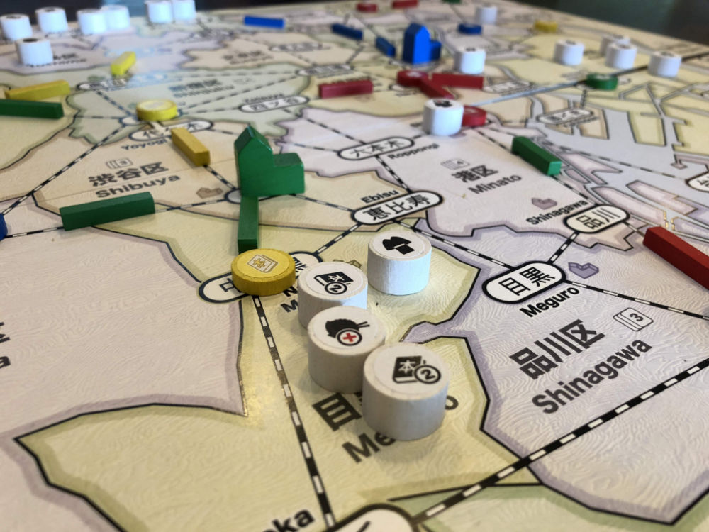
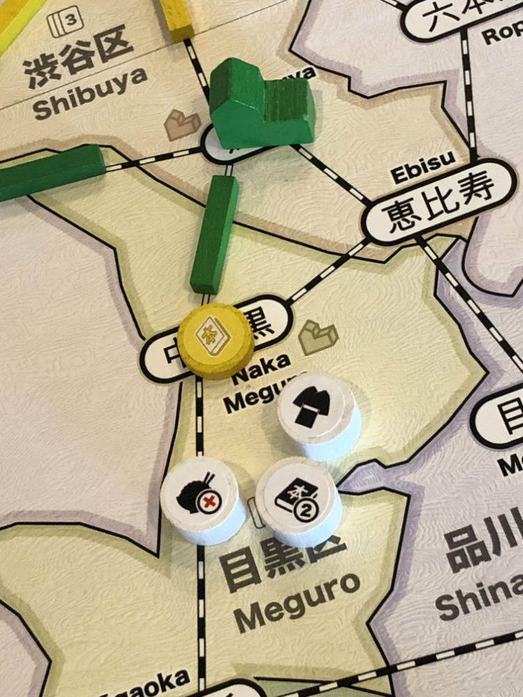
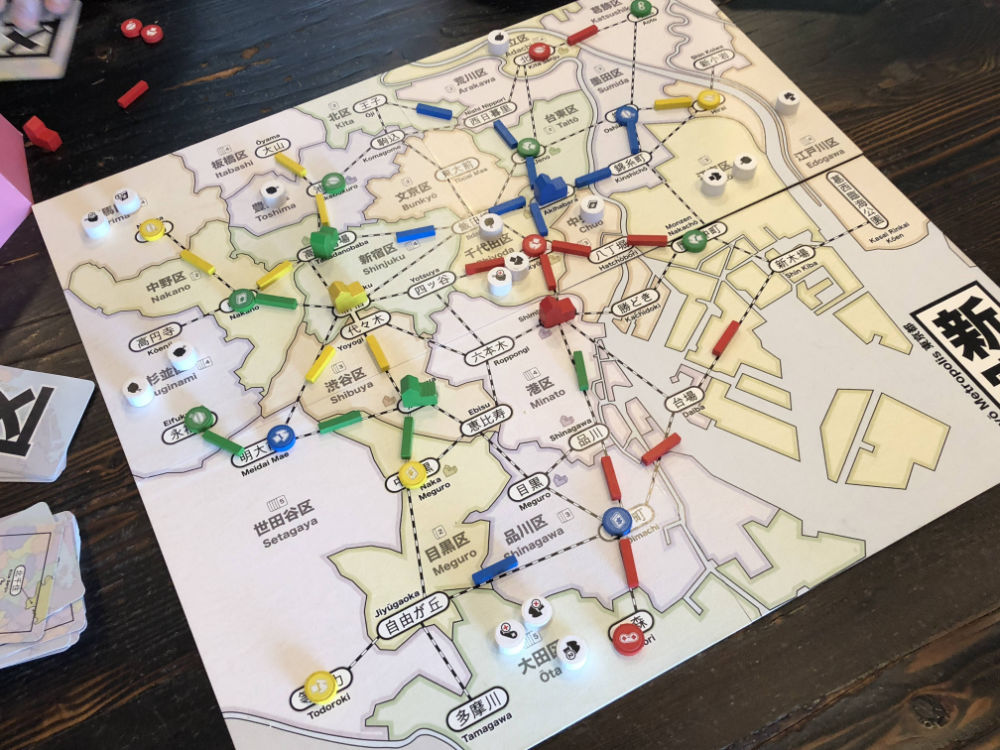
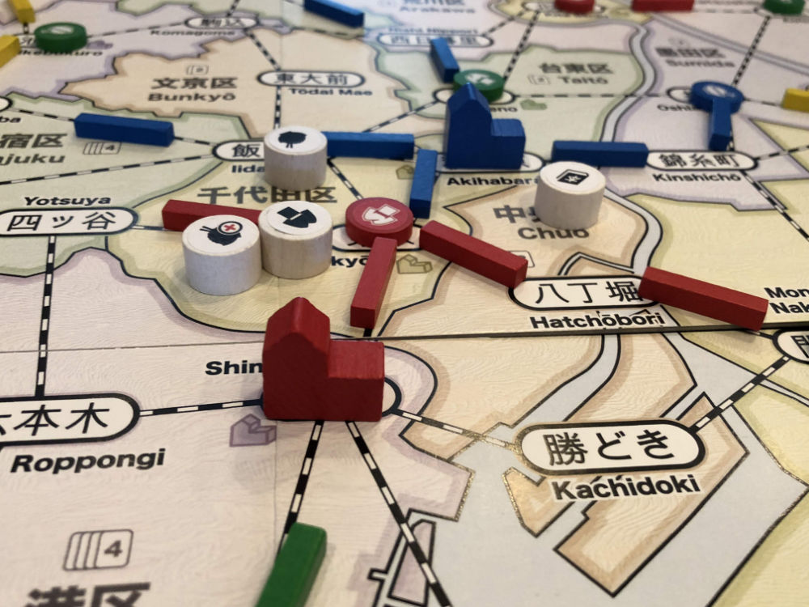
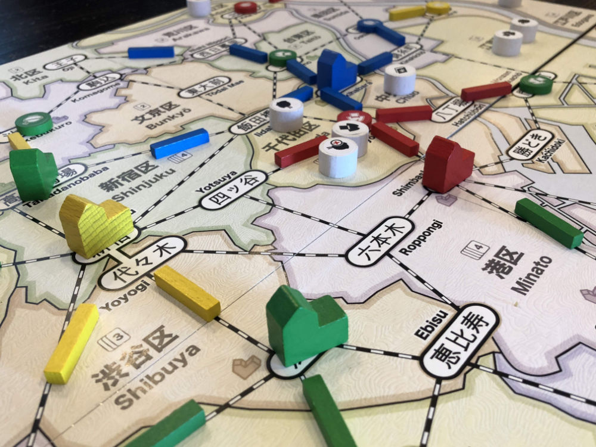
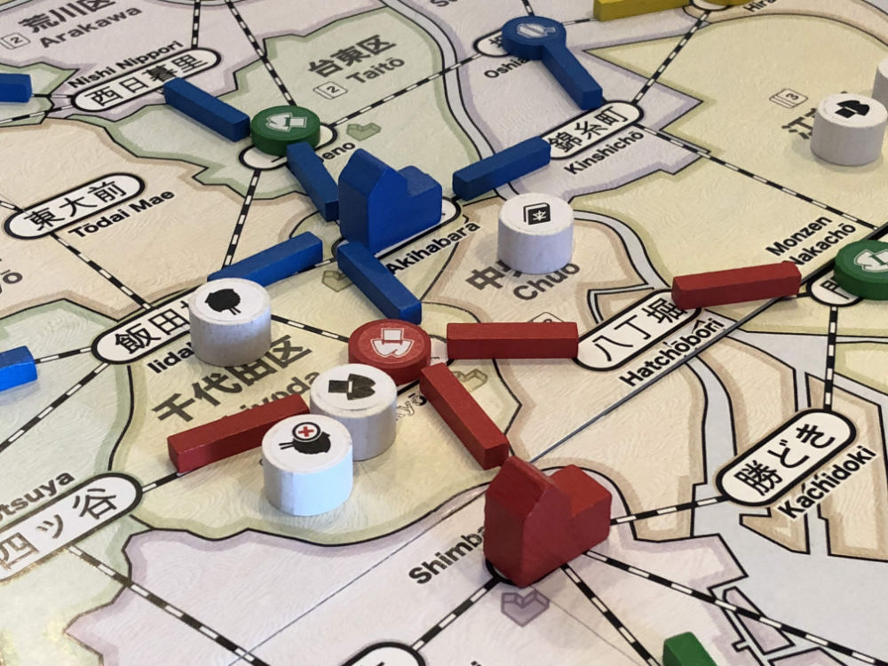
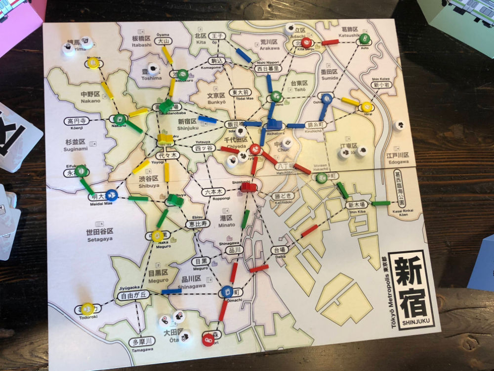

# Playtest #33

Fri 26 Apr 2019

Participants: Jeff, Alex, Sam, self

          

## Overview

* Testing:
   * New icons on components
   * Customer paid for dept store cost is removed from game
   * 56 customers
   * Multiple customers drawn into same location
   * Double customers
   * Thief expansion
	* 1 new players (1 first game)

## Components & Rules

Baseline rules

## Comments

Clarifications:

* When paying a customer to upgrade, pay a single token (double or thief is OK)
* When drawing customers at start of turn, if a thief is drawn, keep drawing until a non-thief is drawn.
* When drawing 2 customers, draw until 2 non-thief customers are drawn.

Scores (removing customer type with highest points): 

|         |    |    |    |    | Score |
| ------- | ----------- | ----------- | ----------- | ----------- | ---- |
| Jeff    |~3/1/0 = 5~  | 3/1/0 = 5   | 2/1/0 = 4   | 2/1/0 = 4   |  13  |
| Alex    |~5/1/1 = 6.5~| 0/2/0 = 2   | 0/0/1 = -0.5| 2/1/1 = 3.5 |   5  |
| Sam     | 1/1/0 = 3   |~2/2/0 = 6~  | 2/1/1 = 3.5 | 0/0/0 = 0   |  6.5 |
| Gary    | 1/1/0 = 3   | 0/1/1 = 1.5 |~2/1/0 = 4~  | 1/1/0 = 3   |  7.5 |

Numbers are token counts: single/double/thief = score

Scores (removing customer type with most tokens): 

|         |    |    |    |    | Score |
| ------- | --- | --- | --- | --- | --- |
| Jeff    |~3/1/0 = 5~  | 3/1/0 = 5   | 2/1/0 = 4   | 2/1/0 = 4   |  13  |
| Alex    |~5/1/1 = 6.5~| 0/2/0 = 2   | 0/0/1 = -0.5| 2/1/1 = 3.5 |   5  |
| Sam     | 1/1/0 = 3   | 2/2/0 = 6   |~2/1/1 = 3.5~| 0/0/0 = 0   |   9  |
| Gary    | 1/1/0 = 3   | 0/1/1 = 1.5 |~2/1/0 = 4~  | 1/1/0 = 3   |  7.5 |

Jeff:

* Assumed that the customer type to remove during scoring was going to be based on number of tokens rather than number of points.
   
## Suggestions/Actions

For next playtest:

* When scoring, remove customer type that you have the most tokens of (rather than most points)

