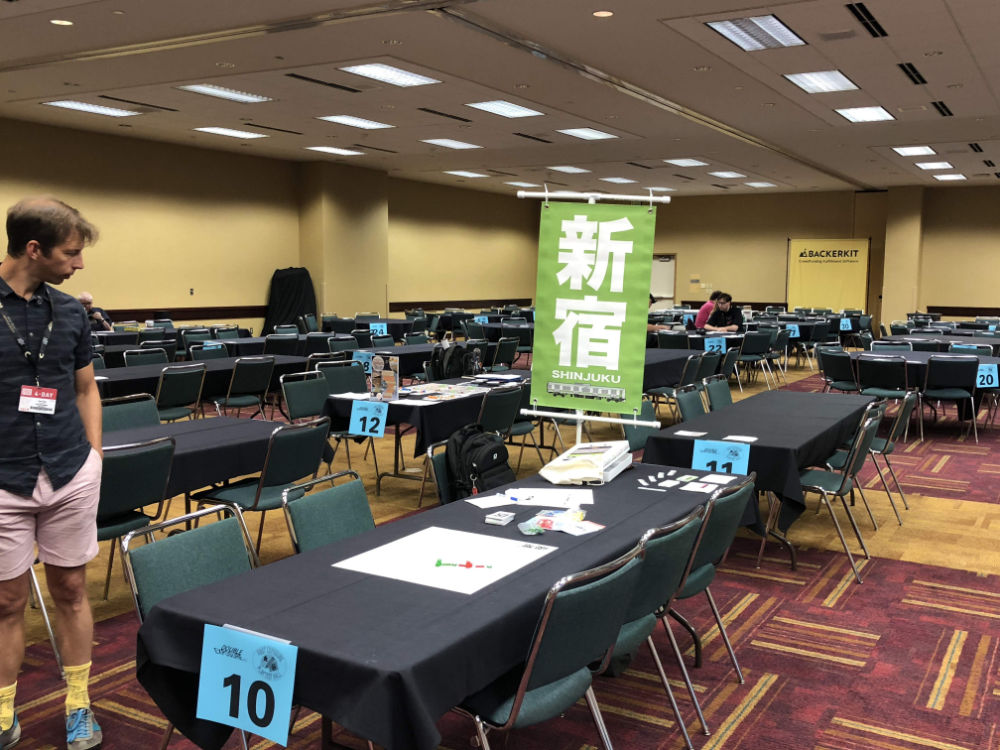
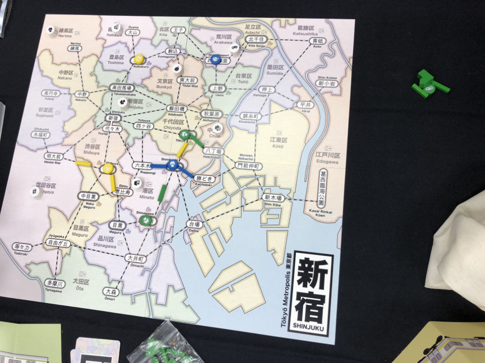
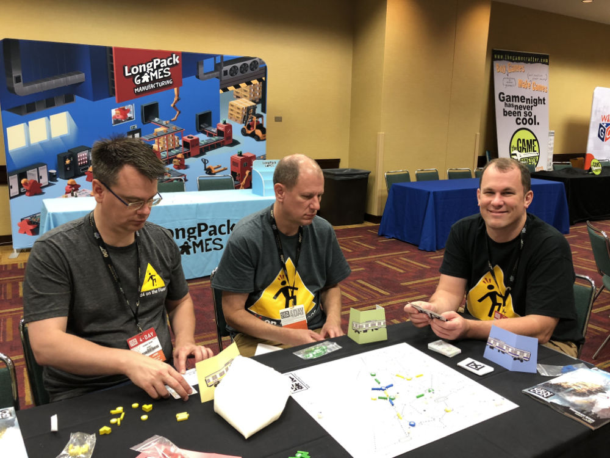
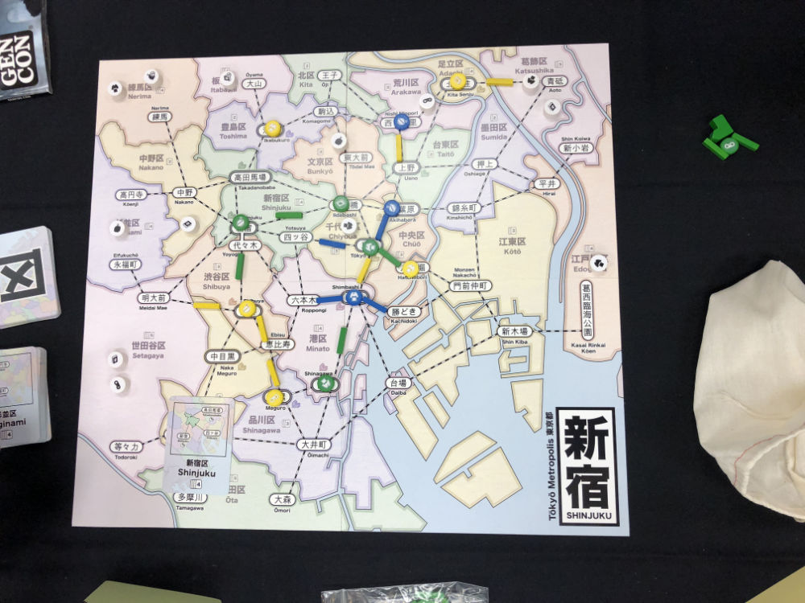
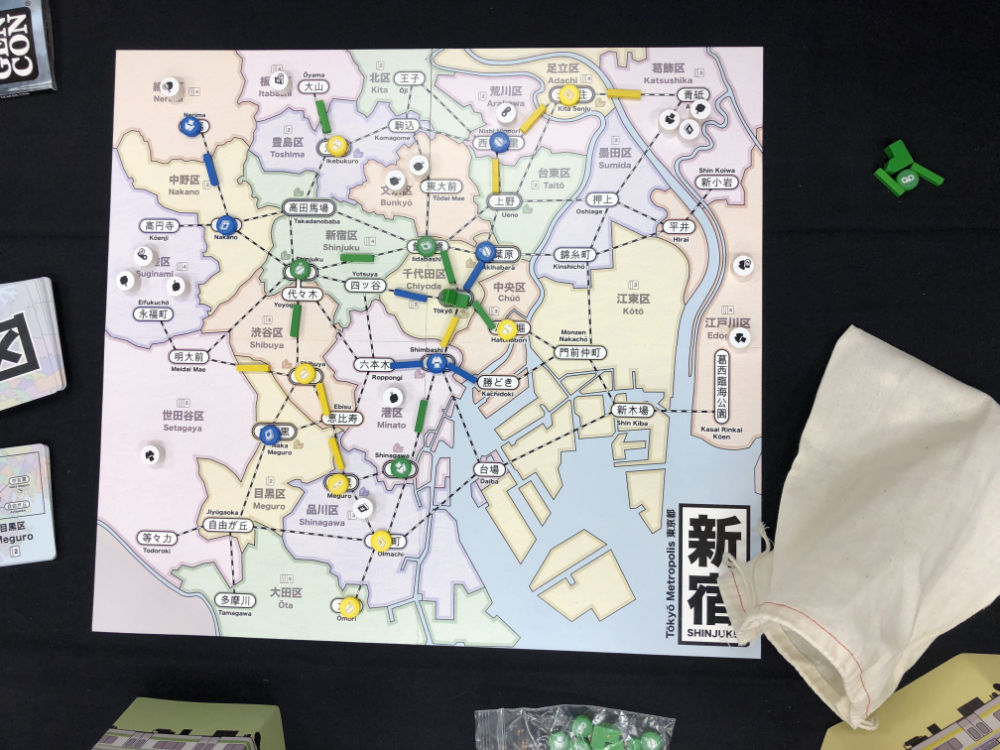
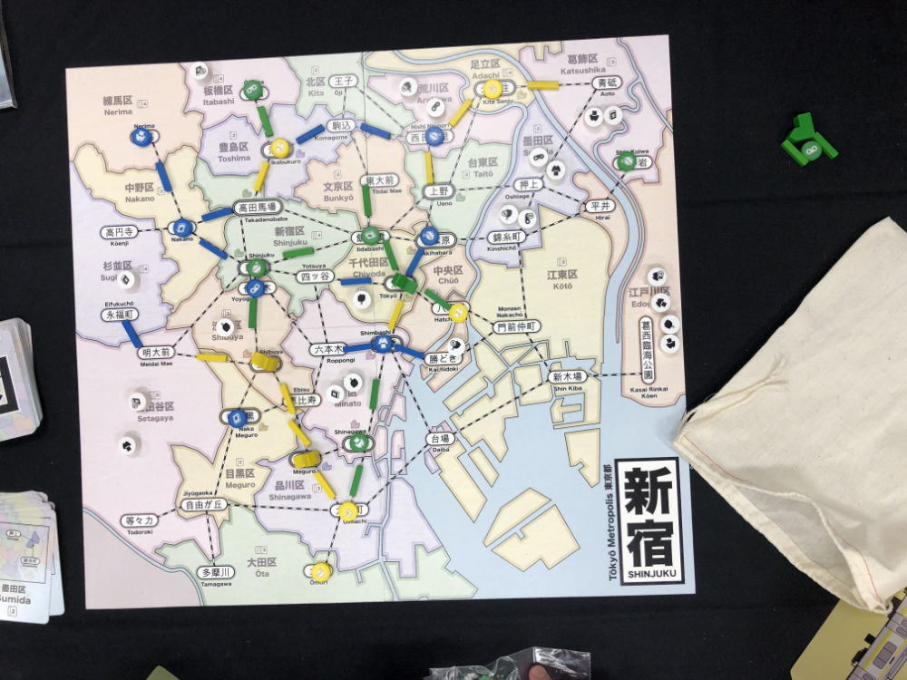
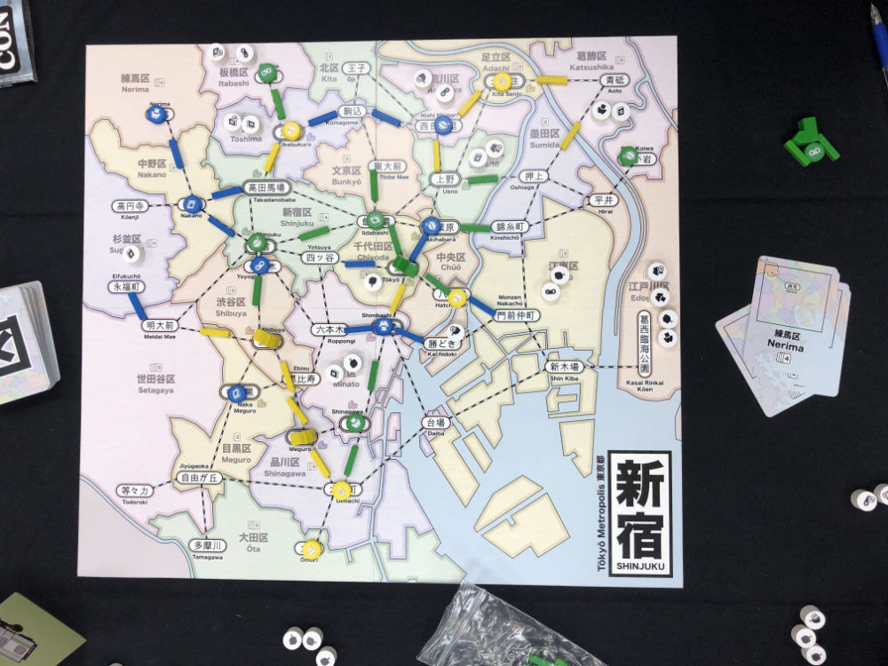

# Playtest #34 - GenCon

Thu 1 Aug 2019 - 10am

Participants: Hudson F, Mark F, Brian F.

       

## Comments

* Is there an advantage to being the player that triggers the last turn?
  * Not that we've noticed in playtests so far.

Scores: 

|         | Score |
| ------- | ----- |
| Hudson  |   12  |
| Mark    |    7  |
| Brian   |    7  |
