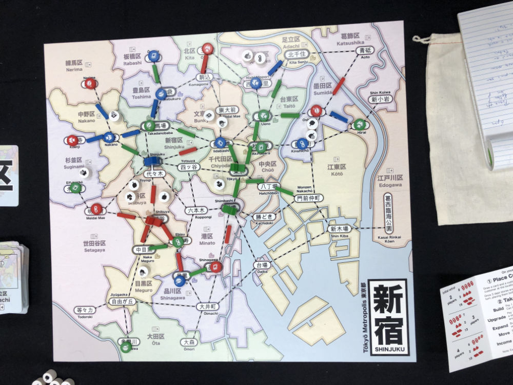

# Playtest #35 - GenCon

Thu 1 Aug 2019 - 6pm

Participants: Patrick H, Kellen P, Joel P

       

## Comments

* Clarify in rules:
  * Passing through another player's station does not trigger income
  * You may pass through an empty station
  * Can wildcards be used to upgrade from Store -> Dept Store [make this explicit in rules)

"Drawing customers at start reminds me of Pandemic"

Passerby: "Is this Catan in Tokyo?" :-7

Consider adding legend on map that shows the customer info (# of each type)

Scores: 

|         | Score |
| ------- | ----- |
| Patrick |   12  |
| Kellen  |   10  |
| Joel    |    7  |
