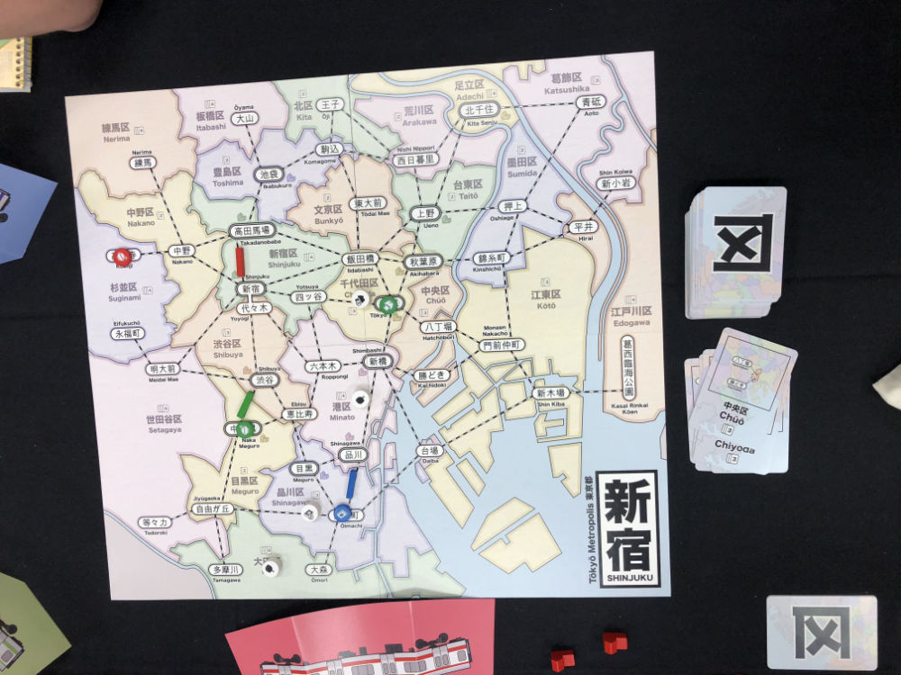
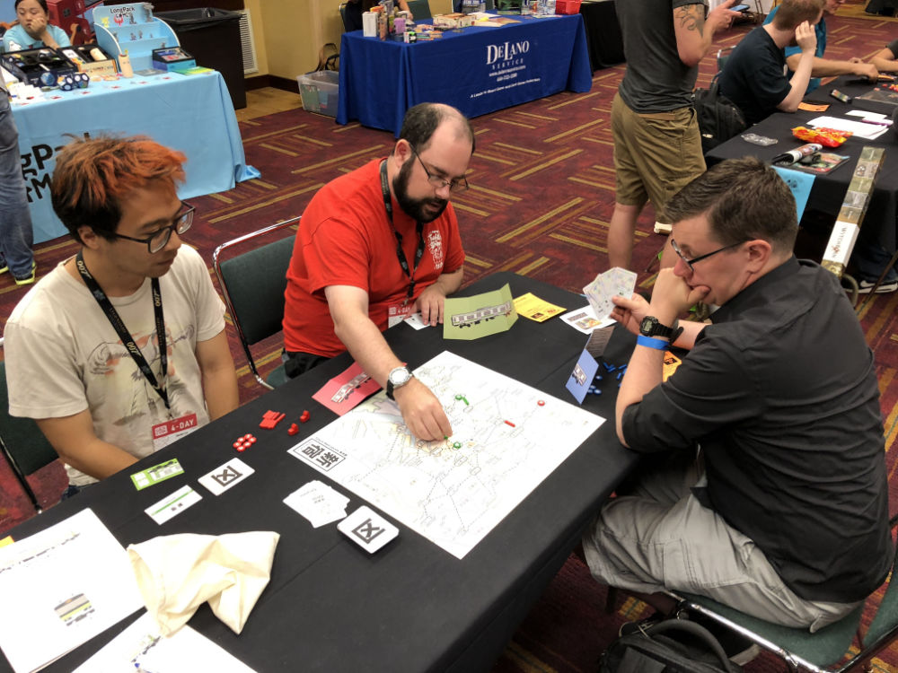
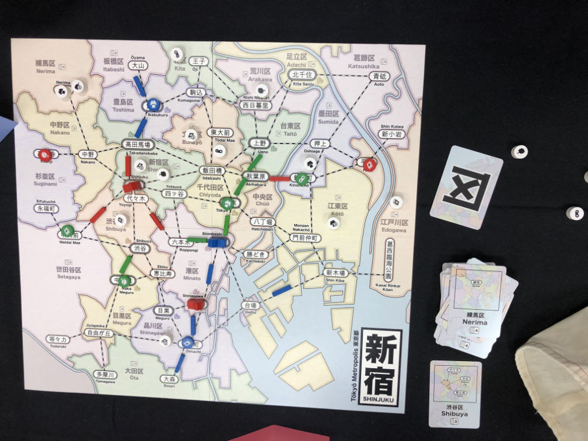
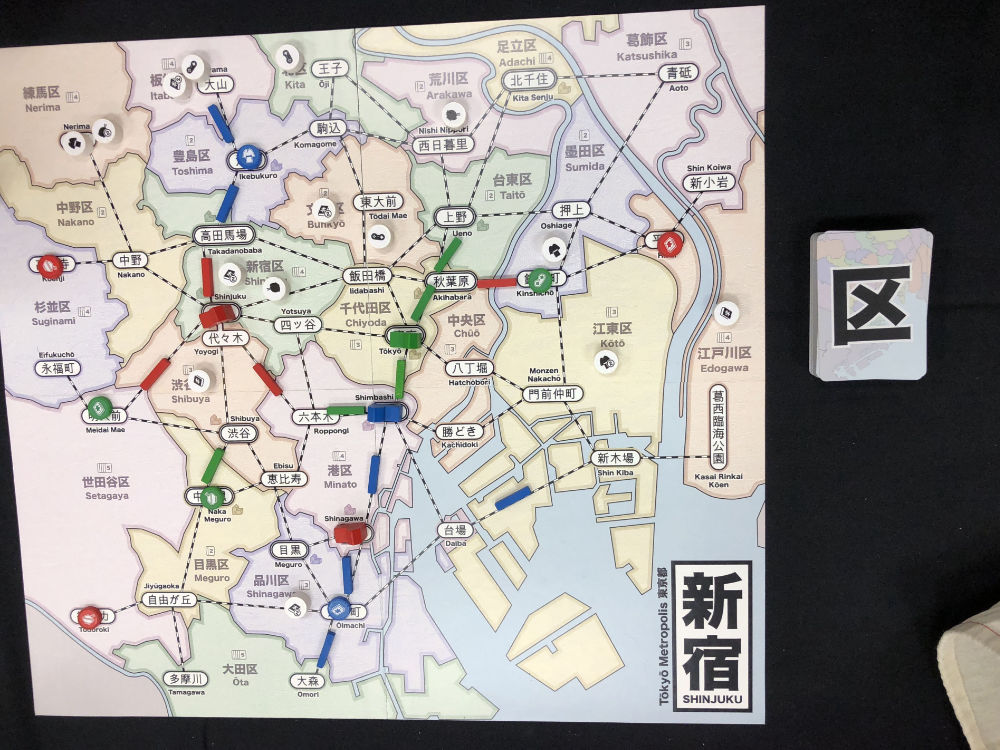
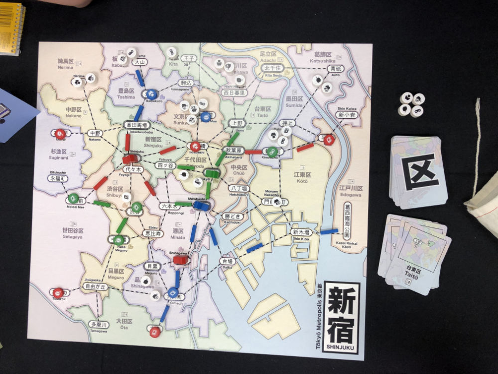
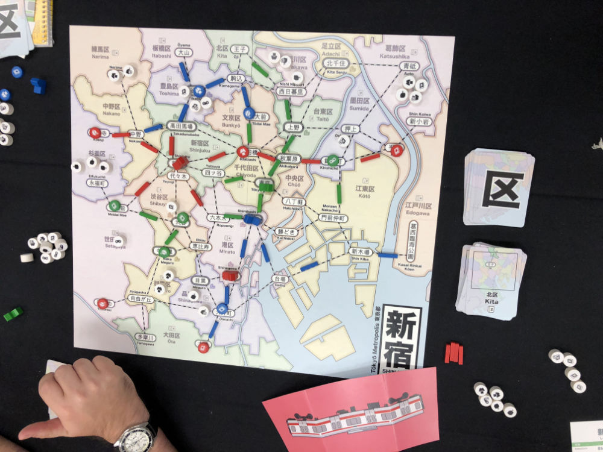
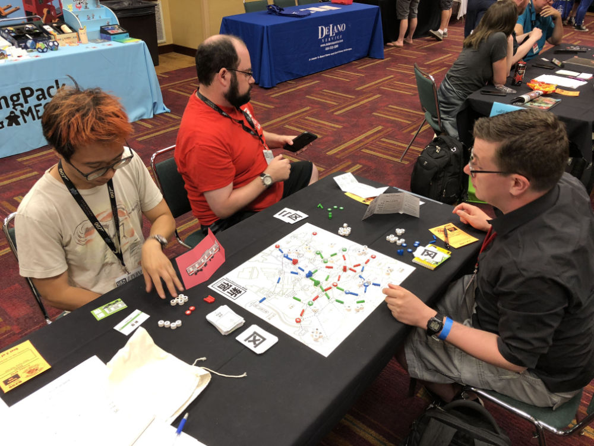

# Playtest #37 - GenCon

Fri 2 Aug 2019 - 4pm

Participants: Dexter L, Seth T, Bill P,

       

## Comments

* Clarify: During Move action, you do not accumulate customers that you pass along the way.

Timestamps:

* 4:33 Game start
* 4:55 First dept store built
* 5:03 Third dept store built
* 5:30 Game finished (start scoring)

Scores: 

|         | Score |
| ------- | ----- |
| Dexter  |    6  |
| Seth    |    8  |
| Bill    |    9  |
