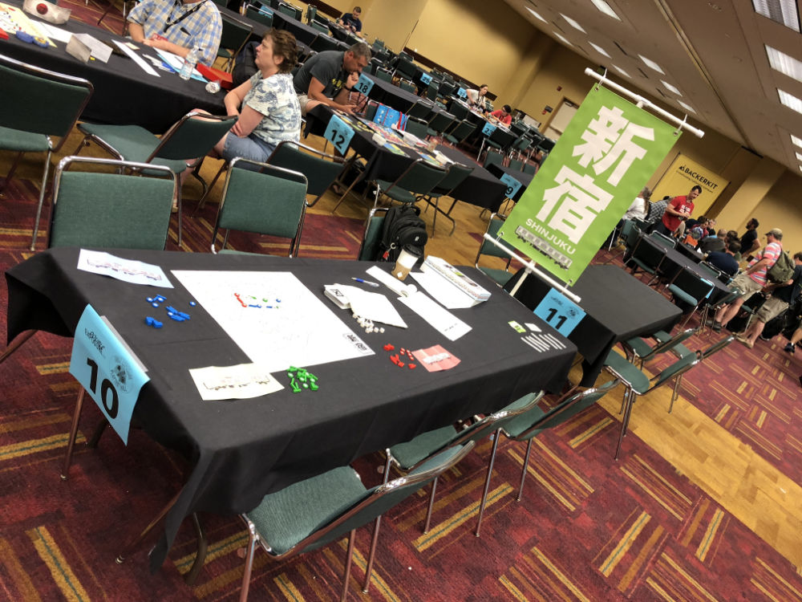
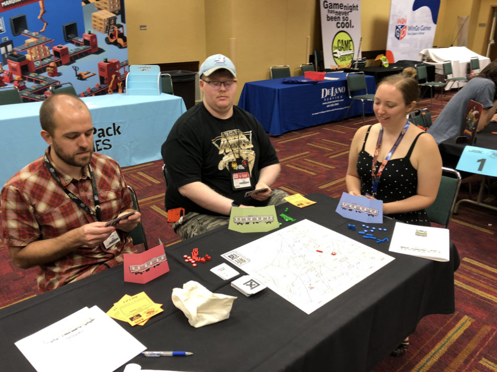
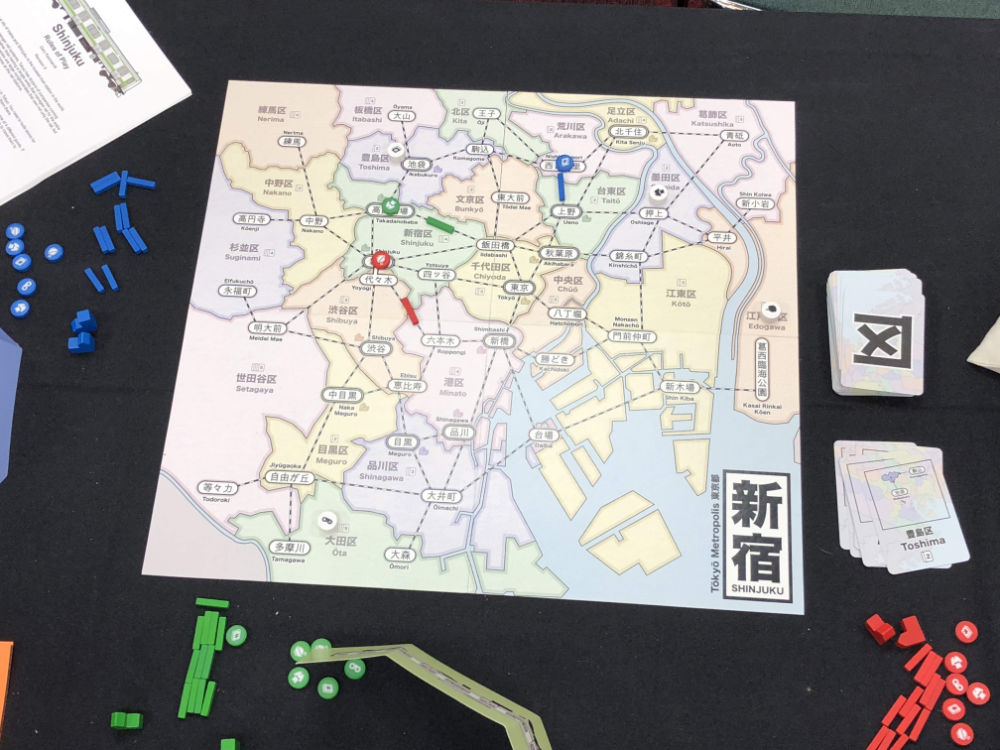
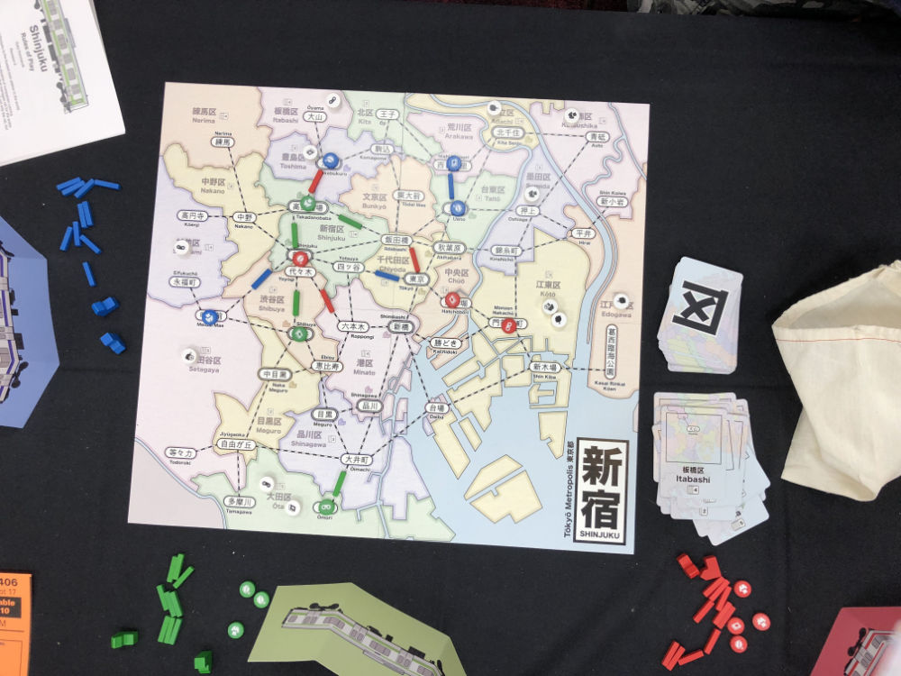
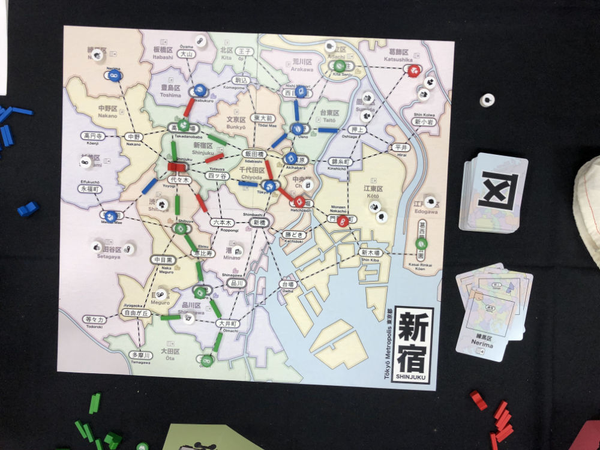
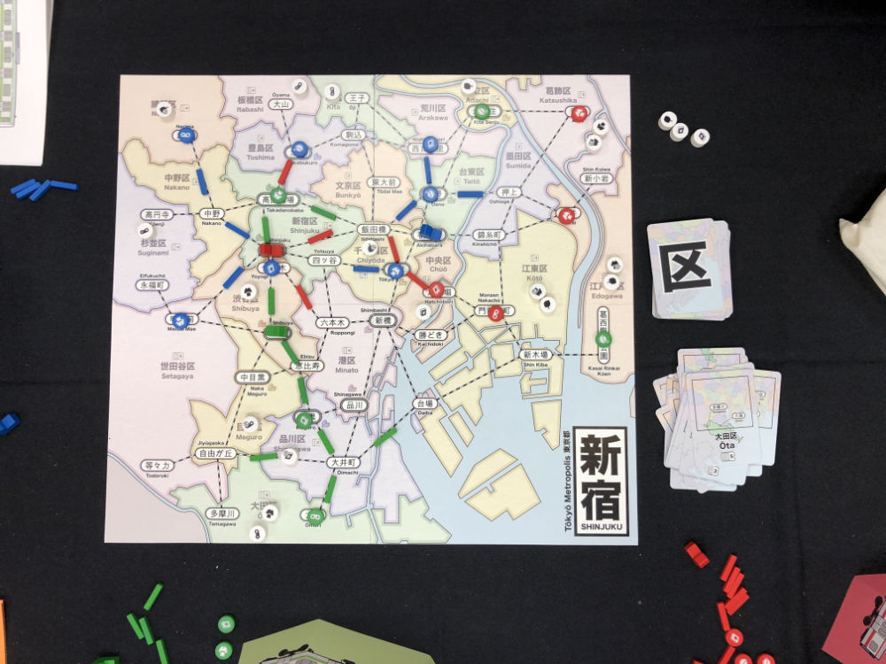
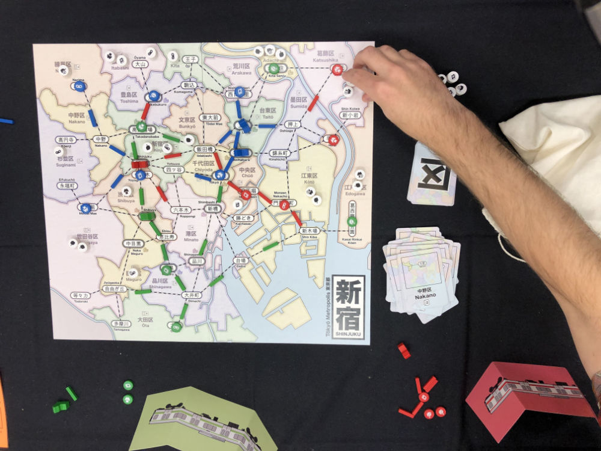
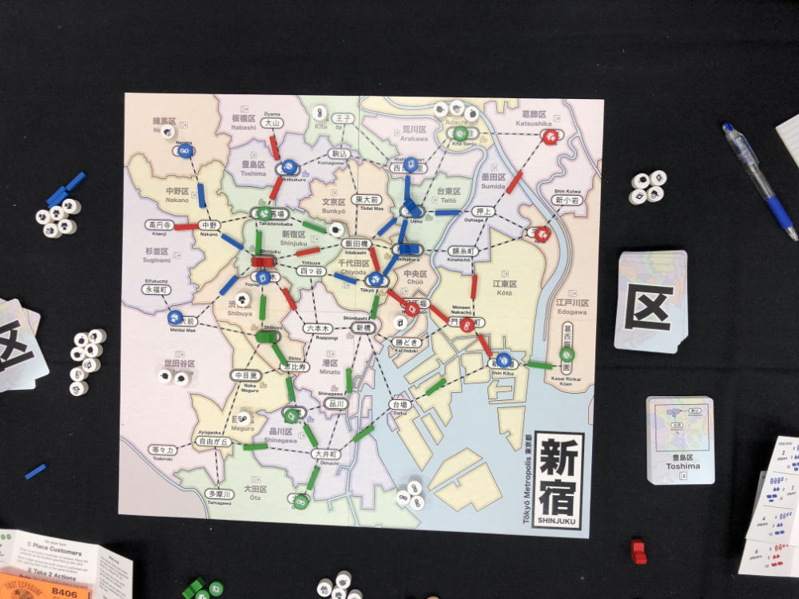

# Playtest #38 - GenCon

Sat 3 Aug 2019 - 8am

Participants: Tim P, Chris S, Holly P

        

## Comments

Rules clarifications:

* Only one store per station
* Only one track per connection
* Can move through empty stations (but not across missing track)

Discussed strategy of using card doubles to make a wildcard (build a store with the first one, 2nd becomes wild).

Noted that we will go through the deck ~3 times (shuffling twice)

Holly: Starts slow, but once it gets going it's fun

Timestamps:

* 8:33 Start
* 8:56 1st dept store
* 9:05 2nd dept store
* 9:06 3rd dept store
* 9:18 4th dept store
* 9:29 End

Scores (single/double = total):

|         |    |    |    |    | Score |
| ------- | --- | --- | --- | --- | --- |
| Tim     | 1/1 = 3 | 2/3 = 8 |~4/2 = 8~| 2/1 = 4  | 15 |
| Chris   | 1/1 = 3 | 2/1 = ? | 1/0 = ? |~3/0 = 3~ |  8 |
| Holly   | 3/0 = 3 |~4/1 = 6~| 0/2 = 4 | 0/2 = 4  | 11 |
