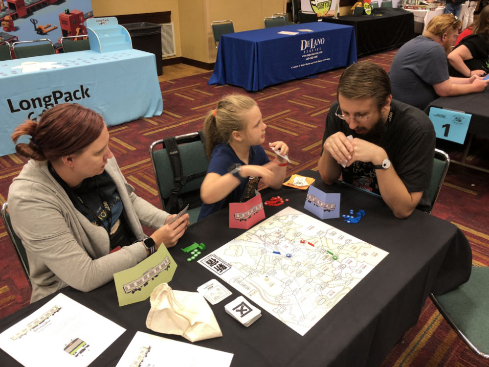

# Playtest #40 - GenCon

Sat 3 Aug 2019 - 6pm

Participants: Katrina O, Evie O (8yo), Corey O

       

## Comments

Slow buildup until first dept store is build.

What about having an initial setup (like Catan)? This would give more first player advantage.

Passerby: "When will this be available?"

Timestamps:

* 6:45 Start (late)
* 7:22 1st dept store
* 7:25 2nd dept store
* 7:41 3rd dept store
* 7:46 4th dept store
* 7:51 Stopped with 7 customers remaining

Scores (single/double = total):

|         |    |    |    |    | Score |
| ------- | --- | --- | --- | --- | --- |
| Katrina | 1/1 = 3 |~2/0 = 2~| 1/0 = 1 | 1/0 = 1  |  5 |
| Evie    | 1/2 = 5 |~2/1 = 4~| 1/2 = 5 | 1/1 = 3  | 13 |
| Corey   | 1/1 = 3 |~1/2 = 5~| 1/0 = 1 | 1/1 = 3  |  7 |
